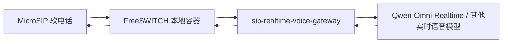
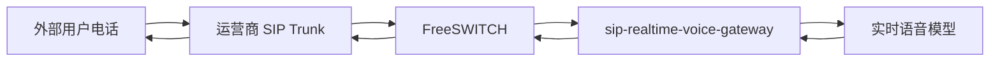
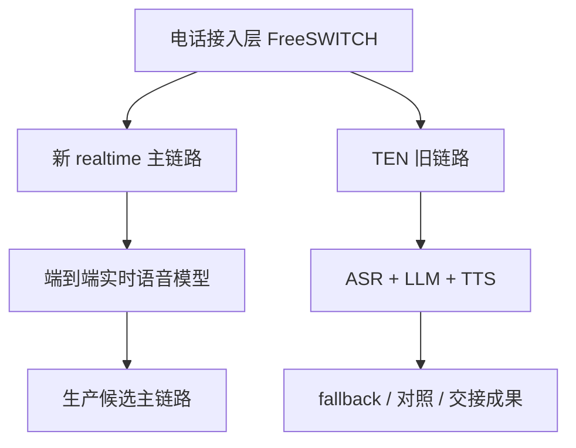
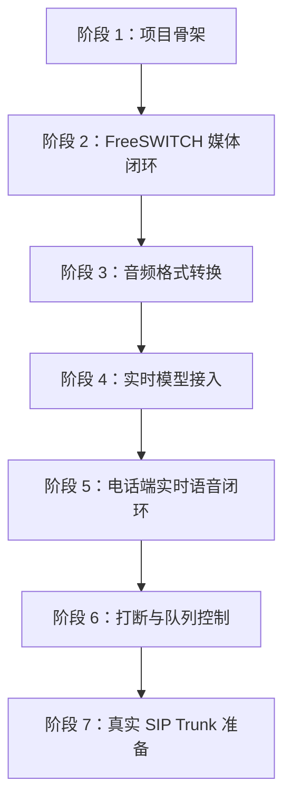

# SIP 实时语音网关新项目方案

## 1. 背景

当前仓库已经验证了一条基于 TEN 的 SIP 电话接入链路：

```text
MicroSIP / SIP Trunk
  -> FreeSWITCH
  -> Media Hub
  -> TEN sip_media_bridge
  -> ASR
  -> LLM
  -> TTS
  -> Media Hub
  -> FreeSWITCH
  -> 电话端播放
```

这条链路证明了以下能力已经可行：

- SIP 电话可以通过 FreeSWITCH 进入本地语音链路。
- FreeSWITCH 可以把电话音频转成媒体流交给后端服务。
- 后端可以把音频送入 TEN 图，再接 ASR、LLM、TTS。
- TTS 下行音频可以回到电话端播放。
- 本地软电话 9199 链路已经验证过 AI 回复。

但是这条链路的结构性问题也已经明确：它是级联式链路，核心路径是：

```text
电话音频 -> 等 ASR final -> LLM 生成 -> TTS 合成 -> 电话播放
```

在最近一次本地测试中，首句 AI 可听回复约为 4.76 秒，其中 ASR final 约 3.00 秒，LLM 首包约 1.24 秒，TTS 首包约 0.45 秒。即使继续局部优化 ASR final 或替换普通 LLM，也只能压缩局部耗时，无法从结构上消除“先等识别结束再开始回答”的延迟。

因此，如果目标是真正可用的智能电话客服，而不是验证 demo，建议新建独立项目 `sip-realtime-voice-gateway/`，使用端到端实时语音模型作为主链路，把 TEN 旧链路保留为基线、回退和对照。

## 2. 项目定位

`sip-realtime-voice-gateway/` 是一个独立实时语音网关项目，不依赖 TEN 框架。

它的职责是：

- 接收 FreeSWITCH 提供的电话媒体流。
- 把电话侧 8kHz 单声道 PCM 音频转换为实时语音模型需要的输入格式。
- 通过 WebSocket 连接端到端实时语音模型。
- 接收模型返回的实时音频 delta。
- 把模型音频转换回电话侧可播放的 8kHz 单声道 PCM 或 PCMA。
- 维护通话会话、播放队列、打断状态、延迟指标和日志。

它不负责：

- 自己实现完整 SIP 协议栈。
- 自己直接对接运营商 SIP trunk。
- 复用 TEN graph 承载实时热路径。

推荐边界是：

```text
SIP / RTP 接入仍由 FreeSWITCH 负责。
实时音频桥接、模型会话和播放控制由 sip-realtime-voice-gateway 负责。
TEN 保留旧链路，作为 fallback、对照组和历史验证成果。
```

## 3. 总体链路

### 3.1 本地测试链路



本地阶段仍使用 MicroSIP 拨打测试分机，例如 `9199` 或新的 realtime 专用分机。FreeSWITCH 负责 SIP 注册、拨号路由、RTP 媒体处理。新项目只处理 FreeSWITCH 转出的媒体流。

### 3.2 真实 SIP Trunk 链路



真实环境下，运营商通常与 FreeSWITCH 之间使用 SIP 信令和 RTP 媒体。项目需要保证 FreeSWITCH 到 realtime gateway 的媒体格式稳定、可观测，并能在模型不可用时回退到兜底策略。

### 3.3 与 TEN 旧链路的关系



新项目不删除 TEN 旧链路。TEN 旧链路继续保留以下价值：

- 验证 SIP 接入和媒体回传能力。
- 对照实时链路的延迟、稳定性和识别效果。
- 在实时模型不可用时作为降级链路。
- 继续保留当前阶段已完成的测试资产和文档。

## 4. 核心模块设计

建议第一版项目结构如下：

```text
sip-realtime-voice-gateway/
  app/
    main.py
    config.py
    freeswitch_media.py
    realtime_client.py
    audio_codec.py
    playback_queue.py
    session.py
    metrics.py
    logging_config.py
  configs/
    local.example.yaml
  docs/
    本地测试说明.md
    数据格式说明.md
  tests/
    test_audio_codec.py
    test_playback_queue.py
    test_session_state.py
```

### 4.1 `freeswitch_media.py`

负责与 FreeSWITCH 建立媒体通道。

第一版推荐延续当前思路：FreeSWITCH 把通话媒体以 WebSocket 或类似媒体通道交给后端服务。网关接收到的理想格式是：

```text
PCM signed 16-bit little-endian
sample_rate = 8000
channels = 1
frame_duration = 20ms
frame_size = 320 bytes
```

如果后续直接处理 RTP，则需要额外实现 RTP 序号、时间戳、抖动缓冲和 PCMA 编解码；第一版不建议自己处理这层复杂度。

### 4.2 `audio_codec.py`

负责所有音频格式转换。

最低需要支持：

- 电话侧 PCM 8kHz mono s16le -> 模型侧 PCM 16kHz mono s16le。
- 模型侧 PCM 24kHz mono s16le -> 电话侧 PCM 8kHz mono s16le。
- 如果网关直接输出 RTP，则还需要 PCM 8kHz -> PCMA / G.711 A-law 编码。

建议把音频转换做成纯函数，方便单元测试。

### 4.3 `realtime_client.py`

负责连接实时语音模型。

以 Qwen-Omni-Realtime 为例，官方文档说明其 WebSocket 接入地址为：

```text
中国内地北京：
wss://dashscope.aliyuncs.com/api-ws/v1/realtime?model=<model>

国际新加坡：
wss://dashscope-intl.aliyuncs.com/api-ws/v1/realtime?model=<model>
```

第一版建议使用北京地域，模型候选：

```text
qwen3.5-omni-plus-realtime
```

具体可用模型、地域和计费必须以阿里云百炼控制台和官方文档为准。

### 4.4 `playback_queue.py`

负责下行播放队列。

电话端播放不能把模型返回的大块音频一次性塞给 FreeSWITCH，否则容易出现突发包、卡顿或断续。下行必须统一走一个播放队列：

```text
模型返回音频 delta
  -> 解码 base64
  -> 重采样到 8k PCM
  -> 切成 20ms / 320 bytes 帧
  -> 单发送器按 20ms 节奏发送给 FreeSWITCH
```

队列必须支持：

- `enqueue(audio_chunk)`：追加音频。
- `clear(reason)`：打断或会话结束时清空。
- `stop()`：通话结束时停止发送。
- `stats()`：返回队列长度、已发送帧数、丢弃帧数。

### 4.5 `session.py`

负责维护通话会话状态。

每通电话至少需要：

```text
call_id
session_id
model_session_id
caller_number
callee_number
sample_rate_in
sample_rate_model_in
sample_rate_model_out
sample_rate_out
current_turn_id
user_speaking
assistant_speaking
created_at
ended_at
```

第一版必须具备轮次隔离能力。原因是实时链路会发生打断和旧音频延迟到达。如果没有 `turn_id` 或等价机制，旧回复可能在新一轮问题后继续播放。

### 4.6 `metrics.py`

必须记录关键延迟：

```text
call_connected_at
first_phone_audio_in_at
first_model_audio_append_at
model_speech_started_at
first_model_audio_delta_at
first_audio_frame_to_freeswitch_at
assistant_audio_done_at
call_ended_at
```

第一版最重要的指标是：

```text
first_audio_frame_to_freeswitch_at - first_phone_audio_in_at
```

这就是用户体感的首包语音延迟。

## 5. 数据传输格式

### 5.1 SIP / RTP 侧

真实电话侧常见格式：

```text
codec = PCMA / G.711 A-law
sample_rate = 8000 Hz
channels = 1
packetization = 20ms
encoded_payload_per_packet = 160 bytes
decoded_pcm_per_packet = 320 bytes
```

解释：

- PCMA 是 8-bit 压缩采样，8kHz 下 20ms 有 160 个采样，所以编码后约 160 bytes。
- 解码成 PCM s16le 后，每个采样 2 bytes，所以 20ms 是 320 bytes。
- 当前本地链路中，后端服务接收到的是 8kHz mono PCM，20ms 一帧 320 bytes。

### 5.2 FreeSWITCH -> Gateway

第一版推荐 FreeSWITCH 先解码 RTP，再把线性 PCM 交给网关。

推荐网关输入帧：

```text
media_type = audio
encoding = pcm_s16le
sample_rate = 8000
channels = 1
frame_duration_ms = 20
frame_bytes = 320
transport = WebSocket binary frame
```

控制消息建议使用 JSON 文本帧：

```json
{
  "type": "register",
  "role": "freeswitch",
  "call_id": "fs_stage_realtime_local",
  "sample_rate": 8000,
  "codec": "pcm_s16le"
}
```

通话结束：

```json
{
  "type": "call.ended",
  "call_id": "fs_stage_realtime_local",
  "reason": "hangup"
}
```

### 5.3 Gateway -> 实时语音模型

以 Qwen-Omni-Realtime 原生 WebSocket 为例，客户端建立连接后先发送 `session.update`。

示例：

```json
{
  "type": "session.update",
  "session": {
    "modalities": ["text", "audio"],
    "voice": "Cherry",
    "instructions": "你是中文电话智能客服。回答要简短、自然、可打断。",
    "input_audio_format": "pcm",
    "output_audio_format": "pcm",
    "input_audio_transcription": {
      "model": "qwen3-asr-flash-realtime"
    },
    "turn_detection": {
      "type": "semantic_vad",
      "threshold": 0.5,
      "prefix_padding_ms": 500,
      "silence_duration_ms": 800
    }
  }
}
```

注意：

- 原生 WebSocket 文档中音频格式字段使用 `"pcm"`。
- Python SDK 文档中输入常见为 `PCM_16000HZ_MONO_16BIT`，输出常见为 `PCM_24000HZ_MONO_16BIT`。
- Qwen3.5-Omni-Realtime 支持 `server_vad` 和 `semantic_vad`，官方建议 Qwen3.5 场景优先使用 `semantic_vad`。
- 因此网关需要把电话侧 8kHz PCM 上采样到模型输入所需采样率，把模型输出再下采样回电话侧 8kHz。
- 最终采样率和格式以选定模型的官方文档为准。

追加输入音频：

```json
{
  "type": "input_audio_buffer.append",
  "audio": "<base64 encoded pcm audio>"
}
```

其中 `audio` 是 base64 编码后的 PCM 字节。不要把 WAV 文件头放进去，应该只传裸 PCM。

### 5.4 实时语音模型 -> Gateway

模型返回事件是 JSON 文本消息。音频增量通常在 `response.audio.delta` 事件中返回：

```json
{
  "type": "response.audio.delta",
  "delta": "<base64 encoded pcm audio>"
}
```

网关处理步骤：

```text
base64 decode
  -> 得到模型输出 PCM
  -> 重采样到 8000 Hz
  -> 切成 20ms / 320 bytes
  -> 放入 playback_queue
```

转录文本事件可以用于日志和客服质检：

```json
{
  "type": "conversation.item.input_audio_transcription.completed",
  "transcript": "用户说的话"
}
```

助手回复文本事件可以用于日志：

```json
{
  "type": "response.audio_transcript.done",
  "transcript": "助手实际回复文本"
}
```

### 5.5 Gateway -> FreeSWITCH

如果 FreeSWITCH 接收 PCM：

```text
encoding = pcm_s16le
sample_rate = 8000
channels = 1
frame_duration_ms = 20
frame_bytes = 320
transport = WebSocket binary frame
```

如果后续改成网关直接发 RTP：

```text
codec = PCMA / G.711 A-law
sample_rate = 8000
channels = 1
packetization = 20ms
payload_bytes = 160
```

第一版不建议网关直接发 RTP。让 FreeSWITCH 继续负责 SIP/RTP/编解码更稳。

## 6. 打断与播放控制

实时客服必须支持用户插话。第一版至少要做到：

```text
检测到用户开始说话
  -> 停止当前助手音频继续播放
  -> 清空 playback_queue
  -> 通知实时模型取消当前 response
  -> 开始接收用户新一轮输入
```

需要关注两个事件来源：

- 模型服务端 VAD 返回的用户开始说话事件。
- FreeSWITCH 或网关自身基于音频能量判断的本地 VAD。

第一版可以先依赖模型的 server_vad，但建议保留本地 VAD 接口，因为电话场景里打断体验非常关键，全部依赖云端事件可能偏慢。

## 7. 业务能力边界

端到端实时语音模型负责低延迟自然对话，但不能替代业务系统。

智能客服还需要：

- 业务状态机：明确当前意图、槽位、流程阶段。
- 工具调用：查订单、建工单、查库存、查账户、转人工。
- 知识库：产品、政策、售后规则。
- 安全边界：敏感问题、越权查询、隐私信息脱敏。
- 质检日志：录音、用户转写、助手回复、工具调用结果。

建议第一版 realtime gateway 只实现语音闭环和基础日志，不急着接复杂业务工具。等延迟和播放稳定后，再接入业务编排层。

## 8. 环境变量建议

不要把任何 API Key 写进代码或文档。

建议使用：

```text
REALTIME_MODEL_PROVIDER=aliyun
ALIYUN_DASHSCOPE_API_KEY=***
ALIYUN_REALTIME_URL=wss://dashscope.aliyuncs.com/api-ws/v1/realtime
ALIYUN_REALTIME_MODEL=qwen3.5-omni-plus-realtime
ALIYUN_REALTIME_VOICE=Cherry

FREESWITCH_MEDIA_HOST=0.0.0.0
FREESWITCH_MEDIA_PORT=9100
FREESWITCH_SAMPLE_RATE=8000
PHONE_CODEC=PCMA

LOG_LEVEL=INFO
METRICS_ENABLED=true
RECORDING_ENABLED=false
```

## 9. 阶段拆分与可测试验收

新项目必须分阶段推进，每个阶段都要能独立启动、独立测试、独立给出结论。上一阶段没有通过时，不进入下一阶段。



### 9.1 阶段 1：项目骨架

目标：新项目可以作为独立服务启动，不依赖 TEN。

范围：

- 创建 `sip-realtime-voice-gateway/` 项目目录。
- 提供配置加载、日志初始化、健康检查接口。
- 提供基础目录结构和测试入口。
- 不接 FreeSWITCH，不接实时模型。

可测试项：

- 本地能安装依赖。
- 服务能启动。
- `GET /health` 返回健康状态。
- 配置文件和环境变量能被正确读取。
- 单元测试能跑通。

通过标准：

```text
python -m pytest
python -m app.main
curl http://127.0.0.1:<port>/health
```

### 9.2 阶段 2：FreeSWITCH 媒体闭环

目标：FreeSWITCH 能把电话音频送到新项目，新项目能原样回声。

范围：

- 新项目接收 FreeSWITCH 媒体流。
- 输入输出均使用 8kHz mono PCM s16le，20ms 一帧。
- 不接实时模型。

可测试项：

- MicroSIP 拨打测试分机后，gateway 能看到 call/session。
- 用户说话后能听到自己的回声。
- 日志中能看到稳定的 320 bytes / 20ms 音频帧。
- 挂断后 session 释放。

通过标准：

```text
MicroSIP -> FreeSWITCH -> sip-realtime-voice-gateway echo -> FreeSWITCH -> MicroSIP
```

### 9.3 阶段 3：音频格式转换

目标：验证电话侧音频与模型侧音频之间的转换可靠。

范围：

- 8kHz PCM -> 16kHz PCM。
- 24kHz PCM -> 8kHz PCM。
- 如需要，验证 PCMA <-> PCM。
- 增加离线音频单元测试。

可测试项：

- 固定输入音频转换后时长不漂移。
- 转换后没有明显变速、爆音、噪声。
- 电话回声链路经过重采样后仍可听。

通过标准：

```text
离线 wav/pcm 样本转换测试通过
电话回声链路听感正常
```

当前实现状态：

- 已新增 `sip-realtime-voice-gateway/app/audio_codec.py`。
- 已支持 `8k PCM -> 16k PCM`、`24k PCM -> 8k PCM`。
- 已支持 `PCM s16le <-> PCMA / G.711 A-law`。
- 已支持按固定字节数切分 20ms 音频帧。
- 已新增 `resample_16k_roundtrip` 回声模式，用于电话链路听感验证。
- 自动化测试已覆盖以上能力。

### 9.4 阶段 4：实时模型接入

目标：不接电话，先验证网关可以独立连接 Qwen-Omni-Realtime 或其他端到端实时语音模型。

范围：

- 建立模型 WebSocket。
- 发送 `session.update`。
- 发送本地 PCM 测试音频。
- 接收 `response.audio.delta`。
- 保存模型返回音频为 WAV 或 PCM 文件。

可测试项：

- 模型连接成功。
- 模型能听懂本地测试音频。
- 模型返回音频可播放。
- 日志能记录模型首包延迟。

通过标准：

```text
本地 PCM 输入 -> 实时模型 -> 输出音频文件可播放
```

### 9.5 阶段 5：电话端实时语音闭环

目标：完成第一条真正的端到端电话实时语音闭环。

验收链路：

```text
MicroSIP
  -> FreeSWITCH realtime 分机
  -> sip-realtime-voice-gateway
  -> Qwen-Omni-Realtime
  -> sip-realtime-voice-gateway
  -> FreeSWITCH
  -> MicroSIP 播放
```

可测试项：

- MicroSIP 拨打 realtime 分机后可以接通。
- 用户说中文短句后，AI 能通过电话端回复。
- 首包语音延迟明显低于当前 TEN 级联链路的 4.76 秒。
- 下行播放 20ms 节奏稳定，无突发连续包。
- 通话挂断后会话资源释放干净。
- 日志能看到每通电话的关键时间点。

建议记录：

```text
call_id
first_phone_audio_in_ms
first_model_audio_delta_ms
first_audio_to_phone_ms
assistant_audio_done_ms
interruption_count
queue_dropped_frames
model_error_count
```

### 9.6 阶段 6：打断与队列控制

目标：用户插话时，当前 AI 回复能停止，播放队列能清空，新一轮输入能继续处理。

范围：

- 维护 `turn_id`。
- 支持清空下行播放队列。
- 支持取消当前模型 response。
- 记录打断次数和丢弃音频帧。

可测试项：

- AI 正在说话时，用户插话。
- 旧回复停止播放。
- 新问题被识别并触发新回复。
- 没有旧音频在新一轮继续播放。

通过标准：

```text
用户插话 -> 清空旧播放队列 -> 新一轮回复正常
```

### 9.7 阶段 7：真实 SIP Trunk 准备

目标：把本地软电话链路迁移到真实运营商 SIP Trunk 前的所有工程前置条件列清并验证。

范围：

- PCMA 固定协商策略。
- NAT、公网 IP、防火墙、RTP 端口范围。
- 来电号码、被叫号码、转人工号码。
- 并发通话与资源释放。
- 日志、录音、转写、质检留存。

可测试项：

- FreeSWITCH 配置检查通过。
- SIP trunk 参数清单完整。
- 本地模拟多通话压测通过。
- 异常挂断、超时、模型失败均有兜底行为。

通过标准：

```text
真实 SIP Trunk 接入信息齐全，部署前检查项全部通过
```

## 10. 主要风险

### 10.1 模型音频格式不匹配

电话侧通常是 8kHz，实时模型常见输入是 16kHz，输出可能是 24kHz。必须做好重采样，否则会出现语速、音调、噪声或播放失败问题。

### 10.2 打断不及时

如果只依赖远端 VAD，用户插话到停止播放之间可能有明显延迟。后续可以增加本地能量 VAD，尽早清空播放队列。

### 10.3 模型输出音频过快或过慢

模型返回音频 delta 的节奏不等于电话播放节奏。电话播放必须由本地队列按 20ms 推进，不能直接按模型回包节奏发送。

### 10.4 业务不可控

端到端模型很自然，但也更容易自由发挥。生产客服必须用工具调用、业务状态机和知识库约束回答范围。

### 10.5 真实 SIP Trunk 与本地软电话差异

本地 MicroSIP 链路只证明媒体闭环可行。真实 SIP Trunk 还要验证：

- 运营商侧 codec 协商是否固定 PCMA。
- NAT、外网 IP、防火墙、RTP 端口范围。
- 来电号码、被叫号码、转人工号码。
- 并发通话数。
- 运营商挂断、超时、重拨等边界行为。

## 11. 推荐实施顺序

1. 新建 `sip-realtime-voice-gateway/` 项目骨架。
2. 实现 FreeSWITCH 到 gateway 的 8k PCM 输入输出闭环。
3. 实现音频重采样模块和单元测试。
4. 实现 Qwen-Omni-Realtime WebSocket client。
5. 实现 `input_audio_buffer.append` 上行音频发送。
6. 实现 `response.audio.delta` 下行播放队列。
7. 完成本地 MicroSIP 端到端测试。
8. 加入基础打断：用户开始说话时清空播放队列。
9. 记录延迟指标并与 TEN 旧链路对比。
10. 再考虑业务工具、知识库、转人工和生产部署。

## 12. 参考资料

- Qwen-Omni-Realtime 官方文档：<https://help.aliyun.com/zh/model-studio/realtime>
- Realtime API 客户端事件：<https://help.aliyun.com/zh/model-studio/client-events>
- Realtime API 服务端事件：<https://help.aliyun.com/zh/model-studio/server-events>
- Qwen-Omni-Realtime Python SDK：<https://help.aliyun.com/zh/model-studio/omni-realtime-python-sdk>
