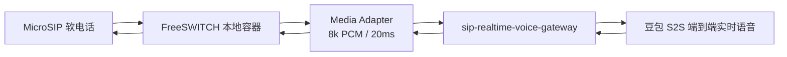
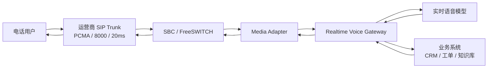
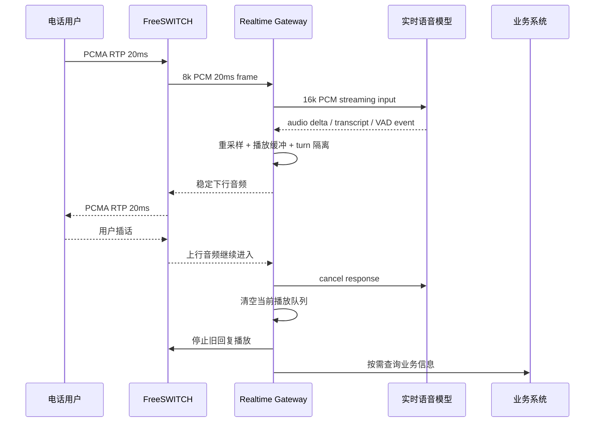
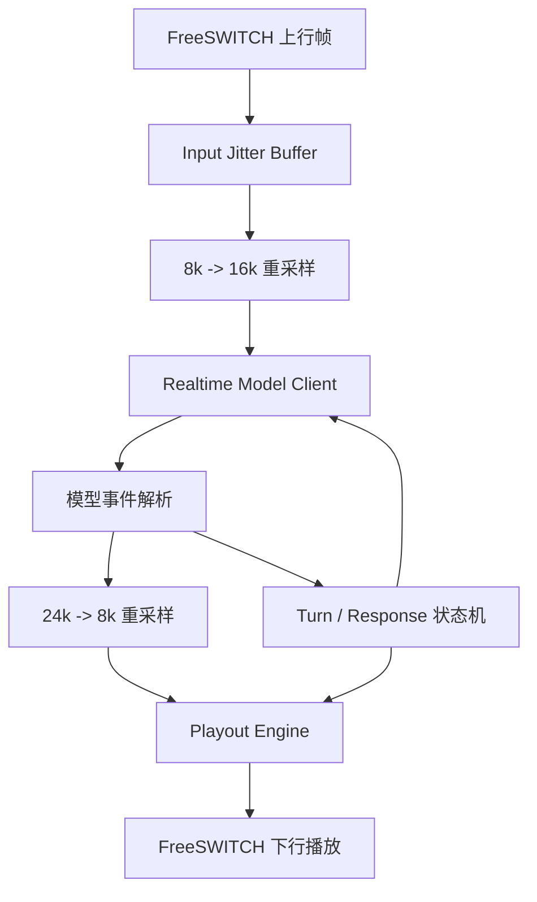
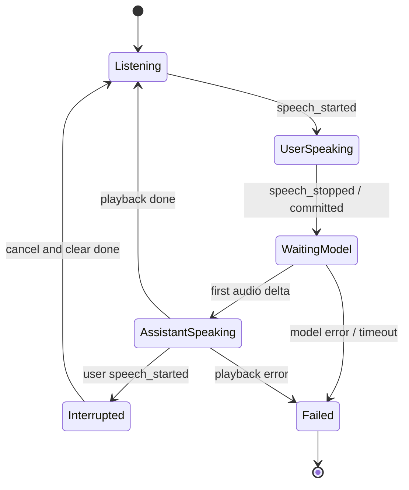

# SIP 实时语音网关最佳架构方案

## 1. 目标结论

本项目后续主路线是建设一个面向商用电话智能客服的独立实时语音网关：

```text
SIP Trunk / 本地软电话
  -> FreeSWITCH
  -> sip-realtime-voice-gateway
  -> 端到端实时语音模型
  -> sip-realtime-voice-gateway
  -> FreeSWITCH
  -> 电话用户
```

明确边界：

- 不把 TEN 旧级联链路作为实时电话主路径。
- 不保留回退到旧 ASR -> LLM -> TTS 级联实现的分支。
- 不在网关内自己实现完整 SIP/RTP 协议栈。
- FreeSWITCH 继续作为电话接入边界，负责 SIP 信令、RTP、PCMA 协商和运营商对接。
- `sip-realtime-voice-gateway` 负责实时音频桥接、模型会话、播放引擎、打断控制、会话状态和可观测性。

第一性原理判断：电话系统的核心不是“拿到模型音频就马上发出去”，而是要稳定满足电话媒体时钟。电话侧是固定节奏的实时媒体系统，模型侧是事件驱动的云端音频生成系统，二者必须通过播放引擎解耦。

## 2. 背景

已经验证过的旧链路证明了 SIP 电话可以进入本地 AI 语音链路，但旧级联结构存在根本延迟问题：

```text
电话音频
  -> 等 ASR final
  -> LLM 生成
  -> TTS 合成
  -> 电话播放
```

该结构只有在用户说完、ASR 完成、LLM 开始、TTS 出音后，电话端才听到回复。它适合验证“电话能接入 AI”，不适合作为低延迟商用客服主链路。

新的主路线使用端到端实时语音模型：

```text
电话音频持续进入模型
模型持续返回音频 delta
网关按电话媒体时钟稳定播放
用户插话时立即取消旧回复并清空播放队列
```

这样可以从结构上减少等待 ASR final、LLM 首包、TTS 首包串行相加的问题。

## 3. 总体架构

### 3.1 本地测试架构



本地测试中的 MicroSIP 只是模拟来电用户。真实上线时它会被运营商 SIP Trunk 替换，但 FreeSWITCH 到网关这一段的媒体契约应保持一致。

### 3.2 真实 SIP Trunk 架构



真实 SIP 接入主要影响 FreeSWITCH 之前的链路，例如公网 IP、防火墙、NAT、SIP ALG、运营商鉴权、DTMF、号码路由和并发限制。网关侧只要继续接收稳定的电话媒体格式，就不需要因本地软电话替换为真实 SIP Trunk 而推倒重做。

### 3.3 核心数据流



## 4. 核心原则

### 4.1 电话媒体时钟优先

电话侧是固定媒体时钟：

```text
sample_rate = 8000 Hz
packetization = 20ms
PCM frame = 160 samples * 2 bytes = 320 bytes
PCMA RTP payload = 160 bytes
```

任何模型返回的音频都不能直接决定电话播放节奏。模型音频必须先进入网关下行缓冲，再由稳定的 playout clock 发给 FreeSWITCH。

### 4.2 模型时钟和播放时钟解耦

模型返回的是事件流：

```text
response.created
response.audio.delta
response.audio_transcript.delta
response.done
input_audio_buffer.speech_started
input_audio_buffer.speech_stopped
```

这些事件的到达时间受模型负载、网络、云端调度影响，不能直接作为电话播放时钟。网关必须维护自己的播放队列和发送节奏。

### 4.3 打断是核心能力，不是附加功能

智能客服里用户插话是常态。打断必须同时完成三件事：

```text
1. cancel 当前模型 response
2. 清空网关本地播放队列
3. 停止 FreeSWITCH 侧尚未播放完成的旧音频
```

只做其中一项都不够。否则会出现用户开始说新问题后，旧回复继续播放，或者旧回复尾音混进下一轮的问题。

### 4.4 失败处理不等于回退旧实现

不保留旧 ASR -> LLM -> TTS 链路作为运行时回退。商用失败处理应是独立策略：

- 播放固定歉意提示。
- 转人工。
- 记录失败原因并结束通话。
- 对模型、网络、播放队列异常进行告警。

这类兜底不复用旧级联代码路径。

## 5. 模块设计

### 5.1 Media Adapter

职责：

- 从 FreeSWITCH 接收电话上行音频。
- 把电话媒体送入网关。
- 接收网关下行音频并回放到电话侧。
- 透传或上报播放事件、连接事件、挂机事件。

第一版可以继续使用 FreeSWITCH + `mod_audio_stream` 作为 Media Adapter，但必须按照商用媒体契约约束它：

```text
上行输入：PCM s16le / mono / 8000Hz / 20ms / 320 bytes
下行输出：PCM s16le 或 PCMA / mono / 8000Hz / 20ms
播放确认：必须能观测 chunk played / queue completed 或等价事件
打断控制：必须能停止当前播放队列
```

如果 `mod_audio_stream` 无法稳定满足播放确认和打断控制，应替换为定制 FreeSWITCH 模块或更强的媒体适配层，而不是在网关里继续堆补丁。

### 5.2 Realtime Gateway

职责：

- 管理每通电话的会话状态。
- 把 8k PCM 上行重采样到模型需要的输入采样率。
- 建立实时模型 WebSocket 会话。
- 接收模型音频 delta、文本 transcript、VAD 和 response 状态事件。
- 把模型音频转换为电话侧可播放格式。
- 管理下行播放引擎。
- 处理 barge-in。
- 输出日志、指标和测试记录。

核心内部结构：



### 5.3 Realtime Model Client

当前主模型方向已收敛为豆包 S2S 端到端实时语音。模型连接使用服务端 WebSocket，鉴权、资源 ID、音色和输出采样率以火山/豆包控制台及本地 `.env` 配置为准。

配置项必须显式化：

```text
DOUBAO_S2S_APP_ID
DOUBAO_S2S_ACCESS_TOKEN
DOUBAO_S2S_APP_KEY
DOUBAO_S2S_RESOURCE_ID
DOUBAO_S2S_WS_URL
DOUBAO_S2S_SPEAKER
DOUBAO_S2S_OUTPUT_SAMPLE_RATE
```

当前主线资源：

```text
resource_id = volc.speech.dialog
speaker = zh_female_vv_jupiter_bigtts
output_sample_rate = 24000
```

模型层只负责实时对话能力，不负责电话播放节奏。

### 5.4 Playout Engine

这是新架构最关键的模块。

输入：

```text
model_output_pcm
source_sample_rate = 24000
turn_id
response_id
timestamp
```

处理：

```text
1. 重采样到 8000Hz mono s16le
2. 切成 20ms / 320 bytes 帧
3. 写入按 turn_id 隔离的播放队列
4. 使用单独 playout clock 向 FreeSWITCH 发送
5. 在模型音频完成后 flush 残余帧，并追加 20ms 对齐的短尾部静音
6. 记录 underrun、queue depth、sent frames、dropped frames
```

尾部静音是播放层止血：它解决的是 FreeSWITCH / `mod_audio_stream` 在流片段末尾没有足够 drain 时间时吞最后几个字的问题。最终商用确认仍应以真实播放完成事件为准，即 FreeSWITCH `queue_completed` / `chunk_played`，或可上报播放完成的 media adapter。

输出：

```text
phone_output_frame
sample_rate = 8000
duration = 20ms
payload = 320 bytes PCM 或 160 bytes PCMA
```

播放引擎禁止直接用“模型 delta 到达时间”作为发送时间。它必须按自己的稳定时钟运行。

### 5.5 Turn State Machine

每一轮对话必须有独立状态。

建议字段：

```text
call_id
session_id
turn_id
response_id
caller_number
callee_number
user_speaking
assistant_speaking
model_response_active
playback_active
created_at
speech_started_at
speech_stopped_at
first_model_audio_delta_at
first_playout_frame_at
response_done_at
playback_done_at
cancelled_at
```

状态流：



旧 response 的迟到音频必须被丢弃。判断依据是 `turn_id` 和 `response_id`。

### 5.6 Barge-in Controller

打断触发来源：

- 模型 Server VAD 的 `speech_started`。
- 本地能量检测作为补充护栏。
- FreeSWITCH/Media Adapter 的上行活动事件。

触发后动作：

```text
1. 标记当前 turn interrupted
2. 调用模型 cancel response
3. 清空 Playout Engine 中当前 response 的未播放帧
4. 通知 Media Adapter 停止当前播放队列
5. 丢弃迟到的旧 response.audio.delta
6. 新建下一轮 turn
```

豆包 S2S 当前还需要额外遵守两条事件语义：

```text
1. ChatEnded / event=559 只表示文本对话结束，不等于 TTS 音频已经完整输出。
2. TTSFinished / event=359 才能作为本轮模型音频完成信号；在 559 和 359 之间仍可能继续收到尾部 TTSAudioData。
```

因此不能在 `ChatEnded` 到达时就 flush / close 当前 turn，否则会吞尾字。`ChatEnded` 的 `content` 也不能直接写入 committed history，因为它可能是结束标记或重复文本，不一定等价于真实已播报内容。

验收标准：

```text
用户开始插话后 100-300ms 内旧 AI 声音停止
不会把旧回复的后半段接到下一次回答里
不会因为打断导致会话断开
```

## 6. 数据格式

### 6.1 运营商 / SIP 侧

目标运营商已确定使用 PCMA，则真实 SIP 侧按以下格式设计：

```text
codec = PCMA / G.711 A-law
sample_rate = 8000 Hz
channels = 1
packetization = 20ms
RTP payload = 160 bytes
```

### 6.2 FreeSWITCH 到网关

推荐让 FreeSWITCH 解码后给网关 PCM：

```text
encoding = signed 16-bit PCM little-endian
sample_rate = 8000 Hz
channels = 1
frame_duration = 20ms
frame_bytes = 320 bytes
```

这样网关无需处理 RTP 序号、RTP 时间戳、乱序、丢包、PCMA 解码等电话底层问题。

### 6.3 网关到模型

实时模型输入通常使用 PCM：

```text
encoding = signed 16-bit PCM little-endian
sample_rate = 16000 Hz
channels = 1
frame_duration = 20ms or 100ms
```

是否 20ms 或 100ms 分片应以模型官方实时接口建议为准。电话输入层仍按 20ms 接收，模型发送层可以合并成更适合模型接口的 chunk。

### 6.4 模型到网关

模型输出通常为实时音频 delta：

```text
encoding = base64 PCM
sample_rate = 24000 Hz
channels = 1
event = response.audio.delta
```

网关收到后立即解码、重采样、入播放队列，但不直接按 delta 到达节奏播放。

### 6.5 网关到 FreeSWITCH

下行输出必须满足电话播放：

```text
encoding = PCM s16le 或 PCMA
sample_rate = 8000 Hz
channels = 1
frame_duration = 20ms
PCM frame_bytes = 320 bytes
PCMA payload_bytes = 160 bytes
```

如果使用 `mod_audio_stream` raw binary playback，需要遵守其播放说明：

```text
20ms chunk 不应只按 20ms 间隔裸发
需要给播放端留出缓冲余量
需要避免超过模块的 segment timeout
需要能确认播放队列 drain
```

## 7. 延迟目标

商用体验目标：

```text
用户停说 -> AI 首字出声：
  优秀：800ms - 1500ms
  可接受：1500ms - 2500ms
  需要优化：> 2500ms

用户插话 -> 旧 AI 停止：
  目标：100ms - 300ms

播放连续性：
  不允许可感知断续
  不允许吞最后一个字
  不允许旧回复混入新一轮
```

播放缓冲会增加几十到一百多毫秒，但这是必要成本。它换来的是连续播放、尾音完整和可控打断。当前重点不是压掉最后几十毫秒 buffer，而是消除结构性延迟和播放不稳定。

## 8. 可观测性

每通电话必须记录：

```text
call_id
session_id
caller_number
callee_number
model
voice
codec
sample_rate
turn_count
interrupt_count
```

每轮必须记录：

```text
turn_id
response_id
speech_started_at
speech_stopped_at
model_response_created_at
first_model_audio_delta_at
first_playout_frame_at
response_done_at
playback_done_at
cancelled_at
model_input_bytes
model_output_bytes
playout_sent_frames
playout_dropped_frames
playout_underruns
max_playout_queue_frames
```

关键判断公式：

```text
首字体感延迟 = first_playout_frame_at - speech_stopped_at
播放稳定性 = playout_underruns == 0 且 dropped_frames 符合预期
打断耗时 = old_playback_stopped_at - new_speech_started_at
尾音完整性 = response_done 后播放队列 drain 或尾部静音完整送出
```

日志中不得打印 API Key、SIP 密码、鉴权 token。

## 9. 分阶段执行计划

每个阶段都必须可测试、可验收。

### P1 媒体契约确认

目标：

- 明确 FreeSWITCH 到网关的上行格式。
- 明确网关到 FreeSWITCH 的下行格式。
- 明确本地测试和真实 SIP Trunk 的差异。
- 在代码中强制锁定 PCMA / 8000Hz / mono / 20ms 的电话媒体契约。

验收：

```text
MicroSIP -> FreeSWITCH -> Gateway -> FreeSWITCH -> MicroSIP
可以稳定回声
无断续
无明显尾音截断
```

当前代码落点：

```text
app/media_contract.py
app/config.py
app/freeswitch_media.py
app/realtime_phone_gateway.py
tests/test_media_contract.py
tests/test_freeswitch_media.py
```

自动化验证命令：

```powershell
cd sip-realtime-voice-gateway
python -m pytest tests/test_media_contract.py tests/test_freeswitch_media.py
python -m app.main --config configs/local.example.toml --check-config
```

P1 的判断标准不是模型能不能回复，而是媒体边界是否稳定明确。模型能力从 P4 开始验证。

### P2 Playout Engine 离线验证

目标：

- 独立实现播放引擎。
- 不依赖模型。
- 用本地 WAV/PCM 模拟模型输出。
- 把模型侧 24k PCM 转换为电话侧 8k / 20ms / 320 bytes 播放帧。
- 验证 `turn_id`、`response_id`、sequence、cancel 和尾部静音 drain。

验收：

```text
输入任意 24k PCM
输出稳定 8k / 20ms 帧
turn_id 隔离正确
cancel 后旧帧不再输出
尾部 drain 正确
```

当前代码落点：

```text
app/playout_engine.py
tests/test_playout_engine.py
```

自动化验证命令：

```powershell
cd sip-realtime-voice-gateway
python -m pytest tests/test_playout_engine.py
```

P2 不验证 FreeSWITCH 是否真实播完，也不验证模型实时事件。P2 只验证下行播放核心是否能稳定产出电话帧；P3 再接 FreeSWITCH 播放事件闭环。

### P3 FreeSWITCH 播放事件闭环

目标：

- 接入 Media Adapter 的播放完成事件。
- 能确认下行音频真实播放完，而不是只确认网关已发送。
- 能主动停止当前播放队列。

当前实现落点：

```text
sip-realtime-voice-gateway/app/freeswitch_event_socket.py
sip-realtime-voice-gateway/app/realtime_phone_gateway.py
sip-realtime-voice-gateway/tests/test_freeswitch_event_socket.py
sip-realtime-voice-gateway/tests/test_realtime_phone_gateway.py
ai_agents/local/freeswitch/conf/dialplan/default.xml
```

FreeSWITCH 播放事件格式：

```text
Event-Type: CUSTOM
Event-Subclass: mod_audio_stream::playback
Unique-ID: <FreeSWITCH 通话 UUID>

{"event":"chunk_played","seq":12,"size":320,"remaining":5}
{"event":"queue_completed","total_chunks":12}
```

打断控制格式：

```text
uuid_audio_stream <FreeSWITCH 通话 UUID> break
```

本地 9199 拨号计划已经把 WebSocket 路径中的 `call_id` 改为 `${uuid}`：

```text
ws://host.docker.internal:9101/media/fs/${uuid}
```

这样网关收到的 `call_id` 就是 FreeSWITCH UUID，打断时可以直接对同一通电话执行 `uuid_audio_stream <uuid> break`，不会再用固定测试名去控制播放队列。

验收：

```text
能看到 chunk played / queue completed 或等价事件
插话时 FreeSWITCH 侧旧播放停止
不会再出现最后一个字被吞
```

自动化验证命令：

```powershell
cd sip-realtime-voice-gateway
python -m pytest tests/test_freeswitch_event_socket.py tests/test_realtime_phone_gateway.py tests/test_config.py
```

当前边界：

```text
已验证：ESL 消息解析、播放事件解析、break API 命令、网关插话时触发 FreeSWITCH break。
待人工验证：Docker FreeSWITCH 重新加载拨号计划后，MicroSIP 拨 9199 时真实播放事件和真实声学打断效果。
```

本地 Docker 注意事项：

```text
网关运行在 Windows 宿主机，FreeSWITCH 运行在 Docker 容器内。
宿主机连接容器内 Event Socket 时，FreeSWITCH 看到的来源地址不是 127.0.0.1。
因此本地 event_socket.conf.xml 需要允许 rfc1918.auto，否则 18021 会返回：
Access Denied, go away.
```

当前本地配置使用专用 ACL，允许宿主机和 Docker 私网访问，同时避免只允许公网段导致容器内 `127.0.0.1` 被拒绝：

```xml
<list name="event_socket_clients" default="deny">
  <node type="allow" cidr="127.0.0.0/8"/>
  <node type="allow" cidr="10.0.0.0/8"/>
  <node type="allow" cidr="172.16.0.0/12"/>
  <node type="allow" cidr="192.168.0.0/16"/>
</list>

<param name="apply-inbound-acl" value="event_socket_clients"/>
```

修改该配置后需要重启 FreeSWITCH 容器，单纯 `reloadxml` 不一定会让 `mod_event_socket` 重新应用 ACL。

本阶段自动化验证结果：

```text
tests/test_freeswitch_event_socket.py tests/test_realtime_phone_gateway.py tests/test_config.py：9 passed
python -m pytest：50 passed
python -m app.main --config configs/local.example.toml --check-config：passed
python -m compileall app tests：passed
Docker FreeSWITCH reloadxml：+OK [Success]
```

### P4 实时模型会话

目标：

- 连接 Qwen-Omni Realtime。
- 持续送入电话音频。
- 接收模型实时音频 delta 和 VAD 事件。

验收：

```text
离线样本可得到模型音频回复
电话拨入可听到 AI 回复
首字延迟可记录
模型事件顺序可追踪
```

### P5 商用打断

目标：

- 用户插话时完整取消旧回复。
- 旧音频不能混入新问题。
- 模型上下文不能把“用户没听完的上一条回复”当成完整已说出内容。

验收：

```text
AI 正在说话时用户开口
100-300ms 内旧声音停止
新一轮回答不包含旧回复后半段
连续多轮不乱序
```

当前实现落点：

```text
sip-realtime-voice-gateway/app/realtime_phone_gateway.py
sip-realtime-voice-gateway/app/realtime_client.py
sip-realtime-voice-gateway/tests/test_realtime_phone_gateway.py
sip-realtime-voice-gateway/tests/test_realtime_client.py
```

当前已实现的商用打断动作：

```text
用户插话时：
1. 清空网关本地播放队列
2. 调用 uuid_audio_stream <uuid> break 清理 FreeSWITCH 播放队列
3. 对正在生成的模型回复调用 response.cancel
4. 将未完整播放的 pending assistant turn 标记为 abandoned，不写入 committed history
5. 关闭被污染的 Realtime 会话
6. 用网关 committed history 重建新的 Realtime 会话
7. 把最近约 0.8 秒上行电话音频和重建期间继续输入的音频重放给新会话，减少插话开头丢失
8. 记录 realtime_session_restarts / gateway_history_committed_turns / gateway_history_abandoned_turns / replayed_input_frames
```

当前豆包 S2S 的补充修正：

```text
1. 不再用 ChatEnded / 559 完成本轮，只等 TTSFinished / 359 或 SessionFinished。
2. 只把 ChatResponse 的文本写入本轮 output transcript，避免 ChatEnded 内容污染上下文。
3. 豆包插话时不继续复用已污染的同一 S2S 服务端会话，而是关闭旧会话，用网关 committed history 新建会话。
4. 新会话从 last_realtime_turn_id 继续编号，避免旧 turn 的迟到音频混入新 turn。
5. 重建期间的上行音频由 realtime_lock 串行保护，先进入重放缓冲，再统一送入新会话，避免插话开头丢失。
```

当前边界：

```text
阿里 Realtime 当前已确认可用 response.cancel 和 session.update。
尚未确认阿里是否提供与 OpenAI conversation.item.truncate 完全等价的服务端上下文截断事件。
本地实测证明，仅靠 session.update 只能降低续说概率，不能从根上删除模型服务端已经接受的上一轮完整回复。
根因是模型 response.done 可能早于电话侧 playback_done：服务端认为上一条回复已经完成，但用户实际只听到前半段。
当前实现已改为“网关托管已确认会话状态”：只有电话侧确认播完的 assistant turn 才写入 committed history；被插话打断的 pending assistant turn 会被丢弃。
如果当前供应商接口不能原位 truncate/delete 服务端上下文，网关会基于 committed history 重建实时会话，而不是依赖提示词要求模型不要续说。
如果后续官方 SDK 或原生协议暴露更强的 item truncate / delete 能力，应优先接入原生能力，但仍由网关以实际播放结果作为会话状态真相来源。
当前 FreeSWITCH 播放事件在本地日志中仍为 0，因此提交点先采用“网关下行播放队列 drain + 尾部静音”的近似确认；真实商用前仍需要修通 FreeSWITCH queue_completed 或替换为可上报播放完成的 media adapter。
```

### P5-S 供应商原生能力验证

P5 当前的重建会话方案是根因方向正确的止血方案，但不是最终商用最优形态。第一性原理上，电话智能客服的打断质量取决于三件事：

```text
1. 旧音频能不能立即停止
2. 模型服务端能不能原位取消或截断上一条未播完回复
3. 用户插话期间的上行音频能不能不中断地继续进入同一个语义会话
```

如果供应商原生协议直接支持这些能力，就不应该长期依赖“关闭旧会话 -> 重建新会话 -> 重放用户音频”的补偿方案。重建方案会引入额外连接耗时、重放耗时和短句丢失风险。

当前候选：

```text
阿里 Qwen-Omni Realtime：
- 已确认有 session.update、response.cancel、input_audio_buffer.append/commit/clear。
- 当前网关已经直接使用阿里 Realtime WebSocket 原生协议，不是只用 OpenAI 兼容接口。
- 公开文档中尚未确认有与 conversation.item.truncate/delete 完全等价的服务端上下文原位截断事件。
- dashscope OmniRealtimeConversation SDK 主要封装 connect、append_audio、cancel_response、update_session、create_response 等能力；是否有更强截断能力需要继续以官方 SDK/协议实测为准。

豆包/火山：
- 豆包端到端实时语音大模型定位为 Speech2Speech 端到端实时语音交互，官方介绍中明确面向智能客服等场景，并强调低时延、自然打断。
- 火山 RTC 实时对话式 AI 的 UpdateVoiceChat 接口存在 interrupt 指令，语义上更接近“供应商托管智能体播放和打断状态”。
- 但它很可能不是简单替换模型 URL，而是新增一个 Volc/Doubao Media Adapter：FreeSWITCH 电话音频仍由本项目接入，模型侧改成对接豆包 S2S 或火山 RTC 智能体。
```

当前业务新增约束：

```text
1. 需要接入自有业务系统，不只是闲聊。
2. AI 返回音色需要支持切换。
3. 后续真实电话仍会走 SIP / FreeSWITCH / PCMA。
```

基于这三个约束，优先级调整为：

```text
第一候选：火山硬件对话智能体标准 WebSocket 协议
原因：
- 它不是电话入口，电话入口仍由 FreeSWITCH 负责。
- 网关可以把自己模拟成“硬件设备/服务端设备”，通过标准 WebSocket 把电话音频送入智能体。
- 官方标准协议支持 input_audio_buffer.append、server_vad、response.cancel、response.audio.delta、response.audio_transcript、conversation item、Function Calling 等事件。
- 业务系统可通过 Function Calling / MCP / RAG 接入，但实际业务请求仍由网关 Business Tool Adapter 代理，避免业务系统直接暴露给模型。
- 支持状态同步和指令控制，语义上更接近商用电话智能体需要的打断、插话、状态闭环。

第二候选：豆包端到端实时语音大模型 RealtimeAPI
原因：
- 这是纯 Speech2Speech WebSocket API，服务端接入明确，适合快速验证低延迟语音体验。
- 输入要求 PCM 16k mono int16 little-endian，也支持 speech_opus；输出默认 OGG Opus，也可在 StartSession 的 TTS 配置中要求返回 24k PCM / pcm_s16le。
- 音色可在 StartSession 的 TTS 配置里指定 speaker，官方音色和克隆音色都有版本约束。
- System Prompt、人设和说话风格可配置。
- 但目前公开文档里没有像硬件智能体标准协议那样清晰的 Function Calling / MCP / RAG 闭环；如果要深度接自有业务系统，它不应作为第一候选。

第三候选：火山 RTC 房间式 AI 音视频互动方案
原因：
- RTC 本身不是电话接入层，不直接等价于 SIP / PSTN / SIP Trunk。
- 如果必须创建 RTC 房间、让一个 RTC 客户端进房，本项目需要额外实现“服务端虚拟 RTC 客户端”，复杂度高于标准 WebSocket。
- 它具备 StartVoiceChat / UpdateVoiceChat、服务端 interrupt、AI 状态、Function Calling、RAG 等能力，但仅在无法走硬件标准协议时再考虑。
- 如果只能用于 App/Web/小程序 RTC，不开放服务端/硬件/标准协议接入，就不进入当前电话主链路。

第四候选：继续阿里 Qwen-Omni Realtime
原因：
- 当前代码已接入，验证成本最低。
- 但当前最关键的原位截断 / 未播放上下文删除能力尚未确认，继续补丁式优化不应作为长期商用主路线。
```

直接判断：

```text
当前更适合的路线是：火山硬件对话智能体标准 WebSocket 协议。

原因不是它“支持电话”，而是它更适合被 sip-realtime-voice-gateway 当成服务端 AI 媒体后端：
FreeSWITCH 解决电话接入，
网关解决电话音频协议桥接，
火山标准协议智能体解决实时语音、打断、状态和业务工具调用。
```

业务系统集成原则：

```text
业务系统不要直接暴露给模型公网调用。
推荐在网关侧新增 Business Tool Adapter：
  模型/智能体发起工具调用
  -> 网关校验参数、鉴权、限流、超时
  -> 调用自有业务系统
  -> 返回结构化结果给模型/智能体

这样可以保证业务权限、日志、重试、脱敏和故障兜底都掌握在本项目里。
```

音色切换原则：

```text
支持粒度至少要到“每通电话启动时选择音色”。
如果供应商支持会话中 update voice，可以再做“通话中动态切换音色”。
商用第一版不强依赖通话中动态切换，先保证按租户、按线路、按场景配置不同音色。
```

关于“RTC 是否支持电话”的结论：

```text
RTC 不直接支持电话并不等于完全不能用。
电话侧由 FreeSWITCH 接入，RTC/智能体侧只作为 AI 媒体后端时，二者中间可以由 sip-realtime-voice-gateway 做协议桥接。

但如果 RTC 方案必须绑定移动端/Web 端 SDK，且没有服务端/硬件/标准协议接入口，就不适合当前电话项目。

因此后续验证不问“RTC 能不能接电话”，而问：
1. 能不能由服务端网关加入会话或通过标准协议送音频
2. 能不能接收 8k/16k 电话音频或 G711A/Opus
3. 能不能返回可控的实时音频
4. 能不能支持打断、状态回调、音色切换和业务工具调用
```

验证目标：

```text
1. 不重建模型连接时，能否打断旧回复
2. 打断后，新回复是否还会续说上一轮未播完尾巴
3. 用户插话期间的音频是否会丢开头
4. 首字延迟、打断停止耗时、回复完成耗时是否明显优于当前方案
5. 是否能提供真实播放完成、智能体状态或可替代 FreeSWITCH queue_completed 的事件
```

需要准备的信息：

```text
火山硬件对话智能体标准协议：
- InstanceID
- product_key
- product_secret
- bot_id
- 选定智能体的 ASR / LLM / TTS / 端到端实时语音配置
- 是否已配置 Function Calling / MCP / RAG
- 目标音色或按业务场景划分的音色策略

豆包端到端实时语音大模型：
- 火山引擎账号
- 已开通的豆包语音项目或应用
- X-Api-App-ID
- X-Api-Access-Key
- X-Api-Resource-Id
- X-Api-App-Key
- 端到端实时语音模型或资源 ID
- 音色、采样率、输入输出音频格式约束

火山 RTC 实时对话式 AI：
- RTC AppId
- Access Key / Secret Key
- RoomId / UserId / Token 生成方式
- 智能体配置方式
- 是否允许服务端网关作为一个 RTC 端加入房间
```

当前火山硬件智能体信息已经具备，且已完成最小连通验证。密钥类信息只允许放在本地 `.env` 或临时 shell 环境中，不写入代码、文档或测试产物。

官方文档入口：

```text
火山硬件对话智能体产品文档：
https://www.volcengine.com/docs/6348/1806621

火山硬件对话智能体官方 SDK 集成指引：
https://www.volcengine.com/docs/6348/1913817?lang=zh

火山边缘智能语音对话智能体 Realtime API：
https://www.volcengine.com/docs/6893/1389041

豆包端到端实时语音大模型产品简介：
https://www.volcengine.com/docs/6561/1594360

豆包端到端实时语音大模型 API 接入文档：
https://www.volcengine.com/docs/6561/1594357

火山 RTC UpdateVoiceChat 打断智能体：
https://www.volcengine.com/docs/6348/1316245

火山 RTC AI 音视频互动方案能力入口：
https://www.volcengine.com/docs/6348/1350595

阿里 Qwen-Omni-Realtime 客户端事件：
https://www.alibabacloud.com/help/en/model-studio/client-events
```

阶段结论规则：

```text
如果豆包/火山可以在同一会话内完成打断、上下文截断和连续收音：
  P5 后续应切到供应商原生能力，当前重建/重放逻辑只作为废弃前的实验依据。

如果豆包/火山仍然只能取消生成，不能控制未播完上下文：
  继续保留网关托管 committed history 的架构，并优先修通真实播放完成事件。
```

### P5-S-1 火山硬件智能体协议探针

目标：

```text
先不接电话媒体流，只验证网关服务端能否作为“硬件设备”接入火山硬件对话智能体标准 WebSocket 协议。
验证内容包括：
1. 动态注册设备
2. 生成 WebSocket 鉴权头
3. 建立智能体实时会话
4. 发送文本型 conversation.item.create
5. 接收 response.audio.delta、response.audio_transcript 和 response.done
6. 导出可播放的 PCM/WAV 测试音频
```

新增代码：

```text
sip-realtime-voice-gateway/app/volc_hardware_client.py
sip-realtime-voice-gateway/app/volc_hardware_probe.py
sip-realtime-voice-gateway/tests/test_volc_hardware_client.py
```

本阶段使用的环境变量名：

```text
VOLC_HARDWARE_INSTANCE_ID
VOLC_HARDWARE_PRODUCT_KEY
VOLC_HARDWARE_PRODUCT_SECRET
VOLC_HARDWARE_BOT_ID
VOLC_HARDWARE_DEVICE_NAME
VOLC_HARDWARE_ID
VOLC_HARDWARE_DEVICE_SECRET
```

其中 `VOLC_HARDWARE_DEVICE_SECRET` 是可选项。如果没有提供，探针会先走动态注册拿到设备密钥；如果已经有稳定设备密钥，可以直接提供它来跳过动态注册。

复测命令：

```powershell
cd sip-realtime-voice-gateway
python -m app.volc_hardware_probe `
  --output-dir artifacts/volc-hardware-probe `
  --input-text "你好，请用一句话介绍你能提供什么帮助。" `
  --timeout 45
```

本次实测结果：

```text
动态注册：通过
WebSocket 连接：通过
文本输入：通过
音频输出：通过
输出音频字节数：338496
首个 audio delta 延迟：约 2328ms
response.done 总耗时：约 11875ms
输出转写：你好！我能为你提供信息查询、学习辅导、生活建议、创意支持等多方面的即时帮助，有任何需求都可以告诉我。
```

导出的本地测试产物：

```text
sip-realtime-voice-gateway/artifacts/volc-hardware-probe/volc_hardware_output.pcm
sip-realtime-voice-gateway/artifacts/volc-hardware-probe/volc_hardware_output.wav
sip-realtime-voice-gateway/artifacts/volc-hardware-probe/volc_hardware_probe_summary.json
```

这些产物属于本地验证输出，不进入 git。

阶段结论：

```text
P5-S-1 通过。
火山硬件对话智能体标准 WebSocket 协议已经证明可由本项目服务端接入。
这一步只证明“供应商智能体协议可连通、可回音频”，还没有证明电话 8k PCM 流可以稳定接入火山智能体。
下一步应做 VolcHardwareRealtimeSession -> 电话网关媒体流适配，把 FreeSWITCH 上行 8k/20ms PCM 转成供应商要求的实时音频输入，再把供应商下行音频送入 Playout Engine。
```

### P5-S-2 火山智能体电话媒体适配

目标：

```text
把 P5-S-1 已验证的火山硬件智能体 WebSocket 会话接入电话媒体网关。
FreeSWITCH 仍负责 SIP/RTP/PCMA。
sip-realtime-voice-gateway 负责把 8k/20ms PCM 上行重采样到 16k PCM 发给火山智能体，
再把火山智能体返回的 24k PCM audio delta 送入现有 Playout Engine，稳定转成 8k/20ms 电话帧。
```

新增代码：

```text
sip-realtime-voice-gateway/app/volc_hardware_realtime.py
```

接入方式：

```text
realtime.provider = "volc_hardware"
media-mode = realtime
```

本阶段的关键实现规则：

```text
1. 启动火山会话后发送 session.update，声明 16k PCM 输入、24k PCM 输出和 server_vad。
2. 电话上行仍按 8k/20ms/320 bytes 接收，再重采样成 16k PCM 发给火山。
3. 火山返回 input_audio_buffer.speech_started 时，沿用现有网关打断流程。
4. 火山返回 input_audio_buffer.committed 后，网关主动发送 response.create。
   原因是 Realtime API 的 commit 只提交音频，不等于生成回复。
5. 火山返回 response.audio.delta 后，继续复用现有 Playout Engine 下行播放链路。
6. 火山打断优先走同一会话内 response.cancel，不走“关闭旧会话 -> 新建会话 -> 重放音频”的阿里补偿路径。
```

本地 `.env` 需要提供：

```text
REALTIME_MODEL_PROVIDER=volc_hardware
VOLC_HARDWARE_INSTANCE_ID=
VOLC_HARDWARE_PRODUCT_KEY=
VOLC_HARDWARE_PRODUCT_SECRET=
VOLC_HARDWARE_BOT_ID=
```

可选项：

```text
VOLC_HARDWARE_DEVICE_NAME=sip_gateway_local
VOLC_HARDWARE_ID=sip_gateway_local
VOLC_HARDWARE_DEVICE_SECRET=
VOLC_HARDWARE_OUTPUT_SAMPLE_RATE=24000
```

启动命令：

```powershell
cd sip-realtime-voice-gateway
python -m app.main `
  --config configs/local.example.toml `
  --env-file ../ai_agents/.env `
  --media-mode realtime
```

9199 实测要观察：

```text
用户停止说话 -> AI 首个下行音频耗时
AI 回复是否连续
尾字是否完整
用户插话 -> 旧声音停止耗时
插话后第二轮是否还带上一轮未播完内容
日志里的 first_audio_delta_ms / response_done_ms / playback_underruns / interruptions
```

本阶段自动化验证结果：

```text
tests/test_volc_hardware_client.py：7 passed
tests/test_volc_hardware_realtime.py：2 passed
tests/test_realtime_phone_gateway.py：2 passed
tests/test_config.py：4 passed
python -m compileall app tests：passed
```

自动化验证命令：

```powershell
cd sip-realtime-voice-gateway
python -m pytest tests/test_realtime_client.py tests/test_realtime_phone_gateway.py
```

本阶段自动化验证结果：

```text
tests/test_freeswitch_event_socket.py tests/test_realtime_phone_gateway.py tests/test_realtime_client.py：13 passed
tests/test_volc_hardware_client.py：7 passed
python -m pytest：58 passed
python -m app.main --config configs/local.example.toml --check-config：passed
python -m compileall app tests：passed
本地 FreeSWITCH 重启后，宿主机 127.0.0.1:18021 返回 auth/request，容器内 fs_cli status 正常。
```

### P6 真实 SIP Trunk 预上线验证

目标：

- 接入运营商 SIP Trunk。
- 验证 PCMA、DTMF、挂机、忙音、超时、并发。

验收：

```text
真实手机拨入可完成多轮对话
PCMA 协商稳定
RTP 无明显丢包和抖动问题
并发测试达到目标路数
异常时能转人工或播放固定兜底语
```

### P7 生产护栏

目标：

- 指标、告警、录音、追踪、失败处理完整。

验收：

```text
每通电话可追踪
每轮耗时可定位
模型异常可告警
播放异常可告警
日志无敏感信息
```

## 10. 当前代码状态说明

当前 `sip-realtime-voice-gateway/` 已完成主线 P1、P2、P3 以及豆包 S2S 电话媒体接入验证：

```text
P1：电话侧媒体契约固定为 PCMA / 8k / mono / 20ms，网关侧固定 320 bytes PCM 帧。
P2：独立 Playout Engine 可把模型侧 24k PCM 稳定转为 8k / 20ms / 320 bytes 播放帧，并支持 turn/response 隔离、cancel 和尾部 drain。
P3：新增 FreeSWITCH Event Socket 适配，支持解析 mod_audio_stream 播放事件，并在插话时调用 uuid_audio_stream <uuid> break 清理 FreeSWITCH 播放队列。
```

目录内不再保留阿里 Realtime 和火山硬件智能体试验线作为运行时路径。保留本地 echo、媒体契约、Playout Engine、FreeSWITCH Event Socket、豆包 S2S 探针和豆包 S2S 电话媒体适配。

后续目标不是兼容所有旧路径，而是收敛到本方案描述的商用实时媒体内核：

```text
FreeSWITCH 电话边界
  -> Gateway 会话状态机
  -> Realtime Model Client
  -> Playout Engine
  -> Barge-in Controller
  -> Observability
```

后续修改时，不再新增阿里或火山硬件分支作为回退；如果要重新评估其他供应商，应作为独立分支或独立探针项目处理，不能污染当前生产主线。

## 11. 配置建议

建议环境变量：

```text
DOUBAO_S2S_APP_ID=
DOUBAO_S2S_ACCESS_TOKEN=
DOUBAO_S2S_APP_KEY=
DOUBAO_S2S_RESOURCE_ID=volc.speech.dialog
DOUBAO_S2S_WS_URL=wss://openspeech.bytedance.com/api/v3/realtime/dialogue
DOUBAO_S2S_SPEAKER=zh_female_vv_jupiter_bigtts
DOUBAO_S2S_OUTPUT_SAMPLE_RATE=24000

FREESWITCH_MEDIA_HOST=0.0.0.0
FREESWITCH_MEDIA_PORT=9101
FREESWITCH_SAMPLE_RATE=8000
FREESWITCH_FRAME_DURATION_MS=20
FREESWITCH_ESL_ENABLED=true
FREESWITCH_ESL_HOST=127.0.0.1
FREESWITCH_ESL_PORT=18021
FREESWITCH_ESL_PASSWORD=ClueCon
FREESWITCH_ESL_PASSWORD_ENV=FREESWITCH_ESL_PASSWORD

PLAYOUT_INITIAL_BUFFER_MS=100
PLAYOUT_MAX_BUFFER_MS=500
PLAYOUT_TAIL_SILENCE_MS=300
PLAYOUT_UNDERRUN_WARN_THRESHOLD=1

BARGE_IN_ENABLED=true
BARGE_IN_STOP_TARGET_MS=300
```

`.env` 只保存在本地，不提交 git。

## 12. 风险和注意事项

- 本地 MicroSIP 测通不等于真实 SIP Trunk 一定稳定，真实链路还要验证 NAT、防火墙、RTP 抖动、运营商侧超时和并发。
- PCMA 已确定后，应尽量固定电话侧 codec，减少上线时的重采样和转码不确定性。
- `mod_audio_stream` 可以用于阶段验证，但双向播放、播放确认、并发授权和稳定性必须单独确认。
- 不应继续用“模型 delta 到了就 sleep 20ms 发一帧”的方式作为商用播放核心。
- 打断必须贯穿模型、网关播放队列和 FreeSWITCH 播放队列三层。
- 业务工具调用会引入额外延迟，应与实时音频播放解耦，必要时先口头确认“我帮您查一下”再执行慢查询。

## 13. 参考资料

- 阿里云百炼 Qwen Realtime 文档：https://help.aliyun.com/zh/model-studio/realtime
- FreeSWITCH Event Socket 文档：https://developer.signalwire.com/freeswitch/FreeSWITCH-Explained/Client-and-Developer-Interfaces/Event-Socket-Library/
- FreeSWITCH JitterBuffer 文档：https://developer.signalwire.com/freeswitch/FreeSWITCH-Explained/Codecs-and-Media/JitterBuffer_6587407/
- 本地 `mod_audio_stream` 说明：`ai_agents/local/mod_audio_stream_pkg/README.playback.md`

## 14. 豆包 S2S 端到端实时语音探针

### 14.1 为什么新增这条链路

火山硬件智能体标准 WebSocket 已经证明“端到端智能体可以被电话网关调用”，但 9199 实测存在明显下行断续。日志显示首个音频返回不算慢，主要问题在于下行音频 delta 的节奏不适合电话侧固定 20ms 播放时钟。

因此下一步不再继续把火山硬件智能体作为最终媒体主链路，而是验证豆包端到端实时语音大模型的服务端 S2S WebSocket API。

目标链路：

```text
FreeSWITCH / SIP Trunk
  -> sip-realtime-voice-gateway
  -> 豆包 S2S 端到端实时语音 WebSocket
  -> sip-realtime-voice-gateway
  -> FreeSWITCH / SIP Trunk
```

这条链路仍然不自己实现 SIP/RTP 协议栈。SIP/RTP 由 FreeSWITCH 承担，网关只负责电话媒体帧与模型实时事件之间的转换。

### 14.2 版本和音色选择

优先验证 O2.0 / S2S 端到端实时语音方向。

当前默认音色：

```text
zh_female_vv_jupiter_bigtts
```

选择原因：

```text
O/O2.0 更偏低延迟助手、客服、外呼场景。
SC/SC2.0 更偏强人格、陪伴、角色和声音复刻，不是当前 AI 外呼主链路优先项。
```

### 14.3 当前新增代码

```text
sip-realtime-voice-gateway/app/doubao_s2s_client.py
sip-realtime-voice-gateway/app/doubao_s2s_probe.py
sip-realtime-voice-gateway/tests/test_doubao_s2s_client.py
```

`doubao_s2s_client.py` 负责：

```text
1. 构造 WebSocket 鉴权 Header。
2. 构造 StartConnection / StartSession / Audio / UserText 事件帧。
3. 解析服务端二进制事件帧。
4. 收集 TTS 音频、ASR 文本、Chat 文本和耗时指标。
```

`doubao_s2s_probe.py` 负责：

```text
1. 从本地 git-ignored .env 读取凭证。
2. 支持文本探针。
3. 支持本地 WAV 音频探针。
4. 输出 pcm、wav 和 summary.json。
```

### 14.4 数据格式

网关到豆包 S2S 输入：

```text
encoding = PCM signed 16-bit little-endian
sample_rate = 16000 Hz
channels = 1
event = 200 / TaskAudio
```

豆包 S2S 到网关输出：

```text
encoding = PCM float32 little-endian
sample_rate = 24000 Hz
channels = 1
event = 352 / TTSAudioData
```

电话侧仍保持：

```text
codec = PCMA / G.711 A-law
sample_rate = 8000 Hz
channels = 1
frame_duration = 20ms
pcm_frame_bytes = 320 bytes
```

因此电话接入后的转换关系会变成：

```text
上行：8k PCM -> 16k PCM -> 豆包 S2S
下行：豆包 S2S 24k float32 PCM -> 16-bit PCM -> 8k PCM -> FreeSWITCH
```

注意：这里是基于 9199 实测修正后的结论。最初误按 16k int16 处理会导致电流声、语速变慢和音高变低。

### 14.5 本地环境变量

必填：

```text
DOUBAO_S2S_APP_ID=
DOUBAO_S2S_ACCESS_TOKEN=
```

可选：

```text
DOUBAO_S2S_APP_KEY=官方实时语音固定 App-Key，通常不用覆盖
DOUBAO_S2S_RESOURCE_ID=volc.speech.dialog
DOUBAO_S2S_WS_URL=wss://openspeech.bytedance.com/api/v3/realtime/dialogue
DOUBAO_S2S_SPEAKER=zh_female_vv_jupiter_bigtts
DOUBAO_S2S_OUTPUT_SAMPLE_RATE=24000
```

注意：这些凭证只能写入本地 `ai_agents/.env`，不能提交 git，也不能写入文档正文。

Header 映射结论：

```text
X-Api-App-ID      -> 控制台 APP ID
X-Api-Access-Key -> 控制台 Access Key / Access Token
X-Api-Resource-Id -> volc.speech.dialog
X-Api-App-Key    -> 端到端实时语音服务固定 App-Key，不是控制台 Secret Key
```

本次 401 根因不是二进制协议，也不是音频格式，而是最初填入的 Access Key / Secret Key 字符不一致；修正 Access Key 后，握手通过。随后服务端明确返回 `X-Api-App-Key` 期望固定实时语音 App-Key，因此不能把 Secret Key 当成 `X-Api-App-Key`。

### 14.6 探针命令

文本探针：

```powershell
cd sip-realtime-voice-gateway
python -m app.doubao_s2s_probe `
  --env-file ../ai_agents/.env `
  --output-dir artifacts/doubao-s2s-probe `
  --text "请用一句话介绍你自己。"
```

音频探针：

```powershell
cd sip-realtime-voice-gateway
python -m app.doubao_s2s_probe `
  --env-file ../ai_agents/.env `
  --output-dir artifacts/doubao-s2s-probe `
  --wav "C:\Users\Tzk00\Downloads\语音标签示例1.wav"
```

输出：

```text
artifacts/doubao-s2s-probe/doubao_s2s_<mode>_output.pcm
artifacts/doubao-s2s-probe/doubao_s2s_<mode>_output.wav
artifacts/doubao-s2s-probe/doubao_s2s_<mode>_summary.json
```

summary 重点看：

```text
first_audio_delta_ms
response_done_ms
output_audio_bytes
input_transcript
output_transcript
event_counts
```

### 14.7 当前验证结果

已通过本地假 WebSocket 自动化验证：

```text
python -m pytest
结果：72 passed

python -m compileall app tests
结果：passed
```

这说明协议封装、事件解析、音色进入 StartSession、配置加载，以及当前网关主线测试没有明显代码级问题。

真实豆包 S2S 联网探针也已通过：文本输入和本地 WAV 音频输入都能返回文本与 PCM/WAV 音频。9199 电话媒体链路已经切到豆包 S2S 并完成多轮人工测试；当前重点不再是“能否接通”，而是复测尾字完整性、插话后上下文是否干净、连续多轮是否仍提前断音。

### 14.8 真实联网探针结果

2026-05-10 已把控制台提供的豆包 S2S 凭证写入本地 `ai_agents/.env`，并补齐：

```text
DOUBAO_S2S_APP_ID
DOUBAO_S2S_ACCESS_TOKEN
DOUBAO_S2S_SECRET_KEY
DOUBAO_S2S_APP_KEY
DOUBAO_S2S_RESOURCE_ID
DOUBAO_S2S_WS_URL
DOUBAO_S2S_SPEAKER
DOUBAO_S2S_OUTPUT_SAMPLE_RATE
```

真实文本探针命令：

```powershell
cd sip-realtime-voice-gateway
python -m app.doubao_s2s_probe `
  --env-file ../ai_agents/.env `
  --output-dir artifacts/doubao-s2s-probe `
  --text "请用一句话介绍你自己。"
```

历史第一次结果：

```text
Doubao S2S probe failed: Doubao S2S websocket handshake failed: HTTP 401
```

当时判断：

```text
1. 失败发生在 WebSocket 握手阶段。
2. 还没有进入 StartConnection / StartSession / 音频事件阶段。
3. 因此当前不是音频格式、音色、二进制帧或电话链路问题。
4. 根因更可能是凭证、服务权限、接口版本权限或控制台复制值不匹配。
```

后来确认的根因：

```text
1. 最初复制的 Access Key / Secret Key 字符存在差异。
2. 曾误把控制台 Secret Key 当成 X-Api-App-Key。
3. X-Api-App-Key 必须使用端到端实时语音服务固定 App-Key，不是控制台 Secret Key。
```

修正凭证和 App-Key 后，真实探针已通过。

文本探针结果：

```text
input_text = 请用一句话介绍你自己。
speaker = zh_female_vv_jupiter_bigtts
output_audio_bytes = 195568
output_transcript = 我叫豆包，我懂得很多知识，非常喜欢聊天呢。
first_audio_delta_ms = 562
response_done_ms = 1469
output_sample_rate = 24000
```

音频探针结果：

```text
input_wav = C:\Users\Tzk00\Downloads\语音标签示例1.wav
input_audio_bytes = 336000
input_transcript = 可当他的手触碰到对方的身体时，却感觉一阵冰冷僵硬，那触感不像是活人，更像是尸体。
output_audio_bytes = 215730
output_transcript = 我的妈呀！这也太吓人了！后来怎么样啦？
first_audio_delta_ms = 16828
response_done_ms = 16828
output_sample_rate = 24000
```

音频探针的 `first_audio_delta_ms=16828` 不能直接等同于电话场景延迟，因为该 WAV 是按实时 20ms chunk 发送，且等待了服务端 VAD 结束；它证明的是“音频输入 -> ASR -> 对话 -> TTS 音频输出”链路可用。真正电话延迟要在 9199 媒体链路切换到 Doubao S2S 后重新测。

### 14.9 豆包 S2S 电话媒体接入

本阶段把豆包 S2S 从探针脚本接入 9199 电话媒体热路径。

新增代码：

```text
sip-realtime-voice-gateway/app/doubao_s2s_realtime.py
sip-realtime-voice-gateway/tests/test_doubao_s2s_realtime.py
```

主链路：

```text
MicroSIP / SIP Trunk
  -> FreeSWITCH
  -> 8k / 20ms / 320 bytes PCM
  -> sip-realtime-voice-gateway
  -> 16k PCM TaskAudio
  -> 豆包 S2S
  -> 24k float32 PCM TTSAudioData
  -> float32 转 int16
  -> Playout Engine
  -> 8k / 20ms / 320 bytes PCM
  -> FreeSWITCH
  -> 电话用户
```

配置入口：

```text
REALTIME_MODEL_PROVIDER=doubao_s2s
```

本地 `ai_agents/.env` 已切到 `doubao_s2s`。该文件只保存本机测试凭证，不提交 git。

本阶段实现边界：

```text
1. DoubaoS2SServerVadSession 负责把豆包 ASR / Chat / TTS 事件映射成网关内部 turn。
2. 网关上行仍固定 8k -> 16k。
3. 最新 9199 实测证明豆包下行是 24k float32 PCM；网关先转 int16，再按 24k -> 8k 播放。
4. 当前不再把豆包下行错误当成 16k int16 PCM，否则会出现电流声、语速变慢和音高变低。
5. 插话时先清理网关播放队列，并通过 FreeSWITCH Event Socket 调用 `uuid_audio_stream <uuid> break` 清理 FreeSWITCH 播放队列，避免旧回复残留继续播放。
```

自动化和本地烟测：

```text
python -m pytest：72 passed
python -m compileall app tests：passed

模拟 FreeSWITCH WebSocket 烟测：通过
provider = doubao_s2s
输入 = 本地 WAV 按 8k / 20ms 电话帧送入网关
输出 = 豆包 S2S 24k float32 下行经 Playout Engine 转为 8k 播放帧
turns_started = 1
turns_completed = 1
playback_underruns = 0
```

烟测里的首个播放帧耗时包含整段 WAV 按真实时间发送的时长，因此只能证明“电话网关媒体路径可通”，不能代替 9199 真实说话体感。

人工验证命令：

```powershell
cd sip-realtime-voice-gateway
python -m app.main `
  --config configs/local.example.toml `
  --env-file ../ai_agents/.env `
  --media-mode realtime
```

9199 实测重点：

```text
1. 是否能听到豆包 AI 回复。
2. 首个可听声音大约多久出现。
3. 是否仍有明显断续。
4. 尾字是否完整。
5. 插话后旧声音是否停止。
6. 第二轮回复是否混入上一轮未播完内容。
```

### 14.10 9199 实测后的根因修复

最近一轮 9199 人工测试暴露两个现象：

```text
1. 多轮后 AI 回复越往后越容易没说完就停止。
2. 用户插话后，下一轮回复仍可能带出上一轮未播完的尾部内容。
```

日志中的关键证据是每轮都出现 `event_counts` 包含 `559`，但没有 `359`。这说明适配器把 `ChatEnded / 559` 误当成了音频完成，而豆包在 559 之后仍可能继续发送尾部 `TTSAudioData / 352`，最终才发送 `TTSFinished / 359`。从电话播放第一性原理看，文本结束不等于音频播放素材结束；用文本结束驱动播放完成必然有概率吞最后一个字。

本次修复：

```text
1. DoubaoS2SServerVadSession 只在 TTSFinished / 359 或 SessionFinished 时完成 turn。
2. ChatEnded / 559 只记录事件计数，不触发 turn 完成。
3. ChatEnded 的 content 不进入 output transcript，避免把结束标记或重复文本写入会话历史。
4. 插话时豆包 S2S 会话按 committed history 重建，不把未完整播放的 pending assistant turn 带入新会话。
5. 重建期间继续到达的上行音频受 realtime_lock 保护，避免因为重连窗口丢掉用户插话开头。
```

自动化验证：

```powershell
cd sip-realtime-voice-gateway
python -m pytest
python -m compileall app tests
```

当前结果：

```text
72 passed
compileall passed
```

待人工复测：

```text
1. 拨 9199，确认尾字是否完整。
2. AI 正在说话时插话，确认旧声音是否停止。
3. 插话后的第二轮回复是否还带上一轮未播完内容。
4. 连续多轮后是否仍会出现“越往后回答越不完整”。
```
### 14.11 打断后直接回复验证通过

2026-05-10 最新 9199 人工复测结论：

```text
听感：打断后旧声音能停止，AI 能直接回复，不需要用户重复问一遍。
结论：打断后音频回放修复通过。
```

本次根因不是删除旧链路导致，而是豆包 S2S 热重启分支漏掉了“把插话期间缓存的上行音频重新送入新会话”。修复前日志表现为：

```text
realtime_phone_server_vad_speech_started_used_for_interrupt
freeswitch_playback_break_requested success=True
doubao_s2s_hot_session_restarted elapsed_ms=108/109
replayed_input_frames=0
replayed_input_bytes=0
```

这说明打断识别、旧播放停止和豆包热重启都成功，但用户插话音频没有进入热重启后的豆包会话，所以 AI 有时不回复，必须再问一遍。

本次修复后的关键日志：

```text
realtime_interruption_audio_replayed replayed_input_frames=46 replayed_input_bytes=29440
turn=6 input_transcript=你喜欢什么？
turn=6 output_transcript=我喜欢好多东西呢，你呢？
```

会话汇总：

```text
interruptions=1
dropped_playback_frames=138
dropped_stale_frames=0
playback_underruns=1
max_playback_send_gap_ms=155
playback_send_gap_overruns=13
freeswitch_break_requests=1
freeswitch_break_failures=0
realtime_interrupt_requests=1
realtime_interrupt_failures=0
context_repair_requests=1
gateway_history_committed_turns=5
gateway_history_abandoned_turns=1
replayed_input_frames=46
replayed_input_bytes=29440
turns_started=6
turns_completed=6
turns_failed=0
```

当前实现语义：

```text
1. 用户插话时，网关先停止本地播放队列。
2. 通过 FreeSWITCH Event Socket 调用 uuid_audio_stream <uuid> break，停止 FreeSWITCH 侧旧播放。
3. 豆包 S2S 执行热重启，隔离旧回复上下文。
4. 打断期间缓存的上行 16k PCM 会重新 append_audio 到热重启后的豆包会话。
5. 被打断的 assistant turn 进入 abandoned，不写入 committed history。
6. 用户完整听完的 assistant turn 才进入 committed history。
```

需要特别说明：这是对“打断后 AI 有时不回复”的根因修复，也是商用打断闭环的一部分，但还不是最终商用媒体架构的全部。

仍需进入下一阶段处理：

```text
1. FreeSWITCH queue_completed / chunk_played 仍为 0。
2. 当前 committed history 仍主要依赖网关下行队列 drain + 尾部静音近似判断播放完成。
3. playback_underruns=1、playback_send_gap_overruns=13 表示播放调度还存在偶发间隔，需要继续量化。
4. 商用前应修通真实播放完成事件，或替换为能上报真实播放完成的 media adapter。
```

下一阶段建议命名：

```text
P6 播放完成确认与媒体状态机
```

验收标准：

```text
1. 每个 assistant turn 都能明确区分 queued / playing / completed / interrupted / abandoned。
2. completed 必须由真实播放完成事件或可证明等价的媒体 adapter 事件驱动。
3. interrupted turn 不进入 committed history。
4. queue_completed 缺失时必须有清晰降级策略和日志告警。
5. 9199 多轮测试中尾字完整、插话直接回复、旧回复不串入新回复。
```
