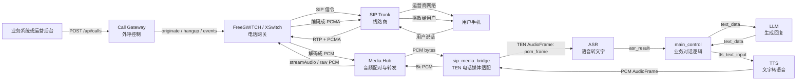
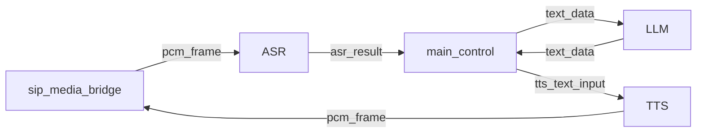

# TEN 电话线路接入学习笔记

## 1. 一句话理解

TEN 不应该直接接 SIP 电话线路。更合理的架构是：

```text
电话线路由 FreeSWITCH / XSwitch / Asterisk 负责
AI 实时对话由 TEN 负责
中间用媒体桥把电话音频转换成 TEN 能处理的 AudioFrame
```

核心边界：

```text
SIP/RTP/PCMA 世界：电话网关负责
PCM/TEN AudioFrame 世界：媒体桥负责
ASR/LLM/TTS 世界：TEN graph 负责
外呼生命周期：Call Gateway 负责
```

## 2. 总链路图



## 3. 关键名词

### SIP

SIP 是电话信令协议，负责“电话怎么建立和结束”。

它处理的问题：

```text
拨号
振铃
接通
挂断
协商音频编码
```

SIP 本身不传真正的声音，真正的声音通常走 RTP。

### SIP Trunk

SIP Trunk 是线路商提供的公网电话线路能力。

它让系统可以通过互联网协议呼叫真实手机号。

常见能力：

```text
外呼手机号
呼入号码
并发线路
主叫号码
IP 白名单
语音编码协商
```

### RTP

RTP 是通话中真正传音频包的协议。

可以理解成：

```text
SIP 负责打电话
RTP 负责传声音
```

### Codec

Codec 是音频编码格式。电话线路中不会直接传大块原始音频，通常会先编码。

常见电话 codec：

```text
PCMA / G.711 A-law
PCMU / G.711 u-law
Opus
G.729
```

### PCMA

PCMA 也叫 G.711 A-law，是传统电话网常见音频编码。

常见参数：

```text
8 kHz
mono
8 bit
64 kbps
```

它适合电话线路传输，但不适合直接给 AI 模型处理。

### PCM

PCM 是原始数字音频波形。

它不是 mp3、wav、PCMA、Opus，而是一串采样点。

给 AI 使用时常见格式：

```text
signed 16-bit PCM
8 kHz 或 16 kHz
mono
little-endian
```

以 8k、16-bit、mono 为例：

```text
1 秒音频 = 8000 个采样点 * 2 字节 = 16000 bytes
20ms 音频 = 320 bytes
40ms 音频 = 640 bytes
```

### 采样率、位深和 320 bytes 的含义

`8k PCM -> 16k PCM -> 8k PCM` 里的 `8k` 和 `16k` 指的是采样率，不是 8 bit / 16 bit。

采样率表示每秒取多少个声音样本：

```text
8kHz  = 每秒 8000 个采样点
16kHz = 每秒 16000 个采样点
24kHz = 每秒 24000 个采样点
```

它主要影响：

```text
可表达的最高声音频率
每秒音频数据量
模型或电话网关是否能正确识别格式
错误解释时的语速和音调
```

从第一性原理看，数字音频就是连续声音波形的离散采样。采样率越高，每秒记录的点越密，能表达的高频越多，数据量也越大。电话语音常用 8kHz，因为电话人声主要关注可懂度；很多 AI ASR / 实时语音模型更偏好 16kHz 或更高，因为它能保留更多语音细节。

但采样率高不等于一定更好。电话侧本来就是 8kHz 时，把它上采样到 16kHz 只是为了满足模型输入格式，不会凭空恢复已经不存在的高频细节。

`16-bit PCM` 里的 `16-bit` 指的是位深，也就是每个采样点用多少 bit 表示振幅：

```text
16-bit = 每个采样点 2 bytes
mono   = 1 个声道
```

所以 8kHz、16-bit、mono 的 20ms PCM 帧大小是：

```text
8000 samples/s * 0.02 s * 2 bytes * 1 channel = 320 bytes
```

16kHz、16-bit、mono 的 20ms PCM 帧大小是：

```text
16000 samples/s * 0.02 s * 2 bytes * 1 channel = 640 bytes
```

24kHz、16-bit、mono 的 20ms PCM 帧大小是：

```text
24000 samples/s * 0.02 s * 2 bytes * 1 channel = 960 bytes
```

`320 bytes in / 320 bytes out` 表示当前电话侧媒体帧是 8kHz、16-bit、mono、20ms，网关收到一帧 320 bytes，也回给 FreeSWITCH 一帧 320 bytes。这说明下行仍然符合电话侧播放节奏。

如果 320 bytes 变大或变小，影响取决于原因：

```text
同样 8kHz / 16-bit / mono 下：
160 bytes = 10ms 音频，包更频繁，调度开销更高，但理论延迟更低
320 bytes = 20ms 音频，电话系统常用，延迟和稳定性比较平衡
640 bytes = 40ms 音频，包更少，但每包自带更高播放等待时间
```

如果 FreeSWITCH 期望 20ms / 320 bytes，但网关乱发更大或更小的 PCM 块，常见问题是：

```text
播放节奏抖动
声音断续或卡顿
延迟增大
缓冲区堆积
音频被截断或拼接异常
某些媒体模块直接丢帧或报警
```

更严重的是“采样率解释错”。例如把 16kHz PCM 当成 8kHz 播放，声音会变慢、音调变低；把 8kHz PCM 当成 16kHz 播放，声音会变快、音调变高。

电话线上的 PCMA 不是 320 bytes。PCMA 是 G.711 A-law 压缩后的 8-bit 编码：

```text
PCMA 8kHz 20ms = 160 samples * 1 byte = 160 bytes
PCM  8kHz 20ms = 160 samples * 2 bytes = 320 bytes
```

当前本地链路里，FreeSWITCH / `mod_audio_stream` 已经把电话侧 PCMA 解码成 8k PCM 给网关，所以网关看到的是 320 bytes 的 PCM 帧，而不是 160 bytes 的 PCMA 包。

PCMA 和 PCM 的关系：

```text
电话线路传输：PCMA
FreeSWITCH 解码后：PCM
TEN 处理：PCM
FreeSWITCH 发回电话前：PCMA
```

### TEN AudioFrame

TEN AudioFrame 是 TEN 内部传递音频的标准“信封”。

PCM 是内容，AudioFrame 是包装。

示意：

```text
AudioFrame {
  name: "pcm_frame",
  sample_rate: 8000,
  channels: 1,
  bytes_per_sample: 2,
  samples_per_channel: 160,
  buffer: <PCM bytes>
}
```

它的作用是告诉 TEN：

```text
这是一段音频
名字叫 pcm_frame
采样率是多少
几个声道
每个采样点几个字节
音频数据在哪
应该通过 graph 发给哪个 extension
```

### TEN Graph

TEN Graph 是 TEN 的编排配置，定义哪些 extension 参与工作，以及消息如何流动。

电话场景下，一个简化 graph 是：



原来的 RTC 入口一般是 `agora_rtc`，电话场景要把入口换成 `sip_media_bridge`。

## 4. 各模块职责

### SIP Trunk

职责：

```text
提供真实电话线路
把电话打到手机号
提供并发线路
处理运营商侧路由
```

不负责：

```text
AI 对话
ASR / LLM / TTS
业务逻辑
```

### FreeSWITCH

FreeSWITCH 是电话网关。

职责：

```text
接 SIP trunk
拨号
接通
挂断
处理 SIP 信令
处理 RTP 音频
把 PCMA 解码成 PCM
把 PCM 编码回 PCMA
```

不负责：

```text
物业费业务逻辑
LLM 生成回复
用户意图判断
```

### XSwitch

XSwitch 可以理解为 FreeSWITCH 体系的产品化平台。

它可能替代：

```text
裸 FreeSWITCH 配置
部分呼叫控制
部分路由和管理后台
部分线路管理
```

但如果还要用 TEN 做实时 AI，仍然要确认：

```text
能否开放双向实时音频流
能否输出 8k PCM 或可转换音频
能否拿到接通 / 挂断 / 失败事件
能否配合 call_id 做会话隔离
```

### Call Gateway

Call Gateway 是外呼控制服务。

一句话：

```text
Call Gateway 管一通电话从创建到结束的生命周期
```

职责：

```text
提供 POST /api/calls
生成 call_id
生成 FreeSWITCH 通话 uuid
控制最大并发
调用 TEN /start
调用 FreeSWITCH / XSwitch 发起外呼
监听接通、忙线、拒接、挂断事件
接通后启动媒体流
通话结束后调用 TEN /stop
释放并发名额
```

不负责：

```text
音频转发
ASR / LLM / TTS
SIP/RTP 底层处理
```

### Media Hub

Media Hub 是音频配对和转发层。

职责：

```text
接收 FreeSWITCH 的音频 WebSocket
接收 TEN 侧 sip_media_bridge 的 WebSocket
按 call_id 配对两边连接
转发上行 PCM 到 TEN
转发下行 PCM 到 FreeSWITCH
防止多通电话串线
```

不负责：

```text
打电话
挂电话
业务话术
模型调用
```

### sip_media_bridge

`sip_media_bridge` 是 TEN 内部的电话媒体适配 extension。

上行职责：

```text
从 Media Hub 收 PCM bytes
创建 TEN AudioFrame("pcm_frame")
设置 sample_rate、channels、bytes_per_sample 等元数据
发送给 ASR
```

下行职责：

```text
接收 TTS 输出的 AudioFrame("pcm_frame")
取出 PCM bytes
必要时把 16k 降采样到 8k
发回 Media Hub
```

它只做媒体适配，不做业务逻辑。

### main_control

`main_control` 是业务对话控制层。

职责：

```text
接收 ASR 文本
维护对话状态
决定何时问身份
决定何时说明欠费
决定何时调用 LLM
决定何时发 TTS
决定何时结束通话
生成通话结果摘要
```

不负责：

```text
SIP 线路
RTP 音频包
音频 codec
并发线路调度
```

## 5. 一通电话的完整过程

### 控制流

```text
1. 业务系统调用 POST /api/calls
2. Call Gateway 创建 call_id
3. Call Gateway 调 TEN /start，启动一个 worker
4. Call Gateway 调 FreeSWITCH / XSwitch 发起外呼
5. 电话接通后，FreeSWITCH 发接通事件
6. Call Gateway 启动音频桥
7. 用户挂断或 AI 完成后，Call Gateway 清理通话
8. Call Gateway 调 TEN /stop
```

### 媒体流

```text
用户说话
  -> SIP trunk
  -> RTP + PCMA
  -> FreeSWITCH / XSwitch
  -> PCM
  -> Media Hub
  -> sip_media_bridge
  -> TEN AudioFrame
  -> ASR
  -> main_control
  -> LLM
  -> TTS
  -> TEN AudioFrame
  -> sip_media_bridge
  -> PCM
  -> Media Hub
  -> FreeSWITCH / XSwitch
  -> PCMA
  -> 用户听到声音
```

## 6. 当前方案和文档的对应关系

文档里的方案对应的是：

```text
FreeSWITCH：电话世界
TEN：AI 世界
Call Gateway：外呼生命周期
Media Hub：音频转发
sip_media_bridge：TEN 和电话音频之间的适配器
```

所以它不是让 TEN 直接打电话，而是：

```text
让 FreeSWITCH 接 SIP
让 FreeSWITCH 把电话音频变成 PCM
让 sip_media_bridge 把 PCM 接进 TEN
让 TEN 完成 ASR/LLM/TTS
再把 TTS PCM 送回 FreeSWITCH
```

## 7. 是否需要 XSwitch

如果使用 XSwitch，可以简化电话网关侧工作。

可能变成：

```text
业务系统
  -> 轻量 Call Gateway
  -> XSwitch API / ESL
  -> SIP trunk
  -> 用户手机

用户语音
  -> XSwitch
  -> 实时媒体流
  -> Media Hub
  -> sip_media_bridge
  -> TEN
```

使用 XSwitch 前需要确认：

```text
是否能接第三方 SIP trunk
是否能外呼手机号
是否能提供接通 / 挂断 / 失败事件
是否能开放双向实时音频流
是否能和 TEN 做低延迟 PCM 对接
是否支持 10 路及以上并发
```

如果 XSwitch 不能开放双向实时音频流，就只能让 XSwitch 自己做部分 AI 电话机器人能力，TEN 的实时语音 graph 价值会下降。

## 8. 本地软电话测试和真实 SIP trunk 测试

没有 SIP trunk 信息时，不能做真实外线电话测试，但仍然可以先做本地电话链路测试。

本地测试的目标不是证明公网电话一定能通，而是先证明我们可控的半条链路成立。

### 两段链路的区别

```text
A. 我们可控段
软电话 / FreeSWITCH
  -> Media Hub
  -> sip_media_bridge
  -> TEN
  -> Media Hub
  -> FreeSWITCH / 软电话

B. 运营商公网段
真实手机号 / 运营商网络
  -> SIP trunk
  -> NAT / 防火墙
  -> FreeSWITCH
```

本地软电话测试主要验证 A 段。

真实 SIP trunk 测试会额外验证 B 段。

关键判断：

```text
本地可以 != 真实一定可以
本地不可以 = 真实大概率也不可以
```

### 本地测试能证明什么

```text
FreeSWITCH 能接 SIP call
软电话能注册到 FreeSWITCH
本地分机之间能互通
FreeSWITCH 能把音频送到 Media Hub
Media Hub 能按 call_id 配对
TEN 能收到 PCM 并转成 AudioFrame
TEN 输出的 PCM 能回到电话侧
基本延迟、帧格式、断开清理是否合理
```

### 本地测试不能证明什么

```text
运营商 SIP trunk 注册是否成功
公网 IP / NAT / 防火墙是否正确
真实 RTP 端口是否能穿透
来电号码、出站号码、DTMF、挂断原因是否符合运营商规则
运营商实际协商的 codec 是否符合预期
公网抖动、丢包、回声、长时间稳定性
```

### 本地测试需要准备什么

```text
本地 FreeSWITCH
软电话客户端，例如 MicroSIP / Zoiper / Linphone
本地分机账号，例如 1000 / 1001
SIP 端口，通常是 5060/udp
RTP 端口范围，常见是 16384-32768/udp
Media Hub 端口，例如 9000/tcp
TEN API 端口，例如 8080/tcp
```

本地测试也需要 FreeSWITCH。

原因是软电话本身只是 SIP endpoint，不是 PBX，也不是媒体桥。没有 FreeSWITCH，就没有地方完成分机注册、呼叫路由、RTP 处理和媒体桥接。

### 推荐测试顺序

```text
1. 部署本地 FreeSWITCH
2. 用软电话注册两个本地分机
3. 1000 呼叫 1001，验证双方能听到声音
4. 让 FreeSWITCH 把其中一通电话的媒体接到 Media Hub
5. Media Hub 接 TEN sip_media_bridge
6. 验证软电话声音能进入 TEN
7. 验证 TEN 返回音频能被软电话听到
8. 拿到 SIP trunk 后，再做真实外线呼入 / 呼出测试
```

### 本地与真实线路的结论

本地测试是进入真实 SIP trunk 前的必要筛选。

它能把问题范围从：

```text
整个电话系统都可能有问题
```

缩小到：

```text
我们可控段已验证，只剩 SIP trunk / 公网 / 运营商侧未验证
```

所以没有 SIP trunk 时，不应该停住，也不应该假装已经完成真实线路验证。正确做法是先完成本地 FreeSWITCH + 软电话链路测试，再接真实 SIP trunk。

### 当前本地验证结果（2026-05-08）

已经完成：

```text
MicroSIP 1000
  -> 本地 FreeSWITCH 9196
  -> echo()
  -> MicroSIP 能听到回声
```

已经完成：

```text
MicroSIP 1000
  -> 本地 FreeSWITCH 9199
  -> mod_audio_stream v1.0.3
  -> Media Hub /media/fs/fs_stage5a_local
  -> 假 TEN 回声客户端 /media/ten/fs_stage5a_local
  -> Media Hub
  -> FreeSWITCH
  -> MicroSIP 能听到回音
```

这说明本地真实电话音频已经可以从 FreeSWITCH 进入 Media Hub，并且 Media Hub 下行音频可以回到电话侧。

已经完成：

```text
MicroSIP 1000
  -> FreeSWITCH 9199
  -> Media Hub
  -> sip_media_bridge
  -> TEN AudioFrame
  -> sip_media_bridge_test_echo
  -> sip_media_bridge
  -> Media Hub
  -> FreeSWITCH
  -> MicroSIP
```

这说明同一通本地真实电话已经可以穿过 `sip_media_bridge`，进入 TEN `AudioFrame("pcm_frame")`，再回到电话侧。

但这还不等于完整 TEN 电话闭环。当前 `9199` 的阶段 5B 回音测试用的是 `sip_media_bridge_test_echo`，没有经过真实 ASR、LLM、TTS，也没有业务 `main_control`。

## 9. 低延迟目标

如果目标是用户说完后 1 秒左右听到 AI 回复，必须做流式链路。

关键点：

```text
ASR 流式识别
LLM 流式输出
TTS 流式合成
短句优先
常用开场白预生成
TTS 尽量直接输出 8k PCM
音频分片控制在 20ms 或 40ms
模型服务和电话网关尽量同地域部署
用户插话时立刻 flush 当前 TTS
```

现实判断：

```text
用户说完后，AI 第一段声音约 1 秒内出来：可以争取
完整理解、完整生成、完整播放都在 1 秒内：不现实
```

## 10. 最推荐的 MVP 路线

如果已经验证 FreeSWITCH 能外呼：

```text
FreeSWITCH + SIP trunk
  -> mod_audio_stream
  -> Media Hub
  -> sip_media_bridge
  -> TEN graph
```

本地阶段 5A 对 `mod_audio_stream` 的结论：

```text
已验证版本：mod_audio_stream v1.0.3
上行：FreeSWITCH -> WebSocket raw binary PCM
下行：WebSocket raw binary PCM -> FreeSWITCH 播放
格式：8k mono s16le / L16
帧大小：320 bytes
帧时长：20ms
必要配置：STREAM_PLAYBACK=true
本地测试号码：9199
```

本地阶段 5B 对 `sip_media_bridge` 的结论：

```text
真实电话媒体：已能进入 sip_media_bridge
TEN AudioFrame：已能收到 8k mono s16le / 320 bytes / 20ms 音频帧
回放方向：已能从 AudioFrame 转回 PCM 并发回电话侧
用户听感：有回音，无明显卡顿
未覆盖：ASR、LLM、TTS、业务话术、真实 SIP trunk
```

本地阶段 6A 当前记录：

```text
目标：9199 本地电话 -> ASR -> LLM -> TTS -> 电话侧听到 AI 回复
新增 graph：voice_assistant_sip_trunk_cn_ai_minimal
新增控制器：sip_trunk_dialog_controller
ASR：Deepgram nova-3，zh-CN，8k linear16
LLM：DeepSeek OpenAI-compatible，OPENAI_API_BASE=https://api.deepseek.com/v1，model=deepseek-chat
TTS：ElevenLabs eleven_multilingual_v2，pcm_16000
桥接护栏：sip_media_bridge 下行会尝试把非 8k mono s16le PCM 转成 8k mono s16le
已验证：graph 可启动，dialog_controller 可创建，ASR WebSocket 可打开，LLM 可初始化，TTS 可产出音频，电话侧可听到 AI 回复
当前边界：这是本地 MicroSIP + Docker FreeSWITCH + 9199 的最小 AI 电话闭环，不是真实 SIP trunk
```

阶段 6A 延迟样本：

```text
测试语音：你好呀
ASR interim：你好呀
ASR final：你好呀
AI 回复：你好！有什么可以帮你的吗？

电话音频进入 -> ASR final：约 2.8s
ASR final -> LLM 第一段文本：约 2.28s
LLM 第一段文本 -> TTS 首包：约 0.78s
电话音频进入 -> 电话侧听到第一声 AI：约 5.88s
```

当前不要把 6A 的慢误判成 FreeSWITCH、RTP、Media Hub 或 `sip_media_bridge` 问题。日志看媒体链路是 20ms / 320 bytes 持续转发，主要慢点在 ASR final、LLM 首句和 TTS 首包。

## 10.1 级联语音链路和 WebSocket 实时音频模型

当前已经实现的是级联链路：

```text
电话侧 PCMA
  -> FreeSWITCH 解码成 8k PCM
  -> Media Hub
  -> sip_media_bridge
  -> ASR 把语音转文字
  -> LLM 根据文字生成回复
  -> TTS 把文字转语音
  -> sip_media_bridge 把音频转回 8k PCM
  -> FreeSWITCH 编码回 PCMA
  -> 用户听到声音
```

这个链路的特点：

```text
每一层职责清楚
容易逐段替换和测试
可以保留当前 FreeSWITCH / Media Hub / sip_media_bridge
但天然存在串行等待：ASR final -> LLM 首句 -> TTS 首包
```

6B-1 的阿里千问 `qwen-flash` 属于文本 LLM 替换：

```text
Deepgram ASR + DeepSeek LLM + ElevenLabs TTS
替换为：
Deepgram ASR + 阿里 qwen-flash LLM + ElevenLabs TTS
```

它只优化：

```text
ASR final -> LLM 第一段文本
```

它不改变：

```text
ASR 仍然负责语音转文字
TTS 仍然负责文字转语音
电话媒体仍然走 8k PCM
整体仍是 ASR -> LLM -> TTS 级联链路
```

WebSocket 实时音频模型是另一种架构。它不是简单“把 LLM 换成 realtime”，而是让模型直接接收音频流并输出音频流：

```text
电话侧 PCMA
  -> FreeSWITCH 解码成 8k PCM
  -> Media Hub
  -> 实时音频模型 WebSocket
  -> 模型直接返回音频
  -> Media Hub / FreeSWITCH
  -> 用户听到声音
```

它可能把 ASR、LLM、TTS 合并到一个实时模型里：

```text
输入：音频流
内部：识别、理解、生成、合成
输出：音频流
```

优势：

```text
可以更低延迟
更适合自然插话和全双工对话
不一定需要等待完整 ASR final
可能天然支持语音活动检测和打断
```

代价：

```text
架构变化更大
TEN 现有 ASR/LLM/TTS 分段能力会被绕过一部分
调试时不容易分清 ASR 慢、LLM 慢还是 TTS 慢
对供应商绑定更强
需要重新处理音频格式、会话状态、打断、取消、下行播放缓冲
```

所以当前阶段选择：

```text
6B-1：先做文本 LLM A/B，验证 qwen-flash 能否降低 LLM 首句延迟
6B-2：再替换 TTS，验证 TTS 首包
6B-3：再替换 8k 电话 ASR，验证 ASR final
后续如果仍无法达到目标，再单独评估 WebSocket 实时音频模型
```

一句话记忆：

```text
qwen-flash：文本 LLM，替换级联链路中的 LLM 这一段
realtime 音频模型：音频进、音频出，属于另一种实时语音架构
```

如果想减少电话网关配置成本：

```text
XSwitch
  -> 实时音频接口
  -> Media Hub
  -> sip_media_bridge
  -> TEN graph
```

不要优先做：

```text
TEN 直接实现 SIP/RTP
```

原因：

```text
SIP/RTP/PBX 是电话网关领域
TEN 的优势是实时 AI 编排
把两者强行混在 TEN 内部会增加复杂度和故障面
```

## 11. 记忆口诀

```text
SIP：负责打电话的信令
RTP：负责传声音
PCMA：电话线上跑的编码音频
PCM：AI 能处理的原始音频
AudioFrame：TEN 内部装 PCM 的信封
FreeSWITCH：电话交换机
Call Gateway：电话调度员
Media Hub：声音转运站
sip_media_bridge：电话音频和 TEN 的翻译器
TEN Graph：AI 对话流水线
main_control：业务对话大脑
```
