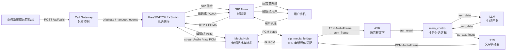
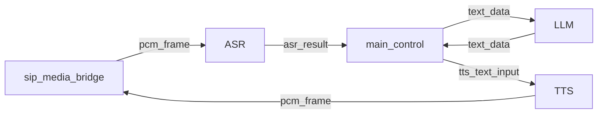

# TEN 电话线路接入学习笔记

## 1. 一句话理解

TEN 不应该直接接 SIP 电话线路。更合理的架构是：

```text
电话线路由 FreeSWITCH / XSwitch / Asterisk 负责
AI 实时对话由 TEN 负责
中间用媒体桥把电话音频转换成 TEN 能处理的 AudioFrame
```

核心边界：

```text
SIP/RTP/PCMA 世界：电话网关负责
PCM/TEN AudioFrame 世界：媒体桥负责
ASR/LLM/TTS 世界：TEN graph 负责
外呼生命周期：Call Gateway 负责
```

## 2. 总链路图



## 3. 关键名词

### SIP

SIP 是电话信令协议，负责“电话怎么建立和结束”。

它处理的问题：

```text
拨号
振铃
接通
挂断
协商音频编码
```

SIP 本身不传真正的声音，真正的声音通常走 RTP。

### SIP Trunk

SIP Trunk 是线路商提供的公网电话线路能力。

它让系统可以通过互联网协议呼叫真实手机号。

常见能力：

```text
外呼手机号
呼入号码
并发线路
主叫号码
IP 白名单
语音编码协商
```

### RTP

RTP 是通话中真正传音频包的协议。

可以理解成：

```text
SIP 负责打电话
RTP 负责传声音
```

### Codec

Codec 是音频编码格式。电话线路中不会直接传大块原始音频，通常会先编码。

常见电话 codec：

```text
PCMA / G.711 A-law
PCMU / G.711 u-law
Opus
G.729
```

### PCMA

PCMA 也叫 G.711 A-law，是传统电话网常见音频编码。

常见参数：

```text
8 kHz
mono
8 bit
64 kbps
```

它适合电话线路传输，但不适合直接给 AI 模型处理。

### PCM

PCM 是原始数字音频波形。

它不是 mp3、wav、PCMA、Opus，而是一串采样点。

给 AI 使用时常见格式：

```text
signed 16-bit PCM
8 kHz 或 16 kHz
mono
little-endian
```

以 8k、16-bit、mono 为例：

```text
1 秒音频 = 8000 个采样点 * 2 字节 = 16000 bytes
20ms 音频 = 320 bytes
40ms 音频 = 640 bytes
```

### 采样率、位深和 320 bytes 的含义

`8k PCM -> 16k PCM -> 8k PCM` 里的 `8k` 和 `16k` 指的是采样率，不是 8 bit / 16 bit。

采样率表示每秒取多少个声音样本：

```text
8kHz  = 每秒 8000 个采样点
16kHz = 每秒 16000 个采样点
24kHz = 每秒 24000 个采样点
```

它主要影响：

```text
可表达的最高声音频率
每秒音频数据量
模型或电话网关是否能正确识别格式
错误解释时的语速和音调
```

从第一性原理看，数字音频就是连续声音波形的离散采样。采样率越高，每秒记录的点越密，能表达的高频越多，数据量也越大。电话语音常用 8kHz，因为电话人声主要关注可懂度；很多 AI ASR / 实时语音模型更偏好 16kHz 或更高，因为它能保留更多语音细节。

但采样率高不等于一定更好。电话侧本来就是 8kHz 时，把它上采样到 16kHz 只是为了满足模型输入格式，不会凭空恢复已经不存在的高频细节。

`16-bit PCM` 里的 `16-bit` 指的是位深，也就是每个采样点用多少 bit 表示振幅：

```text
16-bit = 每个采样点 2 bytes
mono   = 1 个声道
```

所以 8kHz、16-bit、mono 的 20ms PCM 帧大小是：

```text
8000 samples/s * 0.02 s * 2 bytes * 1 channel = 320 bytes
```

16kHz、16-bit、mono 的 20ms PCM 帧大小是：

```text
16000 samples/s * 0.02 s * 2 bytes * 1 channel = 640 bytes
```

24kHz、16-bit、mono 的 20ms PCM 帧大小是：

```text
24000 samples/s * 0.02 s * 2 bytes * 1 channel = 960 bytes
```

`320 bytes in / 320 bytes out` 表示当前电话侧媒体帧是 8kHz、16-bit、mono、20ms，网关收到一帧 320 bytes，也回给 FreeSWITCH 一帧 320 bytes。这说明下行仍然符合电话侧播放节奏。

如果 320 bytes 变大或变小，影响取决于原因：

```text
同样 8kHz / 16-bit / mono 下：
160 bytes = 10ms 音频，包更频繁，调度开销更高，但理论延迟更低
320 bytes = 20ms 音频，电话系统常用，延迟和稳定性比较平衡
640 bytes = 40ms 音频，包更少，但每包自带更高播放等待时间
```

如果 FreeSWITCH 期望 20ms / 320 bytes，但网关乱发更大或更小的 PCM 块，常见问题是：

```text
播放节奏抖动
声音断续或卡顿
延迟增大
缓冲区堆积
音频被截断或拼接异常
某些媒体模块直接丢帧或报警
```

更严重的是“采样率解释错”。例如把 16kHz PCM 当成 8kHz 播放，声音会变慢、音调变低；把 8kHz PCM 当成 16kHz 播放，声音会变快、音调变高。

电话线上的 PCMA 不是 320 bytes。PCMA 是 G.711 A-law 压缩后的 8-bit 编码：

```text
PCMA 8kHz 20ms = 160 samples * 1 byte = 160 bytes
PCM  8kHz 20ms = 160 samples * 2 bytes = 320 bytes
```

当前本地链路里，FreeSWITCH / `mod_audio_stream` 已经把电话侧 PCMA 解码成 8k PCM 给网关，所以网关看到的是 320 bytes 的 PCM 帧，而不是 160 bytes 的 PCMA 包。

PCMA 和 PCM 的关系：

```text
电话线路传输：PCMA
FreeSWITCH 解码后：PCM
TEN 处理：PCM
FreeSWITCH 发回电话前：PCMA
```

### 新实时网关里 20ms / 320 bytes 影响什么

在新的 `sip-realtime-voice-gateway` 最佳架构里，`20ms / 320 bytes` 是电话侧媒体时钟的最小处理粒度。

```text
20ms：这一帧代表 20 毫秒声音
320 bytes：8kHz / 16-bit / mono / 20ms 的 PCM s16le 数据大小
```

它影响的不是“模型聪不聪明”，而是电话播放是否稳定：

```text
播放连续性：每 20ms 都要有可播放帧，否则容易断续
打断响应：最多按 20ms 粒度丢弃旧音频，粒度越大打断越慢
尾音完整性：最后一帧和尾部静音必须完整 drain，否则容易吞最后一个字
调度压力：帧太小包太多，Python / WebSocket / Docker 更容易抖
延迟：帧太大则每包自带更高等待时间
```

所以新方案的播放核心不是“模型返回一点就马上发一点”，而是：

```text
模型音频 delta
  -> 网关重采样成 8k PCM
  -> 切成 20ms / 320 bytes 帧
  -> 放入 Playout Engine
  -> 由稳定播放时钟发给 FreeSWITCH
```

P1 已经把媒体契约锁定为：

```text
电话/SIP 侧：PCMA / 8000Hz / mono / 20ms
FreeSWITCH -> Gateway：PCM s16le / 8000Hz / mono / 20ms / 320 bytes
Gateway -> FreeSWITCH：同样按电话媒体时钟输出
```

P2 要验证的就是这个播放核心：不接模型、不接真实电话播放，先离线证明“任意模型输出音频”能被稳定转换成电话侧 8k / 20ms 帧，并且支持 turn 隔离、cancel 和尾部 drain。

### TEN AudioFrame

TEN AudioFrame 是 TEN 内部传递音频的标准“信封”。

PCM 是内容，AudioFrame 是包装。

示意：

```text
AudioFrame {
  name: "pcm_frame",
  sample_rate: 8000,
  channels: 1,
  bytes_per_sample: 2,
  samples_per_channel: 160,
  buffer: <PCM bytes>
}
```

它的作用是告诉 TEN：

```text
这是一段音频
名字叫 pcm_frame
采样率是多少
几个声道
每个采样点几个字节
音频数据在哪
应该通过 graph 发给哪个 extension
```

### TEN Graph

TEN Graph 是 TEN 的编排配置，定义哪些 extension 参与工作，以及消息如何流动。

电话场景下，一个简化 graph 是：



原来的 RTC 入口一般是 `agora_rtc`，电话场景要把入口换成 `sip_media_bridge`。

## 4. 各模块职责

### SIP Trunk

职责：

```text
提供真实电话线路
把电话打到手机号
提供并发线路
处理运营商侧路由
```

不负责：

```text
AI 对话
ASR / LLM / TTS
业务逻辑
```

### FreeSWITCH

FreeSWITCH 是电话网关。

职责：

```text
接 SIP trunk
拨号
接通
挂断
处理 SIP 信令
处理 RTP 音频
把 PCMA 解码成 PCM
把 PCM 编码回 PCMA
```

不负责：

```text
物业费业务逻辑
LLM 生成回复
用户意图判断
```

### XSwitch

XSwitch 可以理解为 FreeSWITCH 体系的产品化平台。

它可能替代：

```text
裸 FreeSWITCH 配置
部分呼叫控制
部分路由和管理后台
部分线路管理
```

但如果还要用 TEN 做实时 AI，仍然要确认：

```text
能否开放双向实时音频流
能否输出 8k PCM 或可转换音频
能否拿到接通 / 挂断 / 失败事件
能否配合 call_id 做会话隔离
```

### Call Gateway

Call Gateway 是外呼控制服务。

一句话：

```text
Call Gateway 管一通电话从创建到结束的生命周期
```

职责：

```text
提供 POST /api/calls
生成 call_id
生成 FreeSWITCH 通话 uuid
控制最大并发
调用 TEN /start
调用 FreeSWITCH / XSwitch 发起外呼
监听接通、忙线、拒接、挂断事件
接通后启动媒体流
通话结束后调用 TEN /stop
释放并发名额
```

不负责：

```text
音频转发
ASR / LLM / TTS
SIP/RTP 底层处理
```

### Media Hub

Media Hub 是音频配对和转发层。

职责：

```text
接收 FreeSWITCH 的音频 WebSocket
接收 TEN 侧 sip_media_bridge 的 WebSocket
按 call_id 配对两边连接
转发上行 PCM 到 TEN
转发下行 PCM 到 FreeSWITCH
防止多通电话串线
```

不负责：

```text
打电话
挂电话
业务话术
模型调用
```

### sip_media_bridge

`sip_media_bridge` 是 TEN 内部的电话媒体适配 extension。

上行职责：

```text
从 Media Hub 收 PCM bytes
创建 TEN AudioFrame("pcm_frame")
设置 sample_rate、channels、bytes_per_sample 等元数据
发送给 ASR
```

下行职责：

```text
接收 TTS 输出的 AudioFrame("pcm_frame")
取出 PCM bytes
必要时把 16k 降采样到 8k
发回 Media Hub
```

它只做媒体适配，不做业务逻辑。

### main_control

`main_control` 是业务对话控制层。

职责：

```text
接收 ASR 文本
维护对话状态
决定何时问身份
决定何时说明欠费
决定何时调用 LLM
决定何时发 TTS
决定何时结束通话
生成通话结果摘要
```

不负责：

```text
SIP 线路
RTP 音频包
音频 codec
并发线路调度
```

## 5. 一通电话的完整过程

### 控制流

```text
1. 业务系统调用 POST /api/calls
2. Call Gateway 创建 call_id
3. Call Gateway 调 TEN /start，启动一个 worker
4. Call Gateway 调 FreeSWITCH / XSwitch 发起外呼
5. 电话接通后，FreeSWITCH 发接通事件
6. Call Gateway 启动音频桥
7. 用户挂断或 AI 完成后，Call Gateway 清理通话
8. Call Gateway 调 TEN /stop
```

### 媒体流

```text
用户说话
  -> SIP trunk
  -> RTP + PCMA
  -> FreeSWITCH / XSwitch
  -> PCM
  -> Media Hub
  -> sip_media_bridge
  -> TEN AudioFrame
  -> ASR
  -> main_control
  -> LLM
  -> TTS
  -> TEN AudioFrame
  -> sip_media_bridge
  -> PCM
  -> Media Hub
  -> FreeSWITCH / XSwitch
  -> PCMA
  -> 用户听到声音
```

## 6. 当前方案和文档的对应关系

文档里的方案对应的是：

```text
FreeSWITCH：电话世界
TEN：AI 世界
Call Gateway：外呼生命周期
Media Hub：音频转发
sip_media_bridge：TEN 和电话音频之间的适配器
```

所以它不是让 TEN 直接打电话，而是：

```text
让 FreeSWITCH 接 SIP
让 FreeSWITCH 把电话音频变成 PCM
让 sip_media_bridge 把 PCM 接进 TEN
让 TEN 完成 ASR/LLM/TTS
再把 TTS PCM 送回 FreeSWITCH
```

## 7. 是否需要 XSwitch

如果使用 XSwitch，可以简化电话网关侧工作。

可能变成：

```text
业务系统
  -> 轻量 Call Gateway
  -> XSwitch API / ESL
  -> SIP trunk
  -> 用户手机

用户语音
  -> XSwitch
  -> 实时媒体流
  -> Media Hub
  -> sip_media_bridge
  -> TEN
```

使用 XSwitch 前需要确认：

```text
是否能接第三方 SIP trunk
是否能外呼手机号
是否能提供接通 / 挂断 / 失败事件
是否能开放双向实时音频流
是否能和 TEN 做低延迟 PCM 对接
是否支持 10 路及以上并发
```

如果 XSwitch 不能开放双向实时音频流，就只能让 XSwitch 自己做部分 AI 电话机器人能力，TEN 的实时语音 graph 价值会下降。

## 8. 本地软电话测试和真实 SIP trunk 测试

没有 SIP trunk 信息时，不能做真实外线电话测试，但仍然可以先做本地电话链路测试。

本地测试的目标不是证明公网电话一定能通，而是先证明我们可控的半条链路成立。

### 两段链路的区别

```text
A. 我们可控段
软电话 / FreeSWITCH
  -> Media Hub
  -> sip_media_bridge
  -> TEN
  -> Media Hub
  -> FreeSWITCH / 软电话

B. 运营商公网段
真实手机号 / 运营商网络
  -> SIP trunk
  -> NAT / 防火墙
  -> FreeSWITCH
```

本地软电话测试主要验证 A 段。

真实 SIP trunk 测试会额外验证 B 段。

关键判断：

```text
本地可以 != 真实一定可以
本地不可以 = 真实大概率也不可以
```

### 本地测试能证明什么

```text
FreeSWITCH 能接 SIP call
软电话能注册到 FreeSWITCH
本地分机之间能互通
FreeSWITCH 能把音频送到 Media Hub
Media Hub 能按 call_id 配对
TEN 能收到 PCM 并转成 AudioFrame
TEN 输出的 PCM 能回到电话侧
基本延迟、帧格式、断开清理是否合理
```

### 本地测试不能证明什么

```text
运营商 SIP trunk 注册是否成功
公网 IP / NAT / 防火墙是否正确
真实 RTP 端口是否能穿透
来电号码、出站号码、DTMF、挂断原因是否符合运营商规则
运营商实际协商的 codec 是否符合预期
公网抖动、丢包、回声、长时间稳定性
```

### 本地测试需要准备什么

```text
本地 FreeSWITCH
软电话客户端，例如 MicroSIP / Zoiper / Linphone
本地分机账号，例如 1000 / 1001
SIP 端口，通常是 5060/udp
RTP 端口范围，常见是 16384-32768/udp
Media Hub 端口，例如 9000/tcp
TEN API 端口，例如 8080/tcp
```

本地测试也需要 FreeSWITCH。

原因是软电话本身只是 SIP endpoint，不是 PBX，也不是媒体桥。没有 FreeSWITCH，就没有地方完成分机注册、呼叫路由、RTP 处理和媒体桥接。

### 推荐测试顺序

```text
1. 部署本地 FreeSWITCH
2. 用软电话注册两个本地分机
3. 1000 呼叫 1001，验证双方能听到声音
4. 让 FreeSWITCH 把其中一通电话的媒体接到 Media Hub
5. Media Hub 接 TEN sip_media_bridge
6. 验证软电话声音能进入 TEN
7. 验证 TEN 返回音频能被软电话听到
8. 拿到 SIP trunk 后，再做真实外线呼入 / 呼出测试
```

### 本地与真实线路的结论

本地测试是进入真实 SIP trunk 前的必要筛选。

它能把问题范围从：

```text
整个电话系统都可能有问题
```

缩小到：

```text
我们可控段已验证，只剩 SIP trunk / 公网 / 运营商侧未验证
```

所以没有 SIP trunk 时，不应该停住，也不应该假装已经完成真实线路验证。正确做法是先完成本地 FreeSWITCH + 软电话链路测试，再接真实 SIP trunk。

### 当前本地验证结果（2026-05-08）

已经完成：

```text
MicroSIP 1000
  -> 本地 FreeSWITCH 9196
  -> echo()
  -> MicroSIP 能听到回声
```

已经完成：

```text
MicroSIP 1000
  -> 本地 FreeSWITCH 9199
  -> mod_audio_stream v1.0.3
  -> Media Hub /media/fs/fs_stage5a_local
  -> 假 TEN 回声客户端 /media/ten/fs_stage5a_local
  -> Media Hub
  -> FreeSWITCH
  -> MicroSIP 能听到回音
```

这说明本地真实电话音频已经可以从 FreeSWITCH 进入 Media Hub，并且 Media Hub 下行音频可以回到电话侧。

已经完成：

```text
MicroSIP 1000
  -> FreeSWITCH 9199
  -> Media Hub
  -> sip_media_bridge
  -> TEN AudioFrame
  -> sip_media_bridge_test_echo
  -> sip_media_bridge
  -> Media Hub
  -> FreeSWITCH
  -> MicroSIP
```

这说明同一通本地真实电话已经可以穿过 `sip_media_bridge`，进入 TEN `AudioFrame("pcm_frame")`，再回到电话侧。

但这还不等于完整 TEN 电话闭环。当前 `9199` 的阶段 5B 回音测试用的是 `sip_media_bridge_test_echo`，没有经过真实 ASR、LLM、TTS，也没有业务 `main_control`。

## 9. 低延迟目标

如果目标是用户说完后 1 秒左右听到 AI 回复，必须做流式链路。

关键点：

```text
ASR 流式识别
LLM 流式输出
TTS 流式合成
短句优先
常用开场白预生成
TTS 尽量直接输出 8k PCM
音频分片控制在 20ms 或 40ms
模型服务和电话网关尽量同地域部署
用户插话时立刻 flush 当前 TTS
```

现实判断：

```text
用户说完后，AI 第一段声音约 1 秒内出来：可以争取
完整理解、完整生成、完整播放都在 1 秒内：不现实
```

## 10. 最推荐的 MVP 路线

如果已经验证 FreeSWITCH 能外呼：

```text
FreeSWITCH + SIP trunk
  -> mod_audio_stream
  -> Media Hub
  -> sip_media_bridge
  -> TEN graph
```

本地阶段 5A 对 `mod_audio_stream` 的结论：

```text
已验证版本：mod_audio_stream v1.0.3
上行：FreeSWITCH -> WebSocket raw binary PCM
下行：WebSocket raw binary PCM -> FreeSWITCH 播放
格式：8k mono s16le / L16
帧大小：320 bytes
帧时长：20ms
必要配置：STREAM_PLAYBACK=true
本地测试号码：9199
```

本地阶段 5B 对 `sip_media_bridge` 的结论：

```text
真实电话媒体：已能进入 sip_media_bridge
TEN AudioFrame：已能收到 8k mono s16le / 320 bytes / 20ms 音频帧
回放方向：已能从 AudioFrame 转回 PCM 并发回电话侧
用户听感：有回音，无明显卡顿
未覆盖：ASR、LLM、TTS、业务话术、真实 SIP trunk
```

本地阶段 6A 当前记录：

```text
目标：9199 本地电话 -> ASR -> LLM -> TTS -> 电话侧听到 AI 回复
新增 graph：voice_assistant_sip_trunk_cn_ai_minimal
新增控制器：sip_trunk_dialog_controller
ASR：Deepgram nova-3，zh-CN，8k linear16
LLM：DeepSeek OpenAI-compatible，OPENAI_API_BASE=https://api.deepseek.com/v1，model=deepseek-chat
TTS：ElevenLabs eleven_multilingual_v2，pcm_16000
桥接护栏：sip_media_bridge 下行会尝试把非 8k mono s16le PCM 转成 8k mono s16le
已验证：graph 可启动，dialog_controller 可创建，ASR WebSocket 可打开，LLM 可初始化，TTS 可产出音频，电话侧可听到 AI 回复
当前边界：这是本地 MicroSIP + Docker FreeSWITCH + 9199 的最小 AI 电话闭环，不是真实 SIP trunk
```

阶段 6A 延迟样本：

```text
测试语音：你好呀
ASR interim：你好呀
ASR final：你好呀
AI 回复：你好！有什么可以帮你的吗？

电话音频进入 -> ASR final：约 2.8s
ASR final -> LLM 第一段文本：约 2.28s
LLM 第一段文本 -> TTS 首包：约 0.78s
电话音频进入 -> 电话侧听到第一声 AI：约 5.88s
```

当前不要把 6A 的慢误判成 FreeSWITCH、RTP、Media Hub 或 `sip_media_bridge` 问题。日志看媒体链路是 20ms / 320 bytes 持续转发，主要慢点在 ASR final、LLM 首句和 TTS 首包。

## 10.1 级联语音链路和 WebSocket 实时音频模型

当前已经实现的是级联链路：

```text
电话侧 PCMA
  -> FreeSWITCH 解码成 8k PCM
  -> Media Hub
  -> sip_media_bridge
  -> ASR 把语音转文字
  -> LLM 根据文字生成回复
  -> TTS 把文字转语音
  -> sip_media_bridge 把音频转回 8k PCM
  -> FreeSWITCH 编码回 PCMA
  -> 用户听到声音
```

这个链路的特点：

```text
每一层职责清楚
容易逐段替换和测试
可以保留当前 FreeSWITCH / Media Hub / sip_media_bridge
但天然存在串行等待：ASR final -> LLM 首句 -> TTS 首包
```

6B-1 的阿里千问 `qwen-flash` 属于文本 LLM 替换：

```text
Deepgram ASR + DeepSeek LLM + ElevenLabs TTS
替换为：
Deepgram ASR + 阿里 qwen-flash LLM + ElevenLabs TTS
```

它只优化：

```text
ASR final -> LLM 第一段文本
```

它不改变：

```text
ASR 仍然负责语音转文字
TTS 仍然负责文字转语音
电话媒体仍然走 8k PCM
整体仍是 ASR -> LLM -> TTS 级联链路
```

WebSocket 实时音频模型是另一种架构。它不是简单“把 LLM 换成 realtime”，而是让模型直接接收音频流并输出音频流：

```text
电话侧 PCMA
  -> FreeSWITCH 解码成 8k PCM
  -> Media Hub
  -> 实时音频模型 WebSocket
  -> 模型直接返回音频
  -> Media Hub / FreeSWITCH
  -> 用户听到声音
```

它可能把 ASR、LLM、TTS 合并到一个实时模型里：

```text
输入：音频流
内部：识别、理解、生成、合成
输出：音频流
```

优势：

```text
可以更低延迟
更适合自然插话和全双工对话
不一定需要等待完整 ASR final
可能天然支持语音活动检测和打断
```

代价：

```text
架构变化更大
TEN 现有 ASR/LLM/TTS 分段能力会被绕过一部分
调试时不容易分清 ASR 慢、LLM 慢还是 TTS 慢
对供应商绑定更强
需要重新处理音频格式、会话状态、打断、取消、下行播放缓冲
```

所以当前阶段选择：

```text
6B-1：先做文本 LLM A/B，验证 qwen-flash 能否降低 LLM 首句延迟
6B-2：再替换 TTS，验证 TTS 首包
6B-3：再替换 8k 电话 ASR，验证 ASR final
后续如果仍无法达到目标，再单独评估 WebSocket 实时音频模型
```

一句话记忆：

```text
qwen-flash：文本 LLM，替换级联链路中的 LLM 这一段
realtime 音频模型：音频进、音频出，属于另一种实时语音架构
```

如果想减少电话网关配置成本：

```text
XSwitch
  -> 实时音频接口
  -> Media Hub
  -> sip_media_bridge
  -> TEN graph
```

不要优先做：

```text
TEN 直接实现 SIP/RTP
```

原因：

```text
SIP/RTP/PBX 是电话网关领域
TEN 的优势是实时 AI 编排
把两者强行混在 TEN 内部会增加复杂度和故障面
```

## 11. 实时电话里的会话状态应该归谁管

实时电话客服里，模型服务端知道自己生成了什么，但不知道电话用户实际听到了什么。电话链路中真正可靠的事实是：

```text
网关把哪些音频送到了电话播放队列
哪些回复被用户插话打断
哪些回复已经完整播放
```

所以商用实时电话链路里，会话状态应该由网关托管：

```text
pending assistant turn：模型已经生成，但电话端还没确认完整播放
committed history：电话端已经完整听到的历史
abandoned turn：用户插话打断，不能写入历史
```

如果模型 `response.done` 早于电话 `playback_done`，模型服务端会认为上一条回复已经完成，但用户实际只听到一半。这时只靠提示词或 `session.update` 只能缓解，不能从根上删除模型服务端已经接受的上下文。

当前新网关采用的根因修复思路是：

```text
AI 回复完整播放后 -> 写入 committed history
AI 回复被插话打断 -> 丢弃 pending turn
打断后 -> 用 committed history 重建 Realtime 会话
重建后 -> 重放最近一小段上行音频，避免插话开头丢失
```

注意：当前本地 FreeSWITCH 播放事件还可能拿不到，所以先用“网关下行播放队列 drain”近似代表播放完成。真实商用前最好修通 FreeSWITCH `queue_completed`，或者使用能明确上报真实播放完成的 media adapter。

## 12. 为什么要看豆包/火山

当前阿里 Qwen-Omni Realtime 链路已经可以做到语音进、语音出，但本地测试暴露了一个商用关键问题：打断后，如果供应商服务端已经把上一条回复完整写入自己的会话上下文，而电话用户实际只听了一半，下一轮就可能续说上一轮尾巴。

因此评估供应商时，不能只看“模型聪不聪明”，要看它是否原生支持电话客服里的实时打断闭环：

```text
同一会话内取消旧回复
旧音频立即停止
未播放完成的 assistant 内容不进入后续上下文
用户插话期间的音频不丢开头
能上报智能体状态或真实播放完成状态
```

豆包/火山值得看，是因为官方产品线里有两类能力更贴近这个问题：

```text
豆包端到端实时语音大模型：
语音直接进模型，语音直接出模型，官方定位包含低时延、自然打断和智能客服场景。

火山 RTC 实时对话式 AI：
更像托管式语音智能体，官方接口里有 interrupt 指令，可能能把播放、打断、智能体状态放在同一个实时系统里处理。
```

但这不等于“直接换豆包就一定好”。真正要验证的是：

```text
能不能不重建模型连接就完成打断
打断后会不会带出上一轮未播完的尾巴
短句插话会不会丢开头
首字延迟和打断停止耗时是否比当前方案更好
它要求我们对接的是普通 WebSocket 语音 API，还是 RTC 房间/智能体 API
```

如果豆包/火山能原生解决这些问题，后续应该新增供应商 Media Adapter，而不是继续堆当前的重建/重放补偿逻辑。

如果系统还要接自己的业务系统，并且 AI 音色要能切换，那么优先级会变：

```text
优先看火山硬件对话智能体标准 WebSocket 协议
其次看豆包端到端实时语音大模型 RealtimeAPI
再看火山 RTC 房间式 AI 音视频互动方案
最后才是继续在当前阿里 Qwen-Omni Realtime 链路上补丁式优化
```

原因是业务电话客服不只是“模型会说话”，还需要：

```text
调用业务系统查订单、查用户、建工单
控制工具调用权限
记录每次业务调用日志
处理接口超时和兜底话术
按租户、线路或业务场景选择音色
在用户插话时保持对话状态不乱
```

所以更稳的工程形态是：

```text
电话音频 -> FreeSWITCH -> Gateway
Gateway -> 供应商实时智能体/实时语音模型
供应商发起工具调用 -> Gateway Business Tool Adapter
Gateway -> 自有业务系统
业务结果 -> Gateway -> 供应商智能体/模型 -> 电话播放
```

业务系统不建议直接暴露给模型公网调用。中间要有网关适配层，负责鉴权、参数校验、超时、限流、日志和脱敏。

这几个名字要区分清楚：

```text
豆包端到端 RealtimeAPI：
纯 Speech2Speech WebSocket API。适合快速验证低延迟语音体验，可配置音色和人设，但业务工具调用闭环没有硬件智能体标准协议清晰。

火山硬件对话智能体标准协议：
WebSocket 全双工事件协议。支持音频流、server_vad、response.cancel、response.audio.delta、Function Calling、状态同步和指令控制。更适合把电话网关模拟成一个“服务端硬件设备”。

火山 RTC 房间式 AI：
面向 RTC 房间，不是电话入口。除非必须使用它的 RTC 能力，否则电话项目不优先走这条。
```

注意：RTC 不是电话。

```text
RTC：互联网实时音视频房间，通常面向 App / Web / 小程序 / 设备 SDK。
电话：SIP / RTP / PSTN / SIP Trunk，运营商线路进入 FreeSWITCH。
```

所以不能说“火山 RTC 支持电话”。更准确的说法是：

```text
电话接入仍由 FreeSWITCH 负责。
如果火山/豆包提供适合服务端网关或硬件设备接入的实时音频协议，本项目可以把电话音频桥接过去。
如果只提供普通 RTC 客户端 SDK，不提供服务端/硬件/标准协议接入，就不适合当前电话主链路。
```

后续查官方文档时优先看这些入口：

```text
火山硬件对话智能体产品文档：
https://www.volcengine.com/docs/6348/1806621

火山硬件对话智能体官方 SDK 集成指引：
https://www.volcengine.com/docs/6348/1913817?lang=zh

火山边缘智能语音对话智能体 Realtime API：
https://www.volcengine.com/docs/6893/1389041

豆包端到端实时语音大模型产品简介：
https://www.volcengine.com/docs/6561/1594360

豆包端到端实时语音大模型 API 接入文档：
https://www.volcengine.com/docs/6561/1594357

火山 RTC UpdateVoiceChat 打断智能体：
https://www.volcengine.com/docs/6348/1316245

火山 RTC AI 音视频互动方案能力入口：
https://www.volcengine.com/docs/6348/1350595
```

### 火山硬件智能体协议最小验证结果

已经用本地 `sip-realtime-voice-gateway` 新增探针验证过火山硬件对话智能体标准 WebSocket 协议：

```text
动态注册设备：通过
WebSocket 鉴权连接：通过
发送文本型 conversation.item.create：通过
接收 response.audio.delta：通过
接收 response.audio_transcript：通过
接收 response.done：通过
导出 WAV 测试音频：通过
```

这说明网关服务端可以把自己模拟成“硬件设备”接入火山智能体。这个结论很重要，但边界也要说清楚：

```text
已证明：供应商智能体协议可连通、可返回音频。
未证明：电话 8k/20ms PCM 流已经稳定接入火山智能体。
未证明：真实 SIP Trunk 下的打断、播放完成、并发和异常处理已经可商用。
```

这不会改变 SIP 接入边界：

```text
真实电话 / MicroSIP
  -> FreeSWITCH
  -> sip-realtime-voice-gateway
  -> 火山硬件智能体标准 WebSocket
  -> sip-realtime-voice-gateway
  -> FreeSWITCH
  -> 电话用户
```

也就是说，火山硬件智能体替换的是“AI 实时语音后端”，不是 SIP/RTP 电话网关。后续真实 SIP Trunk 仍由 FreeSWITCH 负责，网关负责把电话音频转换成供应商协议需要的实时音频事件。

本次最小探针的耗时样本：

```text
首个 audio delta：约 2.3 秒
response.done：约 11.9 秒
```

这个耗时只代表“文本输入 -> 智能体生成一整段音频”的探针，不等于后续电话流式输入的最终体验。下一步接入电话媒体流后，要重新测：

```text
用户说完到首个下行音频的耗时
用户插话到旧音频停止的耗时
插话后新问题是否丢开头
第二轮回复是否还带上一轮未播完尾巴
下行播放是否断续或吞尾字
```

### 火山电话媒体适配的当前实现

现在已经把火山硬件智能体接入到 `sip-realtime-voice-gateway` 的电话媒体模式里，开关是：

```text
REALTIME_MODEL_PROVIDER=volc_hardware
```

链路变成：

```text
电话侧 8k/20ms PCM
  -> 网关重采样 16k PCM
  -> 火山 input_audio_buffer.append
  -> 火山 server_vad 判断用户说话开始/结束
  -> 火山 input_audio_buffer.committed
  -> 网关发送 response.create
  -> 火山 response.audio.delta
  -> 网关 Playout Engine 转 8k/20ms PCM
  -> FreeSWITCH 播放
```

这里有一个容易误解的点：`input_audio_buffer.committed` 不是“AI 已经开始回答”，它只表示一段用户音频已经提交。火山 Realtime API 需要再收到 `response.create` 才开始生成回复，所以网关适配层必须在 committed 后主动发 `response.create`。

打断处理也和当前阿里补偿方案不同：

```text
阿里当前方案：
插话 -> cancel -> 清空播放 -> 关闭旧会话 -> 新建会话 -> 重放最近上行音频

火山当前方案：
插话 -> cancel -> 清空播放 -> 保持同一火山会话继续收音
```

所以火山方案理论上更接近我们要的商用方向：少一次重连，也少一次重放带来的额外延迟和短句丢开头风险。但这只是架构上更合理，最终还要靠 9199 实测确认。

## 13. 记忆口诀

```text
SIP：负责打电话的信令
RTP：负责传声音
PCMA：电话线上跑的编码音频
PCM：AI 能处理的原始音频
AudioFrame：TEN 内部装 PCM 的信封
FreeSWITCH：电话交换机
Call Gateway：电话调度员
Media Hub：声音转运站
sip_media_bridge：电话音频和 TEN 的翻译器
TEN Graph：AI 对话流水线
main_control：业务对话大脑
```

## 14. 豆包 S2S 端到端实时语音记录

### 14.1 Android 文档和服务端 API 的区别

Android 文档可以用来确认模型能力，例如是否支持端到端对话、16k PCM、音色配置和原始音频输出。

但当前项目是服务端电话网关，不是 Android App：

```text
Android App：
手机麦克风/扬声器 -> Android SDK -> 豆包实时语音服务

电话网关：
FreeSWITCH/SIP -> sip-realtime-voice-gateway -> 豆包 S2S WebSocket API
```

所以实现时不能照搬 Android SDK。主依据应该是服务端 WebSocket API：鉴权 Header、二进制帧、事件号、StartConnection、StartSession、Audio Event、TTS Audio Event。

### 14.2 当前选择

版本方向：

```text
优先 O2.0 / S2S
```

音色：

```text
zh_female_vv_jupiter_bigtts
```

选择原因：

```text
O/O2.0 更贴近低延迟助手、客服、外呼。
SC/SC2.0 更贴近强人格、陪伴、角色和声音复刻。
```

### 14.3 当前新增探针

新增文件：

```text
sip-realtime-voice-gateway/app/doubao_s2s_client.py
sip-realtime-voice-gateway/app/doubao_s2s_probe.py
sip-realtime-voice-gateway/tests/test_doubao_s2s_client.py
```

当前探针先做两类验证：

```text
文本输入 -> 豆包 S2S -> 返回文本和音频
WAV 音频输入 -> 豆包 S2S -> 返回文本和音频
```

这个阶段还不切 9199 电话链路。先验证供应商 S2S 协议本身可用，再接入电话媒体。

### 14.4 数据格式

电话侧：

```text
PCMA / 8k / mono / 20ms
网关解码后为 8k PCM s16le
每帧 320 bytes
```

豆包 S2S 侧：

```text
输入：16k PCM s16le mono
输出：16k PCM s16le mono
```

桥接关系：

```text
上行：电话 8k PCM -> 网关重采样 16k PCM -> 豆包 S2S
下行：豆包 S2S 24k float32 PCM -> int16 PCM -> 8k PCM -> FreeSWITCH
```

如果真实输出仍然断续，优先判断：

```text
1. 供应商下行 audio event 是否稳定。
2. 网关 jitter/prebuffer 是否合理。
3. FreeSWITCH/mod_audio_stream 播放时钟是否稳定。
4. 是否需要换更底层的媒体适配，而不是继续调 prompt 或回复长度。
```

### 14.5 本地环境变量

必填：

```text
DOUBAO_S2S_APP_ID=
DOUBAO_S2S_ACCESS_TOKEN=
```

可选：

```text
DOUBAO_S2S_APP_KEY=官方实时语音固定 App-Key，通常不用覆盖
DOUBAO_S2S_RESOURCE_ID=volc.speech.dialog
DOUBAO_S2S_WS_URL=wss://openspeech.bytedance.com/api/v3/realtime/dialogue
DOUBAO_S2S_SPEAKER=zh_female_vv_jupiter_bigtts
DOUBAO_S2S_OUTPUT_SAMPLE_RATE=24000
```

这些值只能放在本地 `.env`，不能写进 git 文档。

Header 映射结论：

```text
X-Api-App-ID       -> 控制台 APP ID
X-Api-Access-Key  -> 控制台 Access Key / Access Token
X-Api-Resource-Id -> volc.speech.dialog
X-Api-App-Key     -> 端到端实时语音服务固定 App-Key，不是控制台 Secret Key
```

注意：`X-Api-App-Key` 不是控制台 Secret Key。服务端曾明确返回固定实时语音 App-Key 期望值，因此不能把 Secret Key 填到 `X-Api-App-Key`。

### 14.6 当前验证状态

已完成：

```text
本地假 WebSocket 协议测试通过
StartConnection 事件封装通过
StartSession 音色配置通过
Audio Event 二进制帧通过
配置加载测试通过
```

自动化命令：

```powershell
cd sip-realtime-voice-gateway
python -m pytest
python -m compileall app tests
```

结果：

```text
72 passed
compileall passed
```

还没完成：

```text
9199 电话链路切换到豆包 S2S
真实插话、吞尾字、断续和首包耗时测试
```

### 14.7 真实探针结果

2026-05-10 已把豆包 S2S 控制台凭证写入本地 `ai_agents/.env`，并跑通文本探针和本地 WAV 音频探针。

文本探针命令：

```powershell
cd sip-realtime-voice-gateway
python -m app.doubao_s2s_probe `
  --env-file ../ai_agents/.env `
  --output-dir artifacts/doubao-s2s-probe `
  --text "请用一句话介绍你自己。"
```

文本探针结果：

```text
speaker = zh_female_vv_jupiter_bigtts
output_audio_bytes = 195568
output_transcript = 我叫豆包，我懂得很多知识，非常喜欢聊天呢。
first_audio_delta_ms = 562
response_done_ms = 1469
output_sample_rate = 24000
```

音频探针命令：

```powershell
cd sip-realtime-voice-gateway
python -m app.doubao_s2s_probe `
  --env-file ../ai_agents/.env `
  --output-dir artifacts/doubao-s2s-probe `
  --wav "C:\Users\Tzk00\Downloads\语音标签示例1.wav"
```

音频探针结果：

```text
input_audio_bytes = 336000
input_transcript = 可当他的手触碰到对方的身体时，却感觉一阵冰冷僵硬，那触感不像是活人，更像是尸体。
output_audio_bytes = 215730
output_transcript = 我的妈呀！这也太吓人了！后来怎么样啦？
first_audio_delta_ms = 16828
response_done_ms = 16828
output_sample_rate = 24000
```

本次 401 历史阻塞的真实原因：

```text
1. 最初复制的 Access Key / Secret Key 字符存在差异。
2. 曾误把控制台 Secret Key 当成 X-Api-App-Key。
3. 修正 Access Key，并把 X-Api-App-Key 恢复为端到端实时语音固定 App-Key 后，真实联网探针通过。
```

音频探针的 `first_audio_delta_ms=16828` 不能直接等同于电话场景延迟，因为该 WAV 是按实时 20ms chunk 发送，并等待了服务端 VAD 结束。它证明的是“音频输入 -> ASR -> 对话 -> TTS 音频输出”链路可用；真正电话延迟要在 9199 媒体链路切换到豆包 S2S 后重新测。

### 14.8 豆包 S2S 接入 9199 电话链路

本阶段目标是把已经跑通的豆包 S2S 探针接入真实电话媒体热路径。

新增代码：

```text
sip-realtime-voice-gateway/app/doubao_s2s_realtime.py
sip-realtime-voice-gateway/tests/test_doubao_s2s_realtime.py
```

启动 provider：

```text
REALTIME_MODEL_PROVIDER=doubao_s2s
```

当前本地 `ai_agents/.env` 已切到 `doubao_s2s`，该文件不进 git。

9199 链路：

```text
MicroSIP 拨 9199
  -> FreeSWITCH / mod_audio_stream
  -> sip-realtime-voice-gateway
  -> 8k PCM 上行重采样为 16k PCM
  -> 豆包 S2S TaskAudio
  -> 豆包 S2S TTSAudioData 24k float32 PCM
  -> float32 转 int16
  -> Playout Engine 重采样为 8k / 20ms / 320 bytes
  -> FreeSWITCH
  -> 电话侧播放
```

关键注意点：

```text
1. 最新 9199 实测证明豆包下行不是 16k int16 PCM，而是 24k float32 PCM。
2. 必须先把 float32 转 int16，再按 24k -> 8k 播放。
3. 当前自动化验证证明适配器能把 ASR / Chat / TTS 事件映射到电话网关 turn。
4. 下一步人工验证仍然要拨 9199，重点听是否连续、尾字是否完整、首包耗时是否可接受。
5. 当前已启用 FreeSWITCH Event Socket，打断时会尝试清理 FreeSWITCH `mod_audio_stream` 播放队列，避免旧回复残留继续播放。
```

自动化和烟测结果：

```text
python -m pytest：72 passed
python -m compileall app tests：passed

模拟 FreeSWITCH WebSocket 烟测：通过
输入：本地 WAV 按 8k / 20ms 电话帧送入网关
输出：网关收到豆包 S2S 下行后回出 8k 播放帧
turns_started = 1
turns_completed = 1
playback_underruns = 0
```

烟测首个播放帧约 15.7s 出现，但这个数字包含整段 WAV 按真实 20ms 帧发送的时长，不等同于用户说完后的电话响应延迟。下一步要用 MicroSIP 拨 9199 做真实体感测试。

人工启动命令：

```powershell
cd sip-realtime-voice-gateway
python -m app.main `
  --config configs/local.example.toml `
  --env-file ../ai_agents/.env `
  --media-mode realtime
```

### 14.9 豆包 S2S 9199 根因修正记录

最近 9199 人工测试现象：

```text
语速已经正常
音色已经正常
插话后仍偶发旧内容带入下一轮
多轮后越往后越容易回答不完整，最后几个字缺失
```

日志判断：

```text
每轮都出现 ChatEnded / event=559
问题轮次没有看到 TTSFinished / event=359
559 后仍可能继续收到 TTSAudioData / event=352
```

第一性原理结论：

```text
ChatEnded 是文本对话结束，不是音频素材结束。
电话侧真正关心的是“可播放音频是否完整到达并排入播放队列”。
如果用 559 完成本轮，就可能在 359 前提前 flush / close，导致尾字被吞。
```

本次修正：

```text
1. 豆包 S2S 适配器不再把 559 当成本轮完成。
2. 只有 TTSFinished / 359 或 SessionFinished 才完成 turn。
3. ChatEnded 的 content 不写入 output transcript，避免污染 committed history。
4. 插话后关闭旧豆包 S2S 会话，用网关 committed history 重建新会话。
5. 重建期间继续进来的上行音频加锁进入重放缓冲，避免插话开头丢失。
```

2026-05-10 追加复测发现：

```text
每轮 TTSFinished / 359 已经能收到，模型侧 output_transcript 也完整。
但本轮最后几个字仍没有在本轮听到，而是挪到下一轮开头。
本地日志中 FreeSWITCH 播放事件仍为 0，说明还没有真实 queue_completed 可用。
这说明问题已经从“供应商音频是否完整生成”进入“电话侧播放片段是否完整 drain”。
```

对应修正：

```text
1. 网关在模型 turn 完成后 flush 残余下行音频帧。
2. 再按 playback.tail_silence_ms 追加 20ms 对齐的静音尾帧。
3. 追加日志 tail_silence_frames，用来确认本轮实际补了多少尾部静音帧。
4. 新增自动化测试，验证 turn 完成后会发出残余音频帧 + 静音尾帧。
```

判断：

```text
这是对“本地 9199 段尾吞字”的根因方向修复，但仍是播放层止血。
最终商用更稳的做法是修通 FreeSWITCH queue_completed / chunk_played，或换成能上报真实播放完成的 media adapter。
只有真实播放完成事件才能精确决定 assistant turn 是否进入 committed history。
```

自动化验证：

```text
python -m pytest：74 passed
python -m compileall app tests：passed
```

### 14.10 主线收敛和代码清理决定

2026-05-10 尾字完整性复测通过后，当前主线确定为：

```text
业务系统 / 外呼任务
  -> sip-realtime-voice-gateway
  -> FreeSWITCH / SIP Trunk / PCMA
  -> 豆包 S2S 端到端实时语音
  -> FreeSWITCH
  -> 电话用户
```

清理决定：

```text
1. 阿里 Qwen Realtime 链路不再作为运行时回退。
2. 火山硬件智能体标准 WebSocket 线路不再作为运行时候选。
3. 生产代码只保留豆包 S2S、FreeSWITCH、Event Socket、Playout Engine、媒体契约和本地 9199 验证链路。
4. 历史调研结论保留在笔记中，但 README、配置和代码入口不再暴露旧 provider 选择，避免同事误配。
```

下一步人工复测 9199 时重点听：

```text
1. 尾字是否完整。
2. 插话后第二轮是否还带上一轮未播完内容。
3. 连续多轮后是否仍会越答越短或提前断掉。
4. 打断后是否还有明显卡顿。
```
### 14.11 打断后不需要重复问的根因修复

2026-05-10 复测结论：

```text
打断后听感很好。
旧声音停止后，AI 能直接回复插话内容，不需要用户再问一遍。
```

根因：

```text
打断识别成功
旧播放停止成功
豆包 S2S 热重启成功
但热重启后没有把插话期间缓存的用户音频重新送入豆包
```

修复点：

```text
豆包热重启完成后，网关把 repair_replay_frames_16k 重新 append_audio 到当前豆包会话。
```

复测日志关键证据：

```text
realtime_interruption_audio_replayed replayed_input_frames=46 replayed_input_bytes=29440
turn=6 input_transcript=你喜欢什么？
turn=6 output_transcript=我喜欢好多东西呢，你呢？
```

这说明用户插话音频进入了新会话，模型也直接对插话内容作答。

当前 9199 测试指标：

```text
PLAYBACK_JITTER_BUFFER_MS=500
playback_prefill_frames=25
interruptions=1
dropped_stale_frames=0
playback_underruns=1
max_playback_send_gap_ms=155
playback_send_gap_overruns=13
freeswitch_break_failures=0
realtime_interrupt_failures=0
gateway_history_committed_turns=5
gateway_history_abandoned_turns=1
turns_completed=6
turns_failed=0
```

判断：

```text
这是“打断后 AI 有时不回复”的根因修复。
但它不是完整商用媒体状态机。
```

下一步不应该继续加业务功能，应该先做播放完成确认和媒体状态机：

```text
1. 修通 FreeSWITCH queue_completed / chunk_played，或替换为可上报播放完成的 media adapter。
2. 明确定义 assistant turn 的 queued / playing / completed / interrupted / abandoned。
3. 只有真实 completed 的 assistant turn 才能进入 committed history。
4. interrupted / abandoned 的 turn 不能污染模型上下文。
5. 保留 500ms jitter buffer 作为当前本地体验基线，后续再根据播放事件和 send gap 指标调参。
```
