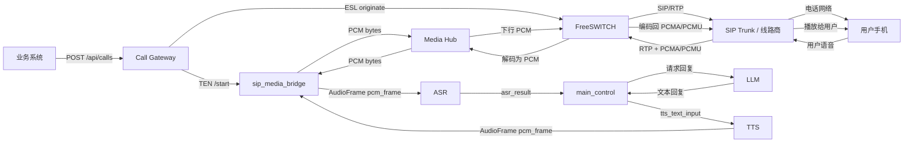

# TEN 电话接入模块总交接文档

最后更新：2026-05-08

## 1. 文档目的

本文是电话接入模块的唯一主交接文档，用于把后续工作交给其他同事继续推进。

保留的补充资料：

- `TEN电话接入学习笔记.md`：概念、名词、链路和本地/真实线路区别的学习笔记。

核心原则：不要让后续同事在多份阶段文档里判断当前状态。本文以当前事实为准。

## 2. 第一性原理结论

电话接入的本质不是“把 SIP 接到 LLM”，而是把三个世界稳定连接起来：

```text
电话世界：SIP / RTP / PCMA / PCMU
媒体桥世界：PCM bytes / WebSocket / call_id 配对
TEN 世界：AudioFrame / ASR / LLM / TTS / main_control
```

职责边界必须保持清楚：

| 模块 | 职责 |
| --- | --- |
| SIP Trunk | 提供真实电话外线，负责运营商侧呼入/呼出能力 |
| FreeSWITCH | 电话网关，处理 SIP、RTP、拨号、接通、挂断、codec 协商 |
| Call Gateway | 管一通电话的生命周期、状态机、并发、ESL originate/hangup、TEN start/stop |
| Media Hub | 按 `call_id` 配对 FreeSWITCH 侧和 TEN 侧媒体连接，转发双向 PCM |
| sip_media_bridge | TEN 扩展，负责 `PCM bytes <-> TEN AudioFrame("pcm_frame")` |
| TEN Graph | 编排 ASR、LLM、TTS 和业务对话控制 |
| main_control | 处理业务对话状态、开场白、打断、结束条件和结果摘要 |

TEN 不应该直接处理 SIP/RTP/PBX 细节。TEN 只应该接收干净的 PCM 音频并输出 PCM 音频。

## 3. 完整目标业务链路

目标是让业务系统能发起一通真实电话，用户接通后与 AI 实时对话。



控制面链路：

```text
业务系统
  -> Call Gateway 创建 call_id
  -> TEN /start(channel_name=call_id)
  -> FreeSWITCH originate
  -> CHANNEL_ANSWER 后启动媒体桥
  -> CHANNEL_HANGUP 或 AI 结束后 TEN /stop
  -> 清理 FreeSWITCH channel、Media Hub session、TEN worker
```

媒体面链路：

```text
FreeSWITCH /media/fs/{call_id}
  -> Media Hub
  -> /media/ten/{call_id}
  -> sip_media_bridge
  -> TEN AudioFrame
  -> ASR/LLM/TTS
  -> sip_media_bridge
  -> Media Hub
  -> FreeSWITCH
```

## 4. 业务需求

当前明确需求：

- 支持真实电话线路接入，优先走 FreeSWITCH + SIP Trunk。
- 第一版先做单通电话闭环，不做批量外呼和复杂业务。
- 用户接通后能听到 AI 开场白。
- 用户说话能进入 TEN，经过 ASR/LLM/TTS 后回到电话侧播放。
- 首响延迟目标：用户说完后约 1 秒到 1.5 秒内开始听到 AI 第一段声音。
- 支持后续打断：用户插话时停止当前 TTS 播放并进入新一轮理解。
- 支持后续至少 10 路并发 MVP。
- 所有链路必须能按 `call_id` 追踪。

第一版非目标：

- 不做批量催收调度。
- 不做 CRM 回写。
- 不做录音质检。
- 不做 50 路以上并发。
- 不做多租户和多 FreeSWITCH 横向扩容。
- 不让 TEN 直接实现 SIP/RTP。

## 5. 当前代码状态

当前工作区：`E:\recov_ten`

新增或相关代码：

```text
ai_agents/agents/examples/voice-assistant-sip-trunk/
ai_agents/agents/ten_packages/extension/sip_media_bridge/
```

当前示例 graph：

```text
voice_assistant_sip_trunk_cn_skeleton
voice_assistant_sip_trunk_audio_frame_test
```

当前 `sip_media_bridge` 关键配置：

```text
channel: default
media_hub_base_url: ${env:MEDIA_HUB_BASE_URL|ws://127.0.0.1:9000}
sample_rate: 8000
heartbeat_interval_seconds: 5
registration_timeout_seconds: 5
```

当前已验证媒体契约：

```text
PCM s16le
8000 Hz
mono
20 ms per frame
320 bytes per frame
```

## 6. 数据格式和接口契约

这一节必须保留。后续同事联调 FreeSWITCH、Media Hub 和 TEN 时，最容易出问题的不是“服务能不能启动”，而是“双方以为自己发的是同一种数据，实际格式不一致”。

### 6.1 call_id / channel 规则

同一通电话必须使用同一个 `call_id` 贯穿全链路：

```text
Call Gateway call_id
TEN /start channel_name
sip_media_bridge.channel
Media Hub /media/ten/{call_id}
Media Hub /media/fs/{call_id}
日志字段
状态查询字段
```

当前已验证的规则：

```text
TEN /start 中的 channel_name 会注入到 sip_media_bridge.channel
sip_media_bridge 使用 channel 拼出 Media Hub URL
Media Hub 使用 URL 中的 channel 做两侧配对
```

建议格式：

```text
只使用 URL-safe 字符
推荐：小写字母、数字、下划线、短横线
示例：call_stage4_audio_frame_001
```

不建议在 `call_id` 中使用中文、空格、斜杠、问号等需要复杂转义的字符。`sip_media_bridge` 当前会对 channel 做 URL quote，但其他系统未必都处理一致。

### 6.2 Media Hub WebSocket 路径

当前已实现路径：

```text
TEN 侧:
ws://<media-hub-host>:9000/media/ten/{call_id}

FreeSWITCH / fake FS 侧:
ws://<media-hub-host>:9000/media/fs/{call_id}
```

本机默认值：

```text
MEDIA_HUB_BASE_URL=ws://127.0.0.1:9000
```

`sip_media_bridge` 最终连接地址：

```text
${MEDIA_HUB_BASE_URL}/media/ten/{channel}
```

### 6.3 Media Hub 控制消息

控制消息走 WebSocket 文本帧，格式是 JSON。

TEN 侧注册请求，已实现：

```json
{
  "type": "register",
  "role": "ten",
  "channel": "call_stage4_audio_frame_001",
  "sample_rate": 8000
}
```

Media Hub 注册响应，已实现：

```json
{
  "type": "registered",
  "role": "ten",
  "channel": "call_stage4_audio_frame_001",
  "session_id": "<media_hub_session_id>"
}
```

心跳请求，已实现：

```json
{
  "type": "ping",
  "channel": "call_stage4_audio_frame_001",
  "ts": 1770000000.123
}
```

心跳响应，已实现：

```json
{
  "type": "pong",
  "role": "ten",
  "channel": "call_stage4_audio_frame_001",
  "session_id": "<media_hub_session_id>",
  "ts": 1770000000.123
}
```

两侧媒体配对成功消息，已实现：

```json
{
  "type": "media_connected",
  "channel": "call_stage4_audio_frame_001",
  "ten_session_id": "<ten_side_session_id>",
  "fs_session_id": "<fs_side_session_id>"
}
```

对端断开消息，已实现：

```json
{
  "type": "peer_disconnected",
  "channel": "call_stage4_audio_frame_001",
  "peer_role": "fs",
  "reason": "connection_closed"
}
```

当前 Media Hub 对 ready 状态的判断：

```text
TEN 侧：必须发送 register 且校验通过，才算 ready
FS 侧：连接成功即算 ready
```

原因：未来 FreeSWITCH 侧如果直接来自某些媒体模块，可能不会先发自定义注册 JSON。

后续如果 FreeSWITCH 侧由自研 adapter 接入，建议也发送：

```json
{
  "type": "register",
  "role": "fs",
  "channel": "call_stage4_audio_frame_001",
  "sample_rate": 8000
}
```

但这属于下一阶段可增强项，不是当前已验证要求。

### 6.4 Media Hub 音频帧格式

音频数据走 WebSocket 二进制帧，不是 JSON，不是 base64，不带 WAV 头。

当前已验证格式：

```text
encoding: signed 16-bit PCM little-endian
sample_rate: 8000 Hz
channels: 1
bytes_per_sample: 2
frame_duration: 20 ms
bytes_per_frame: 320
```

计算方式：

```text
8000 samples/second * 0.02 second = 160 samples
160 samples * 1 channel * 2 bytes = 320 bytes
```

一分钟音频大约：

```text
8000 * 60 * 2 = 960000 bytes
```

要求：

```text
上行：FreeSWITCH/fake FS -> Media Hub -> sip_media_bridge
下行：sip_media_bridge -> Media Hub -> FreeSWITCH/fake FS
```

都应使用同一 PCM 契约，除非在 Media Hub 或 FreeSWITCH adapter 中明确写转换逻辑。

### 6.5 TEN AudioFrame 格式

`sip_media_bridge` 当前把 Media Hub 二进制 PCM 转为 TEN `AudioFrame("pcm_frame")`。

当前已实现字段：

```text
name: pcm_frame
sample_rate: 8000
channels: 1
bytes_per_sample: 2
data_fmt: INTERLEAVE
samples_per_channel: len(payload) / 2
buffer: 原始 PCM bytes
```

以 20ms 音频帧为例：

```text
payload bytes = 320
samples_per_channel = 320 / 2 = 160
```

当前下行逻辑：

```text
TTS 或测试 echo 扩展输出 AudioFrame("pcm_frame")
sip_media_bridge 取出 audio_frame.get_buf()
作为二进制 PCM bytes 发回 Media Hub
```

重要限制：

```text
当前 sip_media_bridge 没有做重采样
当前 sip_media_bridge 没有做 codec 编解码
当前 sip_media_bridge 没有校验下行 AudioFrame 的 sample_rate 是否等于 8000
```

如果后续 TTS 输出 16k 或 24k PCM，必须在以下任一位置补齐转换：

```text
TTS 直接输出 8k mono s16le
sip_media_bridge 做 16k/24k -> 8k 重采样
Media Hub 做重采样
FreeSWITCH 侧做重采样
```

建议第一版优先让 TTS 或桥接层输出 8k mono s16le，减少电话侧不可控变量。

### 6.6 FreeSWITCH 侧音频格式要求

电话线路上常见 codec 是：

```text
PCMA / G.711 A-law
PCMU / G.711 u-law
```

但进入 Media Hub 前必须变成：

```text
PCM s16le 8000 Hz mono
```

FreeSWITCH 负责或协助完成：

```text
电话侧 PCMA/PCMU -> PCM
PCM -> 电话侧 PCMA/PCMU
```

下一阶段如果使用 `mod_audio_stream`，必须确认它的实际协议：

```text
是否输出 raw PCM binary frame
是否输出 JSON 包裹
是否有 WAV header
采样率是 8k 还是 16k
每帧时长是多少
下行回放需要 binary 还是 JSON 命令
是否支持双向实时音频
```

如果 FreeSWITCH 模块输出格式不是当前 Media Hub 契约，就不要改 TEN，优先在 FreeSWITCH adapter 或 Media Hub 侧做转换。

### 6.7 未来 Call Gateway API 数据草案

Call Gateway 当前尚未实现。以下是后续建议格式，不是已实现接口。

发起电话：

```http
POST /api/calls
Content-Type: application/json
```

```json
{
  "phone_number": "13800138000",
  "scenario": "property_fee_reminder",
  "metadata": {
    "customer_id": "cust_001",
    "owner_name": "张三"
  }
}
```

返回：

```json
{
  "call_id": "call_20260508_000001",
  "status": "created"
}
```

状态对象建议：

```json
{
  "call_id": "call_20260508_000001",
  "fs_uuid": "<freeswitch_uuid>",
  "ten_channel": "call_20260508_000001",
  "status": "media_connected",
  "failure_reason": null,
  "created_at": "2026-05-08T21:00:00+08:00",
  "answered_at": "2026-05-08T21:00:08+08:00",
  "ended_at": null
}
```

状态枚举建议：

```text
created
starting_ai
dialing
answered
media_connecting
media_connected
ai_talking
completed
failed
cancelled
```

失败原因枚举建议：

```text
ten_failed
dial_failed
busy
no_answer
rejected
media_failed
unknown
```

清理逻辑必须幂等。用户挂断、AI 主动结束、WebSocket 断开、FreeSWITCH hangup event 可能几乎同时发生，只能触发一次最终清理。

## 7. 已实现部分

### 7.1 TEN 电话 Graph 启动骨架

已实现：

- 新增独立 example：`voice-assistant-sip-trunk`。
- 新增 TEN 扩展：`sip_media_bridge`。
- 新增 graph：`voice_assistant_sip_trunk_cn_skeleton`。
- `channel_name` 能注入到 `sip_media_bridge.channel`。
- `/start` 能启动 worker。
- `/stop` 能清理 worker。

已验证：

```text
/health 正常
/graphs 能看到 voice_assistant_sip_trunk_cn_skeleton
/start 成功
sip_media_bridge on_init / on_start 执行
日志能看到实际 channel
/stop 成功
/list 最终为空
```

需要注意的细节：

- `sip_media_bridge/__init__.py` 必须包含 `from . import addon`，否则 TEN Python addon loader 能导入包，但不会触发 `@register_addon_as_extension("sip_media_bridge")` 注册，最终会报找不到 extension。
- 当前 skeleton graph 只有 `sip_media_bridge` 一个节点，没有接 ASR、LLM、TTS，也没有真实业务逻辑。
- `sip_media_bridge` 在 `on_start` 会尝试连接 Media Hub。如果 Media Hub 没启动，日志中出现连接失败重试不代表 graph 启动失败。
- `/stop` 不一定能让 extension 完整执行所有清理。TEN worker 可能先收到 `SIGTERM`，之后被 `SIGKILL`。后续真实 WebSocket、音频流、FreeSWITCH channel 不能只依赖 `on_stop` 清理。
- 这个阶段只证明 TEN 能识别并启动电话场景 graph，不证明音频链路通。

### 7.2 Media Hub 最小控制连接

已实现：

- Media Hub 服务：`ai_agents/agents/examples/voice-assistant-sip-trunk/server/main.py`
- TEN 侧 WebSocket 路径：`/media/ten/{call_id}`
- FS 侧 WebSocket 路径：`/media/fs/{call_id}`
- TEN 注册消息：`register`
- 心跳：`ping` / `pong`
- 配对消息：`media_connected`
- 心跳超时清理
- 同一 `channel + role` 重复连接替换旧连接

护栏已修正：

- TEN 侧必须注册后才算 ready。
- register 中的 `role` 必须匹配连接路径。
- register 中的 `channel` 必须匹配 URL。
- 重复连接会关闭旧 session。

需要注意的细节：

- TEN 侧必须先发 `register`，并且 `role/channel` 校验通过后才算 ready。
- FS 侧当前是“连接成功即 ready”。这是为了兼容后续 FreeSWITCH 媒体模块可能无法先发自定义 JSON 的情况。
- 同一 `channel + role` 如果重复连接，Media Hub 会关闭旧连接并保留新连接。这是为了避免旧 worker 或旧测试客户端残留造成串线。
- 默认心跳超时由 Media Hub 启动参数控制，当前默认是 12 秒；`sip_media_bridge` 默认每 5 秒发一次 ping。
- Media Hub 默认端口是 `9000`。如果宿主机端口被其他容器占用，需要改 Media Hub 端口，并同步修改 `MEDIA_HUB_BASE_URL`。
- 这个阶段只证明 WebSocket 控制面可用，不证明二进制音频格式正确。

### 7.3 Media Hub 假音频流测试

已实现：

```text
fake_fs_client
  -> Media Hub /media/fs/{call_id}
  -> fake_ten_client /media/ten/{call_id}
  -> Media Hub
  -> fake_fs_client
```

已验证：

- Media Hub 能按 `call_id` 配对。
- 二进制 PCM bytes 能从 FS 侧转发到 TEN 侧。
- TEN 侧 echo 后能转发回 FS 侧。
- 不涉及 FreeSWITCH，不涉及 TEN AudioFrame。

需要注意的细节：

- fake audio 测试使用的是 320 bytes chunk，对应 8k、16-bit、mono、20ms PCM。
- fake TEN client 当前只是把收到的 bytes 反转后发回，用来验证双向转发和字节数，不代表真实可播放语音。
- 这个阶段能发现 Media Hub 配对、二进制转发、断开清理问题。
- 这个阶段不能发现 TEN AudioFrame 元数据问题，也不能发现 FreeSWITCH RTP/NAT 问题。
- 测试时必须保证 FS 侧和 TEN 侧使用同一个 `channel`，否则 Media Hub 不会配对。

### 7.4 TEN AudioFrame 往返测试

已实现 graph：

```text
voice_assistant_sip_trunk_audio_frame_test
```

链路：

```text
fake_fs_client
  -> Media Hub binary PCM
  -> sip_media_bridge
  -> TEN AudioFrame("pcm_frame")
  -> sip_media_bridge_test_echo
  -> TEN AudioFrame("pcm_frame")
  -> sip_media_bridge
  -> Media Hub binary PCM
  -> fake_fs_client
```

已验证：

- `sip_media_bridge` 能把 8k mono s16le PCM 转成 TEN `AudioFrame("pcm_frame")`。
- `AudioFrame` 能从 echo 扩展返回。
- `sip_media_bridge` 能把返回的 `AudioFrame` 转回 PCM bytes。
- 不涉及 FreeSWITCH，不涉及 ASR/LLM/TTS。

需要注意的细节：

- 该阶段需要同时启动 Media Hub、TEN API server，并用同一个 `channel_name` 启动 `voice_assistant_sip_trunk_audio_frame_test`。
- 测试 echo 扩展是 `sip_media_bridge_test_echo`，它只回传 AudioFrame，不做 ASR、LLM、TTS。
- 当前 `sip_media_bridge` 假设上行 PCM 已经是 8k mono s16le，不做重采样、不做 codec 编解码。
- 下行 AudioFrame 目前直接取 `get_buf()` 发回 Media Hub，没有强制校验 sample rate。如果后续接真实 TTS，要补 sample rate 校验或重采样。
- 这个阶段能证明 `PCM bytes <-> TEN AudioFrame` 成立，但仍不能证明电话侧 FreeSWITCH 媒体能进来。

### 7.5 本地 FreeSWITCH + MicroSIP 电话侧基础链路

已完成本机部署和验证：

```text
MicroSIP
  -> FreeSWITCH
  -> 9196 echo()
  -> FreeSWITCH
  -> MicroSIP
```

已验证：

- MicroSIP 能注册到本地 FreeSWITCH。
- 拨打 `9196` 能听到回声。
- Docker NAT 下 RTP 能正常收发。
- 之前约 10 秒接通延迟已消除。

重要边界：

这只证明本地电话侧 SIP/RTP 基础链路可用，不证明真实 SIP trunk 可用，也不证明 FreeSWITCH 已接入 Media Hub。

需要注意的细节：

- 本地 FreeSWITCH 配置保存在 `ai_agents/local/freeswitch/`，该目录已被 `.gitignore` 忽略，不应提交。
- 当前配置依赖本机局域网 IP `192.168.0.165`。换网络、换 Wi-Fi、换机器后，需要同步更新 FreeSWITCH 和 MicroSIP 配置。
- 之前“能拨通但听不到回声”的原因是 Docker NAT 下 FreeSWITCH SDP 返回了容器内部 RTP 地址和未映射 RTP 端口。当前通过 external RTP/SIP IP、RTP 端口范围和 NAT profile 配置修复。
- 之前“接通约 10 秒”的原因是 FreeSWITCH 默认 `default_password=1234` 会触发 dialplan 安全提示和 `sleep(10000)`。当前已改成非默认密码，后续不要改回 `1234`。
- 当前只配置并验证了一个 MicroSIP 分机 `1000`。如果要测试 1000 呼叫 1001，需要第二个软电话实例、第二台设备，或另一个 SIP 客户端。
- `9196` echo 测试只验证 FreeSWITCH 本地电话侧链路，不经过 Media Hub，也不经过 TEN。
- Windows 防火墙、Docker Desktop 网络、RTP 端口映射都会影响媒体流。后续如果“能注册但没声音”，优先查 SDP 地址和 RTP 端口，不要先改 TEN。

## 8. 剩余未实现部分

未实现：

- FreeSWITCH 与 Media Hub 的真实媒体桥接。
- FreeSWITCH 是否可用 `mod_audio_stream` 尚未最终确认。
- Call Gateway。
- ESL originate / hangup / event listener。
- 真实 SIP trunk 配置。
- 真实外呼手机号。
- ASR/LLM/TTS 电话场景 graph。
- main_control 电话业务逻辑。
- AI 开场白。
- 用户插话打断。
- 端到端延迟打点。
- 10 路并发压测。
- 录音、回放、监控、告警。

下一阶段建议先做：

```text
FreeSWITCH
  -> Media Hub
  -> sip_media_bridge
  -> TEN AudioFrame
```

但在进入下一阶段前，必须先确认 FreeSWITCH 容器是否具备可用的双向音频流能力，例如 `mod_audio_stream`。如果没有，需要选择：

```text
方案 A：更换含 mod_audio_stream 的 FreeSWITCH 镜像
方案 B：基于当前镜像编译/安装 mod_audio_stream
方案 C：先用 ESL/RTP 或其他临时桥接方案验证媒体链路
```

## 9. 本次本地测试安装内容

### 9.1 Docker

本机 Docker 可用，当前用于运行本地 FreeSWITCH。

FreeSWITCH 容器：

```text
container name: ten_local_freeswitch
image: safarov/freeswitch:latest
status: healthy
```

注意：镜像使用 `latest`，后续交接给同事时如需严格复现，建议改成固定 tag 或 digest。

### 9.2 FreeSWITCH 持久化目录

本地持久化目录：

```text
E:\recov_ten\ai_agents\local\freeswitch\
```

该目录已加入 `.gitignore`：

```text
ai_agents/local/
```

原因：这里包含本地 FreeSWITCH 配置和分机密码，不应提交。

compose 文件：

```text
E:\recov_ten\ai_agents\local\freeswitch\docker-compose.yml
```

配置挂载：

```text
E:\recov_ten\ai_agents\local\freeswitch\conf -> /etc/freeswitch
```

启动命令：

```powershell
cd E:\recov_ten\ai_agents\local\freeswitch
docker compose up -d
```

停止命令：

```powershell
cd E:\recov_ten\ai_agents\local\freeswitch
docker compose down
```

### 9.3 FreeSWITCH 端口

当前端口映射：

| 宿主机端口 | 容器端口 | 用途 |
| --- | --- | --- |
| 5060/tcp | 5060/tcp | SIP TCP |
| 5060/udp | 5060/udp | SIP UDP |
| 5080/tcp | 5080/tcp | external SIP TCP |
| 5080/udp | 5080/udp | external SIP UDP |
| 18021/tcp | 8021/tcp | ESL |
| 16384-16484/udp | 16384-16484/udp | RTP |

ESL 仍使用 FreeSWITCH 默认密码 `ClueCon`。当前只用于本地测试，不应暴露到公网。

### 9.4 FreeSWITCH 本地配置变更

已修改的关键配置：

```text
/etc/freeswitch/autoload_configs/event_socket.conf.xml
  listen-ip = 0.0.0.0

/etc/freeswitch/vars.xml
  default_password = 非默认值，原 1234 已移除
  domain = 192.168.0.165
  external_rtp_ip = 192.168.0.165
  external_sip_ip = 192.168.0.165

/etc/freeswitch/autoload_configs/switch.conf.xml
  rtp-start-port = 16384
  rtp-end-port = 16484

/etc/freeswitch/sip_profiles/internal.xml
  context = default
  local-network-acl = nat.auto
  aggressive-nat-detection = true
  ext-rtp-ip = autonat:${external_rtp_ip}
  ext-sip-ip = autonat:${external_sip_ip}
```

敏感信息说明：

- 本地分机密码已改成非默认值。
- 本文不写入明文密码，避免误提交。
- 如交接同事需要复现，可在本机忽略目录配置中查看，或重新设置 FreeSWITCH 与 MicroSIP 两边的同一密码。

### 9.5 MicroSIP

已安装软电话：

```text
MicroSIP Lite 3.22.5
```

安装位置：

```text
C:\Users\Tzk00\AppData\Local\MicroSIP\MicroSIP.exe
```

配置文件：

```text
C:\Users\Tzk00\AppData\Roaming\MicroSIP\MicroSIP.ini
```

当前本地账号：

```text
SIP Server: 192.168.0.165
Domain: 192.168.0.165
Username: 1000
Auth ID: 1000
Transport: UDP
Password: 已设置为非默认值，本文不记录明文
```

FreeSWITCH 当前默认本地分机范围：

```text
1000-1019
```

已验证分机：

```text
1000
```

测试号码：

```text
9196：FreeSWITCH echo test，已验证能听到回声
9197：FreeSWITCH tone / milliwatt，可用于听音测试
```

### 9.6 当前本地 IP 依赖

本次测试使用的宿主机局域网 IP：

```text
192.168.0.165
```

如果换网络、换电脑、换 Wi-Fi，该 IP 很可能变化。变化后必须同步更新：

```text
FreeSWITCH vars.xml:
  domain
  external_rtp_ip
  external_sip_ip

MicroSIP Account:
  SIP Server
  Domain
```

否则可能出现：

- 能注册但没有声音。
- 能拨通但 RTP 不通。
- FreeSWITCH SDP 里返回错误地址。

## 10. 本次测试结论

2026-05-08 本地测试结果：

```text
Docker FreeSWITCH：healthy
MicroSIP 注册：Registered(UDP-NAT)
拨打 9196：成功
回声：成功
10 秒接通延迟：已消除
本地 FreeSWITCH 配置持久化：完成
```

10 秒延迟原因：

FreeSWITCH 默认配置中，如果 `default_password=1234`，dialplan 会触发安全提示并 `sleep(10000)`。已通过改成非默认密码解决。

## 11. 常用检查命令

查看 FreeSWITCH 容器：

```powershell
docker ps --filter "name=ten_local_freeswitch"
```

查看注册分机：

```powershell
docker exec ten_local_freeswitch sh -lc "fs_cli -H 127.0.0.1 -P 8021 -p ClueCon -x 'sofia status profile internal reg'"
```

查看当前通话：

```powershell
docker exec ten_local_freeswitch sh -lc "fs_cli -H 127.0.0.1 -P 8021 -p ClueCon -x 'show calls'"
```

查看 channels：

```powershell
docker exec ten_local_freeswitch sh -lc "fs_cli -H 127.0.0.1 -P 8021 -p ClueCon -x 'show channels'"
```

查看 FreeSWITCH 状态：

```powershell
docker exec ten_local_freeswitch sh -lc "fs_cli -H 127.0.0.1 -P 8021 -p ClueCon -x 'status'"
```

启动 Media Hub：

```bash
cd ai_agents/agents/examples/voice-assistant-sip-trunk
task run-media-hub
```

测试 Media Hub 假音频：

```bash
cd ai_agents/agents/examples/voice-assistant-sip-trunk
task test-media-hub-fake-audio
```

测试 TEN AudioFrame 往返：

```bash
cd ai_agents/agents/examples/voice-assistant-sip-trunk
task test-bridge-audio-frame-roundtrip
```

## 12. 重要注意事项

### 12.1 不要误判当前进度

当前已经完成：

```text
本地 softphone -> FreeSWITCH -> echo
Media Hub fake audio
TEN AudioFrame roundtrip
```

当前没有完成：

```text
FreeSWITCH -> Media Hub
真实 SIP trunk
真实手机号外呼
完整 AI 电话闭环
```

本地可以通，不等于真实 SIP trunk 一定可以通。

本地不通，则真实 SIP trunk 大概率也不会通。

### 12.2 不要把本地配置当生产配置

当前 FreeSWITCH 是本地 Docker 测试环境。

它适合验证：

- SIP 注册
- 本地拨号
- RTP/NAT 基础问题
- 后续本地媒体桥验证

它不代表：

- 生产安全配置
- 公网 NAT 配置
- 运营商 SIP trunk 配置
- 高可用部署方案

### 12.3 不要提交敏感文件

不要提交：

```text
ai_agents/.env
ai_agents/local/
*.pem
*.pcm
真实 API key
真实 SIP trunk 密码
```

当前 `.gitignore` 已包含：

```text
ai_agents/.env
ai_agents/local/
```

### 12.4 on_stop 不能作为唯一清理保障

TEN worker 停止时可能先收到 `SIGTERM`，随后被 `SIGKILL`。后续 WebSocket、音频流、外部资源不能只依赖 `sip_media_bridge.on_stop` 清理。

Media Hub 和 Call Gateway 必须具备：

- 心跳超时
- 断线清理
- 幂等释放
- 重复连接替换
- call_id 级别隔离

### 12.5 call_id 必须贯穿全链路

同一通电话必须使用同一个 `call_id` 贯穿：

```text
Call Gateway
TEN /start channel_name
Media Hub /media/fs/{call_id}
Media Hub /media/ten/{call_id}
sip_media_bridge.channel
日志
状态查询
```

否则无法排查串线、资源残留和并发问题。

### 12.6 Windows / Docker NAT 容易影响 RTP

本次无声问题的真实原因是：

```text
FreeSWITCH 在 SDP 中返回了容器内部 RTP 地址和未映射 RTP 端口
```

修复方式是：

- 显式设置 external RTP/SIP IP。
- 限制 RTP 端口到已映射范围。
- 对 internal profile 启用 NAT 相关配置。

后续如果换机器或网络，先检查 SDP 和 RTP 地址，不要只看 SIP 注册。

## 13. 推荐下一步

暂停文档整理后，下一步技术工作建议是：

1. 检查当前 FreeSWITCH 容器是否有 `mod_audio_stream`。
2. 如果有，新增本地测试拨号码，例如 `9199`，让 FreeSWITCH 把媒体送到 Media Hub。
3. 如果没有，先决定镜像/编译/替代方案。
4. 只验证 FreeSWITCH 到 Media Hub 的音频，不急着接 ASR/LLM/TTS。
5. 阶段完成后输出测试结果，再决定是否进入真实 TEN 闭环。

下一阶段通过标准：

```text
MicroSIP 拨本地测试号码
  -> FreeSWITCH 接通
  -> Media Hub 收到电话侧 PCM
  -> Media Hub 能把测试 PCM 发回电话侧
  -> 挂断后 FreeSWITCH channel 和 Media Hub session 都释放
```

## 14. 交接给同事时必须说明的话

请明确告诉接手同事：

```text
当前不是完整电话 AI 产品。
当前是一个分阶段验证中的电话接入模块。
已经验证本地电话侧和 TEN 媒体桥的若干独立环节。
尚未把 FreeSWITCH 的真实媒体流接入 Media Hub。
真实 SIP trunk 完全未验证。
下一步不要直接做业务话术，应先打通 FreeSWITCH -> Media Hub。
```
