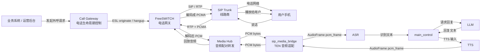
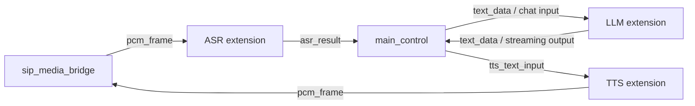
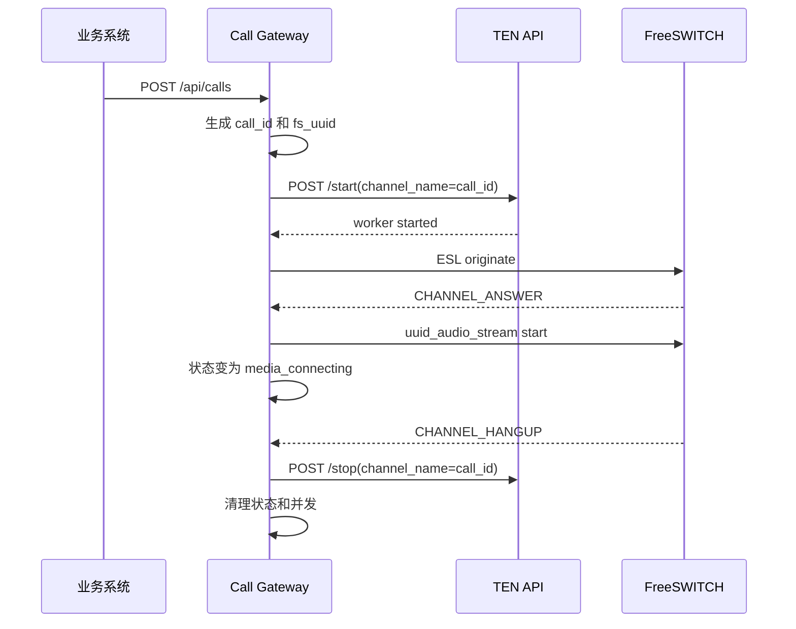
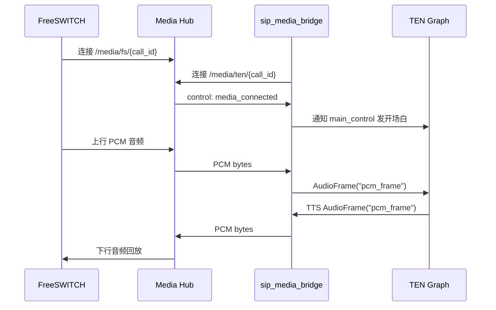

# TEN 电话接入侧职责与分阶段测试说明

## 1. 文档目标

本文只说明在“真实电话线路 + FreeSWITCH + TEN Framework”方案中，TEN 侧需要承担什么职责、它如何与电话网关 FreeSWITCH 间接协作，以及应该如何分阶段验证。

本文不包含具体代码实现。

## 2. 核心结论

TEN 不负责直接接 SIP 线路，也不负责直接拨号。

TEN 负责的是：

```text
接收电话侧传来的 PCM 音频
把 PCM 包装成 TEN AudioFrame
送入 ASR/LLM/TTS graph
把 TTS 产生的 PCM 音频送回电话侧
控制 AI 对话逻辑
```

推荐边界：

```text
FreeSWITCH：负责电话网关能力
Call Gateway：负责电话生命周期控制
Media Hub：负责音频连接配对和转发
sip_media_bridge：负责 TEN 和电话音频之间的格式适配
TEN Graph：负责 ASR/LLM/TTS 编排
main_control：负责业务对话逻辑
```

## 3. 整体架构位置



## 4. TEN 侧职责

### 4.1 TEN 不负责什么

TEN 不应该负责：

```text
SIP trunk 注册或 IP 白名单
SIP 信令处理
RTP 包收发
PCMA / PCMU 电话编码协商
真实拨号 originate
监听 FreeSWITCH 接通、忙线、拒接、挂断事件
全局并发控制
批量外呼调度
电话状态查询 API
```

这些事情属于 FreeSWITCH 和 Call Gateway。

### 4.2 TEN 负责什么

TEN 负责：

```text
1. 在每通电话接通后启动一个独立 AI 会话。
2. 通过 graph 编排 ASR、LLM、TTS。
3. 接收电话侧 PCM 音频。
4. 把 PCM 转成 TEN AudioFrame("pcm_frame")。
5. 把 AudioFrame 送给 ASR。
6. 接收 ASR 结果。
7. 根据业务状态控制 LLM 输入。
8. 把 LLM 输出切成适合电话播放的短句。
9. 把短句送给 TTS。
10. 接收 TTS 输出的 PCM AudioFrame。
11. 把 PCM 音频发回电话侧。
12. 处理用户插话和当前 TTS 打断。
13. 产生对话结束信号和业务结果摘要。
```

## 5. TEN 侧需要新增或调整的模块

### 5.1 `sip_media_bridge`

`sip_media_bridge` 是 TEN 内部的电话音频适配器。

它的本质职责：

```text
PCM bytes <-> TEN AudioFrame("pcm_frame")
```

上行链路：

```text
Media Hub
  -> PCM bytes
  -> sip_media_bridge
  -> AudioFrame("pcm_frame")
  -> ASR
```

下行链路：

```text
TTS
  -> AudioFrame("pcm_frame")
  -> sip_media_bridge
  -> PCM bytes
  -> Media Hub
```

它需要理解：

```text
call_id / channel
Media Hub 地址
音频采样率
音频声道
每个采样点字节数
上行和下行连接状态
```

它不应该理解：

```text
电话号码
欠费金额
SIP trunk
FreeSWITCH ESL
业务拨打策略
批量外呼任务
```

### 5.2 电话场景 TEN Graph

需要新增一个电话场景 graph，例如：

```text
voice_assistant_sip_trunk_cn_aliyun
```

graph 结构：



与普通 TEN 语音 graph 的差异：

```text
普通 RTC 场景：agora_rtc -> ASR -> LLM -> TTS -> agora_rtc
电话场景：sip_media_bridge -> ASR -> LLM -> TTS -> sip_media_bridge
```

也就是说，电话场景不是重写 ASR/LLM/TTS，而是更换媒体入口和出口。

### 5.3 `main_control`

`main_control` 是业务对话控制层。

在电话场景里，它负责：

```text
1. 收到 media_connected 后发开场白。
2. 接收 ASR 最终识别文本。
3. 判断用户是不是在插话。
4. 用户插话时停止当前 LLM/TTS 输出。
5. 维护业务对话状态。
6. 组织 LLM prompt 和上下文。
7. 把 LLM 流式输出切成短句。
8. 把短句送给 TTS。
9. 判断是否结束对话。
10. 生成 conversation_done 事件。
11. 输出通话摘要和业务结果。
```

`main_control` 不负责：

```text
拨号
挂断
FreeSWITCH 事件监听
WebSocket 音频转发
音频 codec 转换
```

### 5.4 配置与动态注入

电话场景里每通电话都应该有一个唯一 `call_id`。

推荐使用：

```text
TEN /start channel_name = call_id
```

`sip_media_bridge` 节点中保留一个 `channel` 属性：

```text
channel = default
```

TEN 启动 worker 时把 `channel_name` 注入到有 `channel` 属性的节点里。

最终效果：

```text
sip_media_bridge.channel = call_id
```

这样每通电话都能连接自己的 Media Hub 地址：

```text
ws://<media-hub>/media/ten/{call_id}
```

## 6. TEN 与 FreeSWITCH 的交互关系

推荐架构下，TEN 不直接连接 FreeSWITCH。

TEN 和 FreeSWITCH 之间通过两个外部层协作：

```text
控制面：Call Gateway
媒体面：Media Hub
```

### 6.1 控制面链路

控制面负责电话生命周期。



TEN 在控制面只暴露：

```text
/start
/stop
/ping
/graphs
```

TEN 不直接知道：

```text
FreeSWITCH ESL 连接
originate 命令
CHANNEL_ANSWER
CHANNEL_HANGUP
```

### 6.2 媒体面链路

媒体面负责双向实时音频。



FreeSWITCH 负责：

```text
PCMA <-> PCM
```

`sip_media_bridge` 负责：

```text
PCM <-> TEN AudioFrame
```

TEN graph 负责：

```text
AudioFrame -> ASR -> LLM -> TTS -> AudioFrame
```

## 7. 实际业务链路

以物业费提醒电话为例，业务链路可以是：

```text
1. 业务系统提交一条外呼任务。
2. Call Gateway 创建 call_id。
3. Call Gateway 启动 TEN AI 会话。
4. Call Gateway 命令 FreeSWITCH 外呼用户手机号。
5. 用户接通。
6. FreeSWITCH 启动音频流。
7. Media Hub 配对 FreeSWITCH 和 TEN。
8. TEN 播放开场白。
9. 用户说话。
10. ASR 把语音转文本。
11. main_control 判断用户意图和对话阶段。
12. LLM 生成简短回复。
13. TTS 生成电话可播放音频。
14. 音频回到 FreeSWITCH。
15. 用户听到 AI 回复。
16. 对话结束或用户挂断。
17. Call Gateway 停止 TEN 会话。
18. 业务系统查询通话结果。
```

TEN 侧在这条业务链中处理的是第 8 到第 15 步。

## 8. 分阶段测试方案

### 阶段 1：TEN Graph 静态验证

目标：

```text
确认电话场景 graph 能被 TEN 识别和启动。
```

测试内容：

```text
1. 新 graph 出现在 /graphs。
2. /start 能用 channel_name 启动 worker。
3. /stop 能停止 worker。
4. channel 能注入到 sip_media_bridge。
```

通过标准：

```text
/graphs 能看到 voice_assistant_sip_trunk_cn_aliyun。
/start 返回成功。
sip_media_bridge 日志中能看到实际 call_id。
/stop 后 worker 退出。
```

### 阶段 2：`sip_media_bridge` 音频格式验证

目标：

```text
确认 sip_media_bridge 能正确处理 PCM 和 AudioFrame。
```

测试内容：

```text
1. 输入一段 8k、16-bit、mono PCM。
2. sip_media_bridge 创建 AudioFrame("pcm_frame")。
3. 检查 AudioFrame 元数据。
4. 模拟 TTS 输出 AudioFrame。
5. sip_media_bridge 输出 PCM bytes。
```

通过标准：

```text
AudioFrame name = pcm_frame。
sample_rate = 8000。
channels = 1。
bytes_per_sample = 2。
samples_per_channel 正确。
输出 PCM 可播放。
```

### 阶段 3：TEN 内部 ASR/LLM/TTS 闭环

目标：

```text
先不接真实电话，只验证 TEN AI 链路。
```

测试链路：

```text
测试 PCM
  -> sip_media_bridge
  -> ASR
  -> main_control
  -> LLM
  -> TTS
  -> sip_media_bridge
  -> 输出 PCM
```

通过标准：

```text
ASR 能识别测试语音。
main_control 能收到文本。
LLM 能返回回复。
TTS 能产生音频。
输出音频能正常播放。
```

### 阶段 4：TEN + Media Hub 验证

目标：

```text
确认 TEN 能通过 Media Hub 收发实时 PCM。
```

测试链路：

```text
fake_fs_client
  -> Media Hub /media/fs/{call_id}
  -> Media Hub /media/ten/{call_id}
  -> sip_media_bridge
  -> TEN graph
  -> sip_media_bridge
  -> Media Hub
  -> fake_fs_client
```

测试内容：

```text
1. TEN /start 启动 call_id。
2. sip_media_bridge 连接 Media Hub。
3. fake_fs_client 连接同一个 call_id。
4. Media Hub 发 media_connected。
5. fake_fs_client 发送 PCM。
6. fake_fs_client 收到 TTS PCM。
```

通过标准：

```text
同一个 call_id 能正确配对。
不同 call_id 不串线。
TEN 能收到上行语音。
fake_fs_client 能收到下行音频。
断开后连接能释放。
```

### 阶段 5：TEN + FreeSWITCH 单通电话联调

目标：

```text
真实电话接通后，TEN 能听见用户，也能把 AI 声音播回手机。
```

测试链路：

```text
手机
  -> SIP trunk
  -> FreeSWITCH
  -> Media Hub
  -> sip_media_bridge
  -> TEN
  -> sip_media_bridge
  -> Media Hub
  -> FreeSWITCH
  -> 手机
```

通过标准：

```text
1. 手机接通后听到 AI 开场白。
2. 用户说话能被 ASR 识别。
3. AI 回复能播回手机。
4. 用户挂断后 TEN session 被停止。
5. FreeSWITCH channel 被释放。
6. Media Hub 连接被释放。
```

### 阶段 6：打断验证

目标：

```text
用户插话时，当前 AI 播放能停止。
```

测试内容：

```text
1. AI 正在播报一段较长回复。
2. 用户中途说话。
3. ASR 检测到用户新语音。
4. main_control 发起 flush。
5. LLM/TTS 停止当前输出。
6. 下行播放队列清空。
7. AI 根据用户插话重新回复。
```

通过标准：

```text
用户插话后旧音频不继续播放。
AI 不重复说上一轮内容。
新一轮响应能正常开始。
```

### 阶段 7：低延迟验证

目标：

```text
用户说完后，AI 第一段声音尽量在 1 秒到 1.5 秒内开始播放。
```

需要记录的时间点：

```text
用户语音结束时间
ASR final 时间
LLM first token 时间
TTS first audio 时间
Media Hub 下发时间
电话侧听到声音时间
```

通过标准：

```text
端到端首响延迟可观测。
首响延迟稳定在 1.5 秒以内。
优化后争取接近 1 秒。
```

### 阶段 8：10 路并发验证

目标：

```text
验证 TEN 多 session 与电话多路并发不会串线。
```

测试内容：

```text
1. 同时启动 10 个 call_id。
2. 每个 call_id 启动独立 TEN worker。
3. 每通电话输入不同测试语音。
4. 随机挂断部分电话。
5. 检查每路回复是否对应自己的用户语音。
```

通过标准：

```text
10 路不串线。
TEN worker 不残留。
Media Hub 连接不残留。
挂断任意一路不影响其他路。
日志能按 call_id 追踪完整链路。
```

## 9. TEN 侧验收清单

基础能力：

```text
[ ] 新 graph 能出现在 /graphs
[ ] /start 能启动电话场景 worker
[ ] channel_name 能注入 sip_media_bridge
[ ] sip_media_bridge 能连接 Media Hub
[ ] 上行 PCM 能变成 AudioFrame
[ ] AudioFrame 能进入 ASR
[ ] ASR 结果能进入 main_control
[ ] main_control 能调用 LLM
[ ] LLM 输出能送入 TTS
[ ] TTS AudioFrame 能回到 sip_media_bridge
[ ] sip_media_bridge 能输出 PCM
```

电话体验：

```text
[ ] 接通后能播开场白
[ ] 用户说话能被识别
[ ] AI 回复能播回手机
[ ] 用户插话能打断
[ ] 用户挂断后 TEN 能清理
[ ] AI 主动结束后能通知外部清理
```

稳定性：

```text
[ ] 单通连续 30 分钟不异常
[ ] 10 路并发不串线
[ ] 断开重连不会造成 worker 残留
[ ] 日志有 call_id
[ ] 日志不泄露密钥
[ ] 日志尽量脱敏手机号
```

## 10. 最小业务闭环

第一版不要追求完整业务系统，只追求下面这条链路成立：

```text
业务系统发起一通测试电话
  -> 用户接通
  -> TEN 播放开场白
  -> 用户说一句话
  -> TEN 识别
  -> TEN 回复
  -> 用户听到回复
  -> 用户挂断
  -> TEN 和 FreeSWITCH 都完成清理
```

这条链路成立后，再逐步增加：

```text
业务话术
低延迟优化
打断能力
失败原因分类
10 路并发
批量任务
CRM 回写
录音质检
```

## 11. 关键设计原则

```text
1. TEN 不直接接 SIP。
2. TEN 不直接管拨号。
3. TEN 只处理干净的 PCM 音频和 AI 对话。
4. 每通电话使用独立 call_id。
5. call_id 贯穿 Call Gateway、Media Hub、sip_media_bridge、TEN worker。
6. 音频桥只做音频适配，不做业务逻辑。
7. main_control 只做对话逻辑，不做电话网关逻辑。
8. 所有清理逻辑必须幂等。
9. 先测声音进出 TEN，再测真实电话。
10. 先单通稳定，再做低延迟和并发。
```
