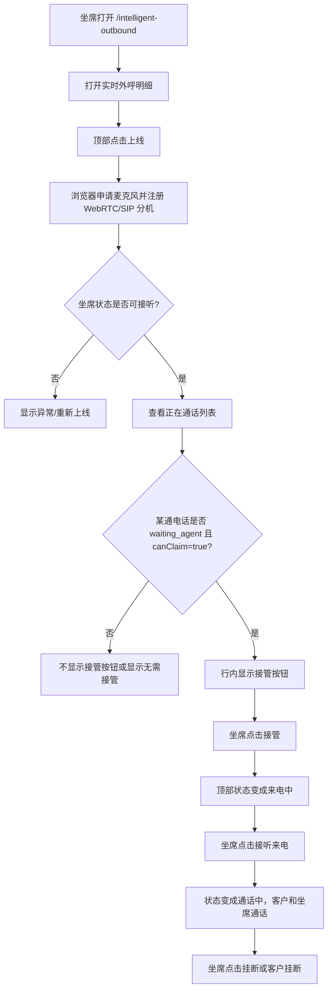
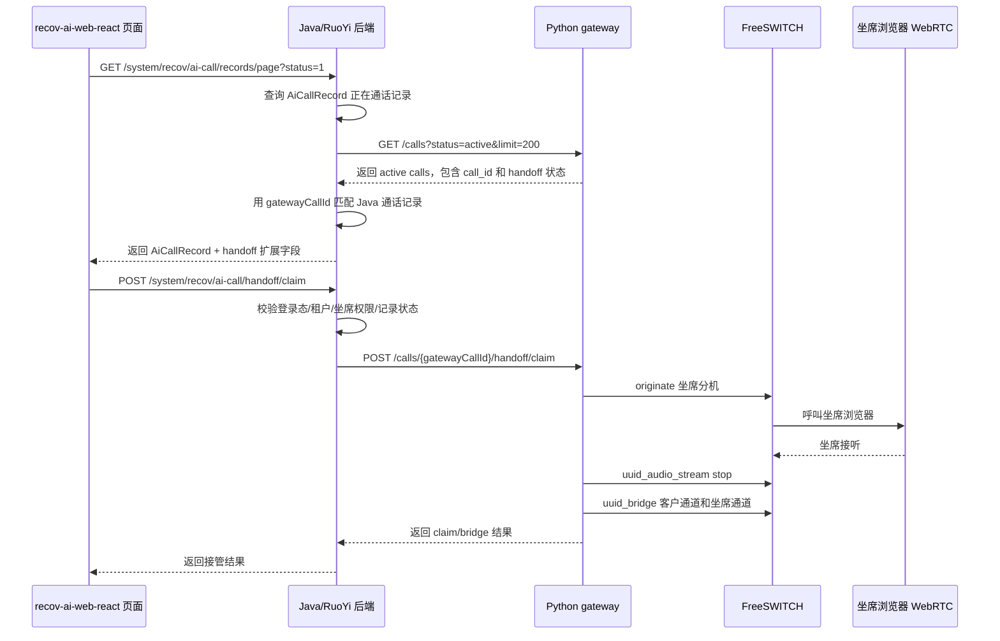
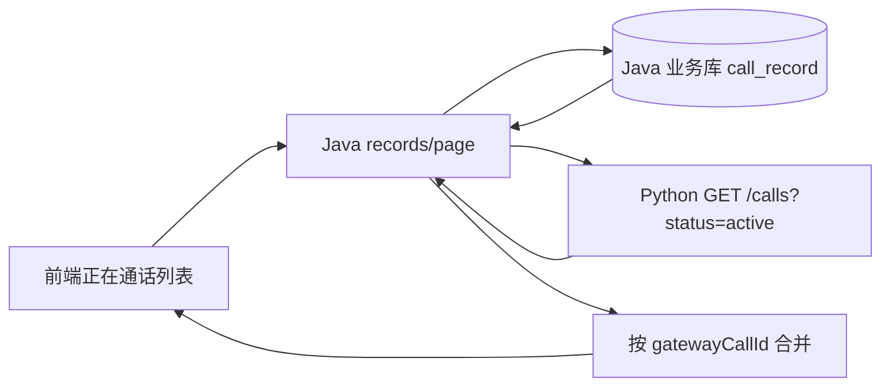

# recov-ai-web-react 人工接管迁移对接说明

## 1. 先看界面怎么操作

本方案采用“方案 A”：不新建独立测试页，复用 `recov-ai-web-react` 现有 `/intelligent-outbound` 页面里的“实时外呼明细”弹窗，把测试页 `/webrtc-agent-test` 的人工接管能力迁移到正式后台页面。

第一版只处理一种场景：

```text
客户在 AI 通话中明确要求转人工
-> 后端把该通电话标记为 waiting_agent
-> 正在通话列表出现“接管”按钮
-> 坐席点击“接管”
-> 后端呼叫坐席浏览器分机
-> 坐席点击“接听来电”
-> 客户和坐席进入人工通话
```

这里有两个动作必须分开理解：

| 动作 | 谁触发 | 作用 |
|---|---|---|
| 接管 | 坐席在列表行点击 | 告诉后端“这通客户电话由我来接”，触发后端 claim 和桥接准备 |
| 接听来电 | 坐席在顶部状态区点击 | 后端已经呼叫浏览器坐席分机，坐席真正接通 WebRTC 来电 |

如果只点“接管”，但浏览器没有上线或没有接听来电，客户还不能和坐席通话。

### 1.1 页面操作流程图



### 1.2 页面状态和按钮

顶部只需要一个坐席状态区，不要把每个状态都做成按钮。状态是展示，按钮按状态出现。

| 坐席状态 | 含义 | 展示按钮 |
|---|---|---|
| 未注册 | 浏览器还没有注册坐席分机 | 上线 |
| 注册中 | 正在连接 WebRTC/SIP 服务 | 上线按钮 loading |
| 可接听 | 坐席已上线，可以被后端呼叫 | 下线 |
| 来电中 | 后端正在呼叫当前坐席分机 | 接听来电、拒接 |
| 通话中 | 坐席已经和客户通话 | 挂断 |
| 异常 | 麦克风、注册、WebRTC 或 SIP 连接失败 | 重新上线 |

正在通话列表增加两列：

| 列名 | 作用 |
|---|---|
| 转人工状态 | 展示客户是否要求转人工、是否等待坐席、是否已被接管 |
| 操作 | 满足条件时显示“接管” |

操作列规则：

| 后端字段条件 | 页面显示 |
|---|---|
| `handoffState = waiting_agent` 且 `handoffCanClaim = true` | 接管 |
| `handoffState = human_active` | 已接管 |
| `handoffState = expired` | 已超时 |
| `handoffState = failed` | 接管失败 |
| 无 `handoffState` 或 `handoffState = none` | 不显示按钮，或显示无需接管 |

## 2. 当前前端现状

`recov-ai-web-react` 现有页面已经具备基础入口：

| 项目 | 当前情况 |
|---|---|
| 页面 | `/intelligent-outbound` |
| 弹窗 | “实时外呼明细” |
| 正在通话列表 | 已有 |
| 查询接口 | `GET /system/recov/ai-call/records/page` |
| 当前筛选 | `status = '1'` 表示正在通话 |
| 当前行类型 | `AiCallRecord` |

现有 `AiCallRecord` 只能表达业务通话记录，例如 `callRecordId`、业主姓名、数字员工身份、通话状态、开始时间、通话时长等。

它还不能表达人工接管，因为缺少这些关键数据：

```text
gatewayCallId
handoffState
handoffCanClaim
handoffLastUtterance
handoffRequestedAt
handoffClaimedBy
handoffError
```

所以前端现在能判断“正在通话”，但不能判断“客户是否要求转人工”，也不能直接发起接管。

## 3. Java 需要做什么

Java 侧是正式后台的业务入口，建议承担四类工作：

```text
1. 保存 Python gateway 返回的真实通话 ID。
2. 在正在通话列表里补人工接管字段。
3. 提供人工接管代理接口。
4. 可选提供 WebRTC 坐席配置接口。
```

### 3.1 总体调用关系



这个图里最关键的是：前端不直接打 Python。前端只和 Java 交互，Java 统一代理 Python 的通话控制能力。

### 3.2 Java 保存 `gatewayCallId`

Python gateway 创建外呼时会生成一个 `call_id`。这个 ID 不只是普通业务编号，它同时是客户侧 FreeSWITCH 通道 UUID。

后续这些动作都依赖它：

```text
查询该通实时电话
停止 AI 音频流
人工接管 claim
uuid_bridge 客户通道和坐席通道
挂断客户通道
```

因此 Java 在调用 Python `POST /calls` 创建外呼后，必须保存 Python 响应里的 `call.call_id`。

建议字段名：

```text
gateway_call_id
```

也可以叫：

```text
media_call_id
fs_call_uuid
```

但推荐 `gateway_call_id`，因为它表达的是“Python gateway 返回的通话控制 ID”。

不能用这些 ID 替代：

| ID | 为什么不能替代 `gatewayCallId` |
|---|---|
| `callRecordId` | Java 数据库通话记录主键，不是 FreeSWITCH 通道 UUID |
| `taskId` | Java 流程任务 ID，不是电话通道 ID |
| `debtId` | 欠费/业主业务数据 ID，不是电话通道 ID |
| `agentExtension` | 坐席分机号，不是客户电话通道 ID |
| `agentUuid` | 坐席侧通道 UUID，不是客户侧通道 UUID |

### 3.3 Java 扩展正在通话列表字段

现有接口：

```http
GET /system/recov/ai-call/records/page
```

当前前端调用示例：

```text
/system/recov/ai-call/records/page?pageNum=1&pageSize=10&status=1
```

建议 Java 在 `status=1` 的正在通话记录中返回人工接管扩展字段。

字段建议如下：

| 字段 | 类型 | 示例 | 注解 |
|---|---|---|---|
| `gatewayCallId` | string | `f3a9c0...` | Python gateway 的 `call_id`，也是客户侧 FreeSWITCH 通道 UUID。前端点击接管时必须传它，不能用 `callRecordId` 替代。 |
| `handoffState` | string | `waiting_agent` | 当前转人工状态。前端用它判断是否展示“接管”“已接管”“已超时”等状态。 |
| `handoffCanClaim` | boolean | `true` | 当前这通电话是否允许坐席接管。只有为 `true` 时才启用“接管”按钮。 |
| `handoffLastUtterance` | string | `我要找人工客服` | 触发转人工前客户最后一句话，帮助坐席了解客户为什么要转人工。 |
| `handoffRequestedAt` | string | `2026-06-08 15:30:12` | 客户要求转人工的时间。用于显示等待时长、排序或排查。 |
| `handoffExpiresAt` | string | `2026-06-08 15:30:42` | 转人工等待超时时间。用于页面提示“即将超时”或后端判断是否还能接管。 |
| `handoffClaimedBy` | string | `admin` | 已经接管该通电话的后台账号或坐席账号。用于避免重复接管和追踪责任人。 |
| `handoffAgentExtension` | string | `1001` | 接管坐席的 SIP 分机号。用于排查坐席分机和桥接问题。 |
| `handoffError` | string | `agent timeout` | 接管失败原因。用于页面提示和日志排查。 |

建议 Java DTO 直接加字段注解，避免后续维护人员误解：

```java
public class AiCallRecordResp {

    @Schema(description = "Java 侧通话记录主键，用于查询业务记录和语义分析详情，不可作为 Python gateway 接管 ID")
    private Long callRecordId;

    @Schema(description = "Python gateway 返回的 call.call_id，也是客户侧 FreeSWITCH 通道 UUID；人工接管、桥接、挂断客户通道必须使用该字段")
    private String gatewayCallId;

    @Schema(description = "转人工状态：none=未触发；waiting_agent=客户已要求转人工，等待坐席接管；agent_claimed=已有坐席抢接处理中；human_active=人工通话中；expired=等待超时；failed=接管失败")
    private String handoffState;

    @Schema(description = "当前是否允许坐席点击接管；只有 true 时前端才启用接管按钮")
    private Boolean handoffCanClaim;

    @Schema(description = "触发转人工前客户最后一句原话，供坐席接管前了解上下文")
    private String handoffLastUtterance;

    @Schema(description = "客户触发转人工的时间，格式建议 yyyy-MM-dd HH:mm:ss")
    private String handoffRequestedAt;

    @Schema(description = "本次转人工等待坐席接管的超时时间，格式建议 yyyy-MM-dd HH:mm:ss")
    private String handoffExpiresAt;

    @Schema(description = "已接管或正在接管的后台账号/坐席账号，用于避免多人重复接管")
    private String handoffClaimedBy;

    @Schema(description = "接管坐席的 SIP 分机号，例如 1001，用于 Python gateway 呼叫坐席浏览器分机")
    private String handoffAgentExtension;

    @Schema(description = "接管失败原因，例如 agent timeout、call not active、bridge failed，用于前端提示和排查")
    private String handoffError;
}
```

### 3.4 `handoffState` 状态建议

建议 Java 对外统一这些状态值：

| 状态 | 含义 | 前端展示 |
|---|---|---|
| `none` | 未触发转人工 | 无需接管 |
| `waiting_agent` | 客户已明确要求转人工，正在等待坐席 | 接管 |
| `agent_claimed` | 已有坐席点击接管，后端正在呼叫坐席分机 | 接管中 |
| `human_active` | 已桥接成功，客户正在和人工通话 | 已接管 |
| `expired` | 等待坐席超时 | 已超时 |
| `failed` | 接管失败 | 接管失败 |

第一版前端只需要在 `waiting_agent + handoffCanClaim=true` 时显示可点击按钮。

## 4. Java 接管代理接口

### 4.1 这个接口是干嘛用的

建议 Java 提供：

```http
POST /system/recov/ai-call/handoff/claim
```

这个接口的作用是：前端点击“接管”时，不直接调用 Python gateway，而是先调用 Java；Java 完成业务校验后，再转发给 Python gateway。

为什么需要 Java 代理：

| 原因 | 说明 |
|---|---|
| 登录态校验 | 前端后台登录态在 Java 侧，Python gateway 不适合直接识别后台用户权限 |
| 租户/组织权限 | Java 可以校验当前坐席是否有权限接管这条记录 |
| 坐席身份绑定 | Java 可以把后台用户映射为 SIP 分机，例如 `admin -> 1001` |
| 数据一致性 | Java 可以记录谁点了接管、接管什么时候开始、失败原因是什么 |
| 安全边界 | Python gateway 是媒体控制服务，不建议直接暴露给正式后台页面 |
| 后续统计 | 人工接管次数、坐席绩效、失败率等更适合从 Java 业务库统计 |

一句话解释：

```text
Java 接管代理接口 = 正式后台页面调用的业务接口；它负责校验和转发，真正桥接电话仍由 Python gateway + FreeSWITCH 完成。
```

### 4.2 接口入参

```json
{
  "callRecordId": 123,
  "gatewayCallId": "f3a9c0d2e7...",
  "agentExtension": "1001",
  "claimedBy": "admin",
  "timeoutSeconds": 20
}
```

字段注解：

| 字段 | 类型 | 必填 | 注解 |
|---|---|---|---|
| `callRecordId` | number/string | 是 | Java 侧通话记录主键，用于查库、权限校验、日志记录。不能拿它去调用 Python 的 `/calls/{id}`。 |
| `gatewayCallId` | string | 是 | Python gateway 的 `call_id`，Java 调 Python claim 接口时放到 URL 里：`/calls/{gatewayCallId}/handoff/claim`。 |
| `agentExtension` | string | 是 | 坐席 SIP 分机号，例如 `1001`。Python 会呼叫这个分机，坐席浏览器收到来电。 |
| `claimedBy` | string | 建议必填 | 当前后台登录账号或坐席账号，用于记录是谁接管。也可以由 Java 从 token/session 中取，不信任前端传值。 |
| `timeoutSeconds` | number | 否 | 等待坐席接听和桥接的超时时间。建议 20-30 秒，Java HTTP client 超时建议 30-60 秒。 |

建议 Java Request DTO：

```java
public class HandoffClaimReq {

    @Schema(description = "Java 侧通话记录主键，用于业务校验和日志记录，不可作为 Python gateway call_id")
    @NotNull
    private Long callRecordId;

    @Schema(description = "Python gateway 的 call.call_id，也是客户侧 FreeSWITCH 通道 UUID；Java 转发 Python claim 接口时使用")
    @NotBlank
    private String gatewayCallId;

    @Schema(description = "坐席 SIP 分机号，例如 1001；Python gateway 会呼叫该分机并等待坐席浏览器接听")
    @NotBlank
    private String agentExtension;

    @Schema(description = "发起接管的后台账号/坐席账号；建议后端从登录态取值，前端传值仅作展示参考")
    private String claimedBy;

    @Schema(description = "等待坐席接听和 bridge 的超时时间，单位秒；建议默认 20，允许范围 1-120")
    private Integer timeoutSeconds;
}
```

### 4.3 Java 转发 Python 的请求

Java 收到前端 claim 请求后，转发 Python：

```http
POST /calls/{gatewayCallId}/handoff/claim
```

Python body：

```json
{
  "agent_extension": "1001",
  "claimed_by": "admin",
  "timeout_seconds": 20
}
```

字段映射：

| Java 字段 | Python 字段 | 说明 |
|---|---|---|
| `gatewayCallId` | URL path `{call_id}` | Python 用它定位客户侧通道 |
| `agentExtension` | `agent_extension` | Python 用它呼叫坐席分机 |
| `claimedBy` | `claimed_by` | Python 记录接管人 |
| `timeoutSeconds` | `timeout_seconds` | Python 等待坐席接听和 bridge 的时长 |

### 4.4 接口返回

建议 Java 返回统一结果：

```json
{
  "code": 200,
  "msg": "接管请求已提交",
  "data": {
    "callRecordId": 123,
    "gatewayCallId": "f3a9c0d2e7...",
    "handoffState": "agent_claimed",
    "agentExtension": "1001",
    "claimedBy": "admin",
    "message": "后端正在呼叫坐席分机，请在页面顶部接听来电"
  }
}
```

如果 Python 已经 bridge 成功，也可以返回：

```json
{
  "code": 200,
  "msg": "接管成功",
  "data": {
    "handoffState": "human_active"
  }
}
```

第一版前端不要强依赖返回一定是 `human_active`，因为后端呼叫坐席、坐席接听、bridge 之间存在时间差。更稳妥的做法是：

```text
点击接管成功返回
-> 前端提示“正在呼叫坐席，请接听来电”
-> 继续刷新正在通话列表
-> 顶部 WebRTC 状态区收到来电后显示“接听来电”
```

### 4.5 Java Controller 注释示例

```java
@PostMapping("/handoff/claim")
@Operation(summary = "人工接管正在通话", description = "前端坐席点击接管时调用。该接口只负责业务校验和代理 Python gateway，真正的坐席呼叫、AI 音频停止、FreeSWITCH bridge 由 Python gateway 完成。")
public AjaxResult claimHandoff(@RequestBody @Valid HandoffClaimReq req) {
    // 1. 校验 callRecordId 是否存在且仍在通话中
    // 2. 校验当前登录用户是否有权限接管该通电话
    // 3. 获取或校验坐席 SIP 分机号 agentExtension
    // 4. 校验 gatewayCallId 是否与 callRecordId 绑定，防止前端篡改
    // 5. 调用 Python: POST /calls/{gatewayCallId}/handoff/claim
    // 6. 记录接管人、开始时间、Python 返回状态或失败原因
    // 7. 返回给前端
}
```

## 5. Java 如何拿到 handoff 状态

第一版建议用“查询时合并”的方式，不强制先改复杂的数据同步。

### 5.1 推荐第一版：列表查询时合并 Python `/calls`

流程：

```text
1. Java 查询自己的 AiCallRecord 正在通话记录。
2. Java 调 Python GET /calls?status=active&limit=200。
3. Python 返回当前活跃电话，包括 call_id、handoff、agent_takeover_suggestion。
4. Java 用 gatewayCallId == Python call.call_id 做匹配。
5. Java 把 Python handoff 状态合并到 AiCallRecord 返回给前端。
```



优点：

```text
改造快
不需要 Python 先回写每个 handoff 过程状态到 Java DB
状态接近实时
适合第一版验证
```

注意：

```text
Python /calls 的 limit 要覆盖当前正在通话量，例如 200。
Java 调 Python 失败时，列表仍返回业务记录，但 handoff 字段置为 none/unknown。
不要因为 Python 状态查询失败导致整个正在通话列表打不开。
```

### 5.2 后续增强：Python 状态回调或 Java 落库

如果后续要做坐席统计、审计、失败率分析，可以新增 Java 表或字段保存 handoff 过程：

```text
handoff_requested_at
handoff_claimed_at
handoff_claimed_by
handoff_agent_extension
handoff_connected_at
handoff_finished_at
handoff_error
```

但第一版不建议一开始就把过程表做复杂。先保证页面能接管，确认链路跑通后，再补统计和审计。

## 6. 可选：Java 提供 WebRTC 坐席配置接口

前端 `useWebRtcAgent` 需要知道 SIP/WSS 配置。测试页里这些配置是写死的，但正式后台不建议写死。

建议 Java 提供：

```http
GET /system/recov/ai-call/agent/webrtc-config
```

返回示例：

```json
{
  "wsUrl": "wss://example.com:7443",
  "sipUri": "sip:1001@example.com",
  "displayName": "坐席1001",
  "agentExtension": "1001",
  "iceServers": [
    { "urls": "stun:stun.l.google.com:19302" }
  ]
}
```

字段注解：

| 字段 | 注解 |
|---|---|
| `wsUrl` | FreeSWITCH SIP over WSS 地址。测试环境可能是 `ws://111.229.146.182:5066`，正式环境建议 HTTPS/WSS。 |
| `sipUri` | 当前坐席 SIP 地址，例如 `sip:1001@111.229.146.182`。 |
| `displayName` | 坐席显示名，只用于页面展示和 SIP display name。 |
| `agentExtension` | 坐席分机号，claim 接口也要使用。 |
| `iceServers` | WebRTC STUN/TURN 配置，生产环境建议准备 TURN。 |

如果第一版赶进度，也可以先在前端 `.env` 写测试配置。但正式环境最好由 Java 按登录用户返回坐席配置。

## 7. Java 侧校验和异常处理

### 7.1 claim 前建议校验

Java 调 Python 之前建议做这些校验：

| 校验项 | 目的 |
|---|---|
| `callRecordId` 存在 | 防止接管不存在的业务记录 |
| 记录仍在通话中 | 防止接管已完成/失败/挂断的电话 |
| `gatewayCallId` 不为空 | 没有 Python call_id 就无法接管 |
| `gatewayCallId` 和 `callRecordId` 绑定一致 | 防止前端篡改 gatewayCallId 接管别的电话 |
| 当前用户有权限 | 防止跨组织/跨租户接管 |
| 当前用户有坐席分机 | 没有分机就无法被 Python 呼叫 |
| 坐席状态允许接管 | 可选；如果 Java 能感知坐席在线状态，可以提前拦截 |

### 7.2 常见错误码建议

| 场景 | Java 返回文案 |
|---|---|
| 没有 `gatewayCallId` | 当前通话缺少网关通话 ID，暂不能接管 |
| 非通话中 | 当前电话已结束，不能接管 |
| 非 `waiting_agent` | 客户尚未请求转人工，不能接管 |
| 已被别人接管 | 当前电话已由其他坐席接管 |
| 坐席分机为空 | 当前账号未绑定坐席分机 |
| Python 连接失败 | 接管服务连接失败，请稍后重试 |
| 坐席未接听超时 | 坐席接听超时，接管失败 |
| bridge 失败 | 电话桥接失败，请联系管理员排查 |

前端展示建议：

```text
短错误提示放 message/toast。
关键失败原因保留在行内状态或详情中，方便排查。
```

## 8. 前端改造清单

前端需要做这些事：

| 模块 | 工作 |
|---|---|
| `service.ts` | 扩展 `AiCallRecord` 类型，新增 `claimHandoff`、可选新增 `getWebRtcConfig` |
| `useWebRtcAgent` | 封装 JsSIP/WebRTC 注册、来电、接听、拒接、挂断、远端音频播放 |
| `LiveMonitorDetailModal` | 顶部增加坐席状态区，正在通话表格增加“转人工状态”和“操作”列 |
| 状态展示 | 根据 `handoffState/handoffCanClaim` 控制“接管”按钮 |
| 异常提示 | 接管失败、WebRTC 注册失败、麦克风失败时给出明确提示 |

前端字段类型建议：

```ts
export type AiCallHandoffState =
  | 'none'
  | 'waiting_agent'
  | 'agent_claimed'
  | 'human_active'
  | 'expired'
  | 'failed';

export type AiCallRecord = {
  callRecordId?: number | string;
  status?: string;

  /** Python gateway 的 call.call_id，人工接管时必须传给 Java */
  gatewayCallId?: string;

  /** 当前转人工状态，用于控制行内状态文案和接管按钮 */
  handoffState?: AiCallHandoffState;

  /** 是否允许当前坐席点击接管 */
  handoffCanClaim?: boolean;

  /** 触发转人工前客户最后一句话 */
  handoffLastUtterance?: string;

  /** 客户要求转人工的时间 */
  handoffRequestedAt?: string;

  /** 转人工超时时间 */
  handoffExpiresAt?: string;

  /** 已接管坐席账号 */
  handoffClaimedBy?: string;

  /** 已接管坐席分机 */
  handoffAgentExtension?: string;

  /** 接管失败原因 */
  handoffError?: string;
};
```

## 9. 验收标准

### 9.1 联调前验收

| 检查项 | 成功标准 |
|---|---|
| Java 保存 `gatewayCallId` | 创建外呼后，Java 记录能查到 Python `call.call_id` |
| 正在通话列表字段 | `status=1` 的记录能返回 `gatewayCallId/handoffState/handoffCanClaim` |
| Java claim 接口 | 前端调用 Java 接口后，Java 能转发到 Python `/calls/{gatewayCallId}/handoff/claim` |
| 坐席配置 | 前端能拿到或配置坐席 SIP/WSS 信息 |

### 9.2 页面验收

| 操作 | 成功标准 |
|---|---|
| 坐席点击上线 | 状态变为可接听 |
| 客户要求转人工 | 正在通话列表对应行出现“接管” |
| 坐席点击接管 | 页面提示正在呼叫坐席，顶部进入来电中 |
| 坐席点击接听来电 | 状态变为通话中 |
| 客户和坐席说话 | 双方能听见 |
| 任意一方挂断 | 页面状态恢复，列表刷新 |

### 9.3 后端验收

| 检查项 | 成功标准 |
|---|---|
| Python handoff 状态 | `waiting_agent -> agent_claimed -> human_active` 正常流转 |
| FreeSWITCH bridge | 客户侧 `gatewayCallId` 和坐席侧 `agentUuid` bridge 成功 |
| AI 音频停止 | 转人工后 AI 不再继续说话 |
| 失败处理 | 坐席不接、超时、bridge 失败时有明确错误 |

## 10. 需要技术经理确认的问题

请重点确认 Java 侧这些点：

```text
1. Java 当前调用 Python POST /calls 的代码在哪里？
2. Python 返回的 call.call_id 现在有没有保存？
3. 如果没保存，gateway_call_id 加到哪张表、哪个 VO、哪个 mapper？
4. GET /system/recov/ai-call/records/page 是否可以扩展返回 handoff 字段？
5. Java 是否同意在 records/page 查询时调用 Python /calls 合并实时 handoff 状态？
6. Java 是否提供 POST /system/recov/ai-call/handoff/claim 代理接口？
7. 后台用户和 SIP 坐席分机如何绑定？第一版是否先固定 1001？
8. Java HTTP client 调 Python claim 接口的超时时间能否设置到 30-60 秒？
9. 是否需要 Java 记录接管日志？如果需要，先落主表字段还是新增 handoff_log 表？
10. 正式环境 WebRTC 是用 ws 还是 wss？如果是 wss，证书和域名由谁配置？
```

## 11. 给技术经理的核心结论

```text
前端现有“正在通话”列表可以复用，但 Java 必须补人工接管的数据边界：

1. 创建外呼时保存 Python 返回的 call.call_id，字段建议叫 gateway_call_id。
2. 正在通话列表返回 gatewayCallId、handoffState、handoffCanClaim 等字段，并给字段加清楚注解。
3. Java 提供 POST /system/recov/ai-call/handoff/claim 代理接口。
4. 前端只调用 Java，Java 校验后再调用 Python /calls/{gatewayCallId}/handoff/claim。
5. gatewayCallId 不能用 callRecordId、taskId、debtId 替代，因为它是客户侧 FreeSWITCH 通道 UUID。

页面上，“接管”和“接听来电”要分开：

接管 = 告诉后端这通客户电话由我接。
接听来电 = 后端呼叫坐席浏览器后，坐席真正接起 WebRTC 来电。
```

