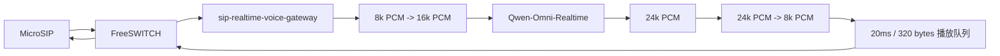

# 阶段 5 测试说明：电话端实时语音闭环

## 背景

阶段 5 的目标是把前四个已经拆开验证过的能力接成一条电话热链路：



从第一性原理看，电话智能客服是否可用，最低要求不是“模型离线能回答”，而是：

- 电话音频能进入模型。
- 模型音频能回到电话。
- 下行音频必须按电话侧节奏播放，不能把大块音频一次性塞给 FreeSWITCH。
- 每一轮用户说话必须有一个明确的提交边界，否则模型不知道什么时候开始回答。

## 当前实现范围

本阶段已新增：

- `app/realtime_phone_gateway.py`
  - 新的 FreeSWITCH 媒体 WebSocket 服务。
  - 接收电话侧 `8kHz mono pcm_s16le`。
  - 使用本地能量 VAD 判断一句话结束。
  - 将电话输入重采样为 `16kHz mono pcm_s16le` 后发送给实时模型。
  - 接收模型返回的 `24kHz mono pcm_s16le` 音频 delta。
  - 将下行音频重采样为 `8kHz mono pcm_s16le`。
  - 按 `20ms / 320 bytes` 切帧，并通过单播放 worker 节奏化写回 FreeSWITCH。
  - 检测到用户在 AI 播放期间开口时，清空剩余播放队列，避免旧回复尾巴和新回复混播。
- `app/voice_activity.py`
  - 基于 PCM RMS 能量的本地端点检测。
  - 支持起始语音时间、结束静音时间、最短语音、最长语音、前置缓冲和保留尾部静音。
- `app/realtime_client.py`
  - `response.audio.delta` 增加流式回调，模型音频到达时可以立刻交给电话播放队列。
- `app/main.py`
  - 新增 `--media-mode echo|realtime`。
  - 默认仍为 `echo`，不破坏前面阶段的回声测试。
  - `realtime` 模式会从环境变量或 `../ai_agents/.env` 读取 `DASHSCOPE_API_KEY` / `ALIYUN_DASHSCOPE_API_KEY`。

## 启动方式

阶段 5 使用 realtime 模式：

```powershell
cd <repo>\sip-realtime-voice-gateway
python -m app.main `
  --config configs/local.example.toml `
  --env-file ../ai_agents/.env `
  --media-mode realtime
```

当前本地 FreeSWITCH 的 `9199` 分机仍指向：

```text
ws://host.docker.internal:9101/media/fs/fs_stage5a_local
```

因此服务启动后，用 MicroSIP 拨打 `9199`，说一句较短中文，停止说话后等待 AI 回复。

## VAD 配置

默认配置在 `configs/local.example.toml`：

```toml
[vad]
speech_rms_threshold = 300
start_speech_ms = 60
end_silence_ms = 800
min_speech_ms = 240
max_utterance_ms = 12000
pre_speech_ms = 160
keep_silence_ms = 160
```

含义：

- `speech_rms_threshold`：判断“当前帧是否像说话”的能量阈值。
- `start_speech_ms`：连续多少毫秒超过阈值才认为用户开始说话。
- `end_silence_ms`：连续多少毫秒低于阈值才认为一句话结束。
- `min_speech_ms`：太短的声音不提交给模型，避免误触发。
- `max_utterance_ms`：一句话最长收集时间，防止长时间不提交。
- `pre_speech_ms`：保留用户开始说话前的一小段音频，减少开头被截断。
- `keep_silence_ms`：提交给模型时保留少量尾部静音，避免结束音被截断。

如果人工测试中出现“说完很久才回复”，优先降低 `end_silence_ms`。如果出现“没说话也触发”，优先提高 `speech_rms_threshold` 或 `start_speech_ms`。

## 已完成的自动化验证

```text
python -m pytest -> 29 passed
python -m py_compile app/config.py app/health_server.py app/logging_config.py app/main.py app/freeswitch_media.py app/audio_codec.py app/env_loader.py app/wav_io.py app/realtime_client.py app/realtime_probe.py app/voice_activity.py app/realtime_phone_gateway.py -> passed
```

覆盖点：

- 旧的 FreeSWITCH echo 服务仍可用。
- VAD 可以在语音后跟随静音时切出一轮用户输入。
- 短噪声不会触发提交。
- realtime client 可以在收到 `response.audio.delta` 时触发流式回调。
- 电话网关可以把模拟模型返回的 `24kHz PCM` 转成 `8kHz / 20ms / 320 bytes` 并写回 WebSocket 客户端。
- 用户在播放中插话时，会清空尚未播放的下行队列，并记录 `interruptions` 和 `dropped_playback_frames`。

## 人工电话测试记录

### 2026-05-09 首轮测试

现象：

- 用户停止说话到听到回复大约 `2-3s`。
- 出现 AI 回答到一半停止的情况。
- 用户再次提问时，听感上会出现“上一段断掉的回复”和“新回复”粘在一起返回。

日志结论：

```text
turns_started=3
turns_completed=3
turns_failed=0
ignored_busy_frames=643
```

模型侧没有报错，三轮都完整返回。问题发生在电话播放侧：AI 播放期间用户继续说话时，原实现把这些输入当作忙时输入忽略，同时旧播放队列没有被清空，导致旧回复尾音和后续回复混播。

已修正：

- 用户在 AI 播放期间开口时，立即清空剩余播放队列。
- 如果模型回复仍在生成，取消当前 turn task。
- 增加 `interruptions`、`dropped_playback_frames`、`cancelled_turns` 日志指标。
- 增加自动化测试覆盖播放中插话场景。

### 2026-05-09 第二轮复测

日志结果：

```text
turns_started=3
turns_completed=3
turns_failed=0
interruptions=1
dropped_playback_frames=16
cancelled_turns=0
ignored_busy_frames=919
invalid_frame_count=0
```

三轮识别和回复：

```text
1. input_transcript=你好。
   output_transcript=您好，很高兴为您服务，请问有什么可以帮您的吗？
   first_audio_delta_ms=1250
   response_done_ms=1766

2. input_transcript=你是谁呀？
   output_transcript=我是您的智能客服助手，专门帮您解决各种问题。请问有什么可以帮您的吗？
   first_audio_delta_ms=1250
   response_done_ms=2094

3. input_transcript=今天几号？
   output_transcript=今天是2024年5月22日，星期三。您是想查日程还是有什么安排需要我帮忙？
   first_audio_delta_ms=1437
   response_done_ms=2687
```

客观结论：

- 电话到模型、模型到电话的三轮链路均完成，没有模型异常。
- 最小打断护栏已触发，清空了 `16` 帧剩余播放音频，约 `320ms`。
- `cancelled_turns=0` 说明这次打断发生在模型已经生成完成之后，主要清理的是本地下行播放队列，还没有验证“模型正在生成时取消 response”的完整场景。
- `ignored_busy_frames=919` 说明 AI 播放期间仍有大量电话侧输入帧被按忙时处理，其中可能包含静音、回声或用户插话，需要在阶段 6 用更明确的状态机区分。
- “今天几号”回答错误，不属于音频链路问题。当前 prompt 没注入当前日期，也没有接工具查询能力，模型会凭参数记忆或幻觉回答。后续如果需要回答日期、订单、业务状态等事实问题，必须注入业务上下文或接工具。

人工听感补充：

- 旧回复和新回复没有再混在一起。
- AI 回复中断发生在用户开口之后，符合当前最小打断护栏的预期。
- 被打断时，AI 回复的最后一个音会突然结束。这是硬清播放队列的副作用，不是模型未返回完整音频。
- 延迟体感仍然偏高，需要后续优化。

延迟拆解：

```text
本地 VAD 等待结束静音：默认约 800ms
模型首个音频 delta：约 1250-1437ms
电话播放和调度开销：几十到数百毫秒
体感首包延迟：约 2-3s
```

当前状态：阶段 5 电话闭环已基本跑通，最小打断护栏有效；体验层仍存在尾音硬切和延迟偏高两个问题。

待记录：

```text
是否接通：
用户说话后是否听到 AI 回复：
是否明显卡顿：
从停止说话到听到首个 AI 声音的大致耗时：
日志中的 input_transcript：
日志中的 output_transcript：
```

## 当前限制

阶段 5 目前只做了最小打断护栏：检测到用户开口后清空本地播放队列，并取消本地 turn task。它还不是完整阶段 6 能力。

阶段 6 仍需要继续补：

- 明确维护 `turn_id`。
- 对模型 WebSocket 发送正式取消事件。
- 丢弃迟到的旧轮次音频 delta。
- 为打断前后的用户输入做更细的状态机。

阶段 5 也不直接实现 SIP/RTP 协议栈。SIP 注册、拨号、RTP 收发和运营商 PCMA 边界仍由 FreeSWITCH 负责，新网关只处理 FreeSWITCH 已解码后的 PCM 媒体流。
