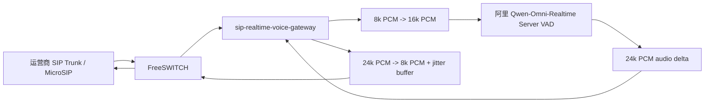

# 阿里 Server VAD 商用路径说明

## 背景结论

当前项目目标是国内 SIP 电话智能客服。前面阶段已经证明：

- FreeSWITCH 可以把 SIP/软电话媒体交给 Gateway。
- Gateway 可以完成 `8k PCM -> 16k PCM -> 8k PCM` 音频转换。
- Gateway 可以接通 Qwen-Omni-Realtime 并拿到语音回复。
- 端到端电话链路能跑通，但基于本地 VAD / Manual mode 的 turn-taking 在商用品质上不稳定。

因此后续不再继续沿着“本地 VAD + Manual mode”做补丁式优化，而是改走阿里官方更适合语音通话的 Server VAD 路线。

## 为什么不优先走 B / C 方案

### B 方案：ASR -> LLM -> TTS 级联链路

不作为当前主线。

原因：

- 级联链路天然多段网络和推理：ASR、LLM、TTS 都会引入首包和排队延迟。
- 当前目标是低延迟电话客服，级联链路更难压到自然通话体验。
- 级联链路适合强业务可控、复杂工具流、质检归档等场景，但不是当前“先把实时电话体验做顺”的最短路径。

### C 方案：RTC / Voice Agent 平台

不作为当前主线。

原因：

- 当前目标是国内电话和 SIP Trunk，FreeSWITCH 已经承担 SIP/RTP/PCMA 边界。
- RTC 平台会增加供应商依赖、合规评估和与现有 FreeSWITCH 架构的融合成本。
- 该路线适合 App/WebRTC 场景或全托管语音 Agent，不是当前国内 SIP 电话接入的优先路线。

## 推荐路线：A 方案

推荐架构：



职责边界：

- FreeSWITCH：SIP 注册、拨号路由、RTP 收发、PCMA/PCM 编解码。
- Gateway：音频格式转换、会话状态、播放队列、jitter buffer、业务上下文、日志和兜底。
- 阿里 Realtime：语音输入理解、Server VAD、response 生成、语音输出。

该方式支持最终 SIP 接入。Server VAD 是 Gateway 与阿里模型之间的 turn-taking 机制，不要求运营商 SIP Trunk 支持任何特殊协议。

## 官方依据

阿里官方文档把 realtime 交互分为 VAD mode 和 Manual mode。Manual mode 更适合按住说话或语音消息；VAD mode 更适合语音通话、免提语音助手等自然对话场景。

相关文档：

- [Realtime 模型说明](https://www.alibabacloud.com/help/en/model-studio/realtime)
- [Realtime 交互流程](https://www.alibabacloud.com/help/zh/model-studio/omni-realtime-interaction-process)
- [客户端事件](https://www.alibabacloud.com/help/zh/model-studio/client-events)
- [服务端事件](https://www.alibabacloud.com/help/en/model-studio/server-events)

后续实现必须优先遵循官方事件流：

- `session.update` 设置 `turn_detection` 为 Server VAD。
- Gateway 持续发送 `input_audio_buffer.append`。
- 由服务端产生 `input_audio_buffer.speech_started`、`input_audio_buffer.speech_stopped`、`input_audio_buffer.committed` 等事件。
- 使用 `response.created`、`response.audio.delta`、`response.done` 中的 `response_id` 管理下行音频。
- 用户新一轮 speech started 时，对当前 response 执行 `response.cancel`，并清空本地播放队列。

## 目标状态

目标链路：

```text
电话接通
-> Gateway 建立一个持久 realtime session
-> Gateway 持续 append 电话音频
-> 阿里 Server VAD 判断用户开始/结束
-> 阿里自动或事件驱动创建 response
-> Gateway 按 response_id 播放 audio delta
-> 用户插话时 cancel 当前 response + 清空播放队列
```

关键约束：

- 不再用本地 VAD 作为主判定。
- 本地可以保留能量检测作为快速打断或保护，但不能替代 Server VAD 的 turn 事件。
- 下行音频必须走 jitter buffer，不能直接按模型 delta 到达节奏写给 FreeSWITCH。
- 任何音频播放必须绑定 `response_id`，旧 response 的迟到音频必须丢弃。
- 真实商用需要处理回声、噪声、异常挂断、并发通话和模型失败兜底。

## 分阶段计划

### A1：Server VAD 离线事件流验证

目标：先不接电话，只验证阿里 Server VAD 在当前账号、模型、音频格式下的真实事件流。

链路：

```text
本地 WAV / PCM
-> Gateway Realtime Server VAD probe
-> 阿里 Qwen-Omni-Realtime
-> 保存返回音频和事件摘要
```

需要实现：

- 新增 Server VAD probe 命令，或扩展当前 `realtime_probe.py`。
- `session.update` 使用 Server VAD 配置。
- 持续 append 本地音频，不手动 commit。
- 记录完整服务端事件，重点记录：
  - `input_audio_buffer.speech_started`
  - `input_audio_buffer.speech_stopped`
  - `input_audio_buffer.committed`
  - `response.created`
  - `response.audio.delta`
  - `response.done`
  - `response_id`
- 输出 `summary.json` 和可播放 WAV。

验收标准：

```text
1. 能收到 speech_started。
2. 能收到 speech_stopped。
3. 能收到 committed 或等价提交事件。
4. 能收到 response.created / response.audio.delta / response.done。
5. summary 中能看到 response_id。
6. 输出音频可播放。
```

如果 A1 不通过，不进入电话链路改造。

当前 A1 验证状态：已通过。详见 `阶段A1测试说明.md`。

已确认：

- 默认短 PCM 样本可完整触发 `speech_started -> speech_stopped -> committed -> response.created -> response.audio.delta -> response.done`。
- Gateway 能拿到 `response_id`、输入转写、输出转写和可播放的 24k PCM/WAV。
- 离线探针已改为边发音频边读事件，避免用“先灌完整段音频再读事件”的方式误判实时链路。
- 用户提供的长 WAV 样本在 `silence_duration_ms=800` 时出现 `response.done.status=cancelled`、`reason=turn_detected`；调到 `silence_duration_ms=2000` 且补足尾部静音后成功生成语音回复。

A1 给 A2 的约束：

- 电话链路中的 Server VAD 参数必须可配置，尤其是 `silence_duration_ms`。
- 低延迟和完整断句存在天然取舍：静音窗口越短，回复越快，但长句和停顿多的场景越容易截断；静音窗口越长，越稳但等待更久。
- A2 应先用电话短问答验证，再补长句、停顿、噪声和插话样本。

### A2：电话持续 append + Server VAD 回复

目标：接入 FreeSWITCH，但暂时不做打断，先验证 Server VAD 能替代本地 VAD 完成多轮电话对话。

链路：

```text
MicroSIP / SIP
-> FreeSWITCH
-> Gateway 持续 append 16k PCM
-> 阿里 Server VAD 判定用户一句话结束
-> 模型回复
-> Gateway 播回电话
```

验收标准：

```text
1. 用户说完后 AI 能回复。
2. 多轮对话正常。
3. 不依赖本地 VAD commit/create response。
4. 日志能按 response_id 复盘每轮。
5. 延迟不高于当前阶段 6。
```

### A3：response_id 下行隔离 + jitter buffer

目标：解决断断续续和旧音频串轮的工程问题。

需要实现：

- `response_id -> playback stream` 映射。
- 只播放当前有效 `response_id` 的音频。
- 旧 `response_id` 的 delta 直接丢弃。
- 播放前缓存 `200-400ms`，按 `20ms / 320 bytes` 稳定写回 FreeSWITCH。
- 记录：
  - `queue_depth_ms`
  - `underrun_count`
  - `dropped_stale_frames`
  - `first_audio_delta_ms`
  - `first_audio_to_phone_ms`

验收标准：

```text
1. 声音连续性明显改善。
2. 长回复不明显断续。
3. 旧 response 音频不会进入新 response。
4. 日志能解释每次卡顿或丢帧。
```

### A4：官方打断 barge-in

目标：按阿里官方事件处理用户插话。

事件逻辑：

```text
收到 input_audio_buffer.speech_started
-> 如果当前正在播放 AI
-> response.cancel
-> 清空 jitter buffer
-> 标记当前 response_id invalid
-> 后续旧 response_id 音频全部丢弃
```

验收标准：

```text
1. AI 播放中用户开口，AI 停止。
2. 新问题能被识别。
3. 新回复不混旧回复。
4. 不因 AI 自己的声音误触发。
```

注意：本地 MicroSIP 外放测试容易回采 AI 自己的声音。A4 最好使用耳机、真实 SIP 设备或具备回声消除的链路验证。

### A5：商用护栏

目标：补齐部署前必须具备的工程能力。

内容：

- 模型超时兜底。
- `response.cancel` 失败兜底。
- FreeSWITCH 异常挂断清理。
- 单通话资源释放。
- 并发通话隔离。
- 录音、转写、耗时日志。
- 当前日期、业务上下文和工具能力注入。
- 敏感信息和密钥不落日志。

验收标准：

```text
1. 异常挂断不残留 session。
2. 模型失败有兜底话术。
3. 多通电话互不影响。
4. 日志能复盘每轮延迟和错误。
5. 事实类问题不依赖模型裸答。
```

## 下一步

下一步进入 A2：电话持续 append + Server VAD 回复。

原因：

- A1 已验证阿里 Server VAD 在当前模型和 key 下可用。
- A1 已明确关键事件字段和 `response_id` 行为。
- A2 才会触碰电话热链路，因此需要保留现有 echo / manual realtime 能力作为回退。
- A2 实现时必须把 `silence_duration_ms` 做成配置项，并在日志里记录每轮 VAD 参数和事件时间。
